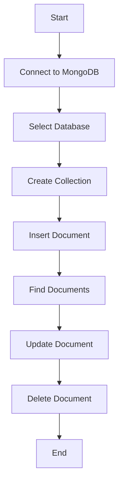

## MongoDB - PHP

To use MongoDB with PHP, you need to use MongoDB PHP driver. Download the driver from the [MongoDB PHP Driver download page](https://www.php.net/manual/en/mongodb.installation.php). Make sure to download the latest release of it. Now unzip the archive and put `php_mongo.dll` in your PHP extension directory (`ext` by default) and add the following line to your `php.ini` file:

```ini
extension = php_mongo.dll
```

### Make a Connection and Select a Database

To make a connection, you need to specify the database name. If the database doesn't exist, MongoDB creates it automatically.

Following is the code snippet to connect to the database:

```php
<?php
   // connect to mongodb
   $m = new MongoClient();
   
   echo "Connection to database successfully";
   // select a database
   $db = $m->mydb;
   
   echo "Database mydb selected";
?>
```

When the program is executed, it will produce the following result:

```
Connection to database successfully
Database mydb selected
```

### Create a Collection

Following is the code snippet to create a collection:

```php
<?php
   // connect to mongodb
   $m = new MongoClient();
   echo "Connection to database successfully";
   
   // select a database
   $db = $m->mydb;
   echo "Database mydb selected";
   $collection = $db->createCollection("mycol");
   echo "Collection created successfully";
?>
```

When the program is executed, it will produce the following result:

```
Connection to database successfully
Database mydb selected
Collection created successfully
```

### Insert a Document

To insert a document into MongoDB, `insert()` method is used.

Following is the code snippet to insert a document:

```php
<?php
   // connect to mongodb
   $m = new MongoClient();
   echo "Connection to database successfully";
   
   // select a database
   $db = $m->mydb;
   echo "Database mydb selected";
   $collection = $db->mycol;
   echo "Collection selected successfully";
   
   $document = array( 
      "title" => "MongoDB", 
      "description" => "database", 
      "likes" => 100,
      "url" => "http://www.tutorialspoint.com/mongodb/",
      "by" => "tutorials point"
   );
   
   $collection->insert($document);
   echo "Document inserted successfully";
?>
```

When the program is executed, it will produce the following result:

```
Connection to database successfully
Database mydb selected
Collection selected successfully
Document inserted successfully
```

### Find All Documents

To select all documents from the collection, `find()` method is used.

Following is the code snippet to select all documents:

```php
<?php
   // connect to mongodb
   $m = new MongoClient();
   echo "Connection to database successfully";
   
   // select a database
   $db = $m->mydb;
   echo "Database mydb selected";
   $collection = $db->mycol;
   echo "Collection selected successfully";
   $cursor = $collection->find();
   // iterate cursor to display title of documents
   
   foreach ($cursor as $document) {
      echo $document["title"] . "\n";
   }
?>
```

When the program is executed, it will produce the following result:

```
Connection to database successfully
Database mydb selected
Collection selected successfully
title: MongoDB
```

### Update a Document

To update a document, you need to use the `update()` method.

In the following example, we will update the title of the inserted document to MongoDB Tutorial. Following is the code snippet to update a document:

```php
<?php
   // connect to mongodb
   $m = new MongoClient();
   echo "Connection to database successfully";
   
   // select a database
   $db = $m->mydb;
   echo "Database mydb selected";
   $collection = $db->mycol;
   echo "Collection selected successfully";
   // now update the document
   $collection->update(array("title"=>"MongoDB"), 
      array('$set'=>array("title"=>"MongoDB Tutorial")));
   echo "Document updated successfully";
   
   // now display the updated document
   $cursor = $collection->find();
   
   // iterate cursor to display title of documents
   echo "Updated document";
   
   foreach ($cursor as $document) {
      echo $document["title"] . "\n";
   }
?>
```

When the program is executed, it will produce the following result:

```
Connection to database successfully
Database mydb selected
Collection selected successfully
Document updated successfully
Updated document
title: MongoDB Tutorial
```

### Delete a Document

To delete a document, you need to use the `remove()` method.

In the following example, we will remove the documents that have the title MongoDB Tutorial. Following is the code snippet to delete a document:

```php
<?php
   // connect to mongodb
   $m = new MongoClient();
   echo "Connection to database successfully";
   
   // select a database
   $db = $m->mydb;
   echo "Database mydb selected";
   $collection = $db->mycol;
   echo "Collection selected successfully";
   
   // now remove the document
   $collection->remove(array("title"=>"MongoDB Tutorial"), false);
   echo "Documents deleted successfully";
   
   // now display the available documents
   $cursor = $collection->find();
   
   // iterate cursor to display title of documents
   echo "Updated document";
   
   foreach ($cursor as $document) {
      echo $document["title"] . "\n";
   }
?>
```

When the program is executed, it will produce the following result:

```
Connection to database successfully
Database mydb selected
Collection selected successfully
Documents deleted successfully
Updated document
```

In the above example, the second parameter is a boolean type and used for the `justOne` field of the `remove()` method.

Remaining MongoDB methods such as `findOne()`, `save()`, `limit()`, `skip()`, `sort()` etc., work the same way as explained above.



| Step                 | Description                                              |
|----------------------|----------------------------------------------------------|
| Connect to MongoDB   | Establish a connection to the MongoDB server.            |
| Select Database      | Choose the database to work with.                        |
| Create Collection    | Create a new collection within the selected database.    |
| Insert Document      | Add a new document to the collection.                    |
| Find Documents       | Retrieve documents from the collection.                  |
| Update Document      | Modify existing documents in the collection.             |
| Delete Document      | Remove documents from the collection.                    |