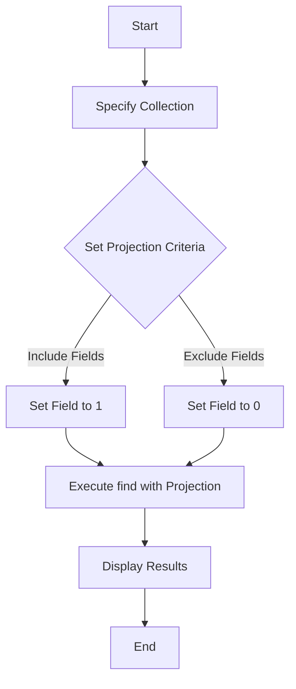

# MongoDB - Projection

In MongoDB, projection means selecting only the necessary data rather than selecting the whole data of a document. If a document has 5 fields and you need to show only 3, then select only those 3 fields.

## The find() Method

MongoDB's `find()` method, explained in MongoDB Query Document, accepts a second optional parameter that is a list of fields that you want to retrieve. In MongoDB, when you execute the `find()` method, it displays all fields of a document. To limit this, you need to set a list of fields with value 1 or 0. `1` is used to show the field while `0` is used to hide the fields.

### Syntax

The basic syntax of the `find()` method with projection is as follows:

```bash
> db.COLLECTION_NAME.find({},{KEY:1})
```

### Example

Consider the collection `mycol` has the following data:

```json
{ "_id" : ObjectId("507f191e810c19729de860e1"), "title": "MongoDB Overview" }
{ "_id" : ObjectId("507f191e810c19729de860e2"), "title": "NoSQL Overview" }
{ "_id" : ObjectId("507f191e810c19729de860e3"), "title": "Tutorials Point Overview" }
```

The following example will display the title of the document while querying the document:

```bash
> db.mycol.find({},{"title":1,_id:0})
{"title":"MongoDB Overview"}
{"title":"NoSQL Overview"}
{"title":"Tutorials Point Overview"}
```

Please note that the `_id` field is always displayed while executing the `find()` method. If you don't want this field, then you need to set it as `0`.

## Diagrams

### Projection Operation Flow


> **Notes:**
> - Projections are used to retrieve only the necessary data, reducing the amount of data transferred and improving query performance.
> - The `_id` field is included by default in projections. To exclude it, explicitly set `_id: 0`.
> - Use `1` to include a field in the projection and `0` to exclude it.

## Table of Commands

| Command | Description |
| ------- | ----------- |
| `db.COLLECTION_NAME.find({}, {KEY: 1})` | Includes specified fields in the results. |
| `db.COLLECTION_NAME.find({}, {KEY: 0})` | Excludes specified fields from the results. |
| `db.COLLECTION_NAME.find({}, {"title": 1, "_id": 0})` | Retrieves only the `title` field, excluding the `_id` field. |
