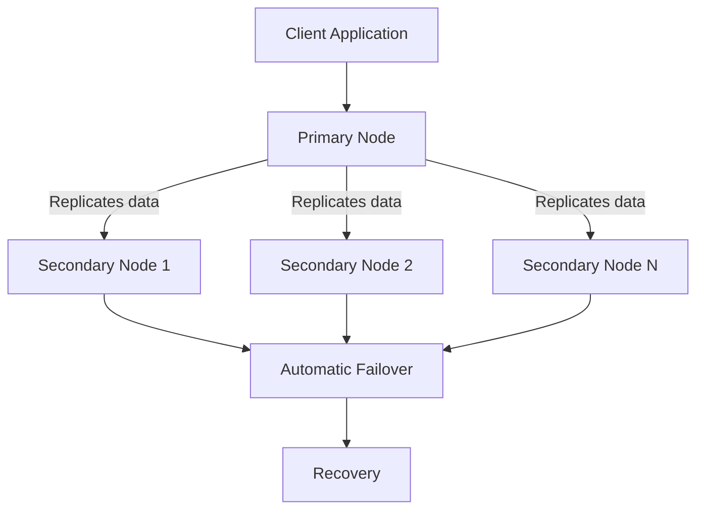

# MongoDB - Replication

Replication in MongoDB is the process of synchronizing data across multiple servers. It provides redundancy, increases data availability, and allows for disaster recovery and high availability of data.

## Why Replication?

- **Data Safety**: Keeps your data safe with multiple copies.
- **High Availability**: Ensures 24/7 availability of data.
- **Disaster Recovery**: Helps in recovering from disasters.
- **No Downtime**: No downtime for maintenance activities.
- **Read Scaling**: Provides extra copies for reading operations.
- **Transparent to Application**: Replica set is transparent to applications.

## How Replication Works in MongoDB

MongoDB achieves replication through the use of a replica set, which is a group of mongod instances hosting the same data set. Here's how it works:



### Replica Set Features

- Cluster of N nodes.
- Any one node can be primary.
- All write operations go to the primary.
- Automatic failover and recovery.
- Consensus election of primary.

## Set Up a Replica Set

To set up a replica set, follow these steps:

1. Shutdown the running MongoDB server.
2. Start the MongoDB server with the `--replSet` option:

   ```shell
   mongod --port "PORT" --dbpath "YOUR_DB_DATA_PATH" --replSet "REPLICA_SET_INSTANCE_NAME"
   ```

   Example:
   ```shell
   mongod --port 27017 --dbpath "D:\set up\mongodb\data" --replSet rs0
   ```

3. Connect to this mongod instance and issue the command `rs.initiate()` to initiate a new replica set.
4. Use `rs.conf()` to check the replica set configuration and `rs.status()` to check the status of the replica set.

## Add Members to Replica Set

To add members to a replica set:

1. Start mongod instances on multiple machines.
2. Connect to the primary node in the Mongo client.
3. Issue the `rs.add()` command to add members to the replica set.

### Syntax

```shell
>rs.add(HOST_NAME:PORT)
```

Example:

```shell
>rs.add("mongod1.net:27017")
```

> **NOTE :** You can add mongod instances to the replica set only when connected to the primary node. Use `db.isMaster()` to check your connection status.
