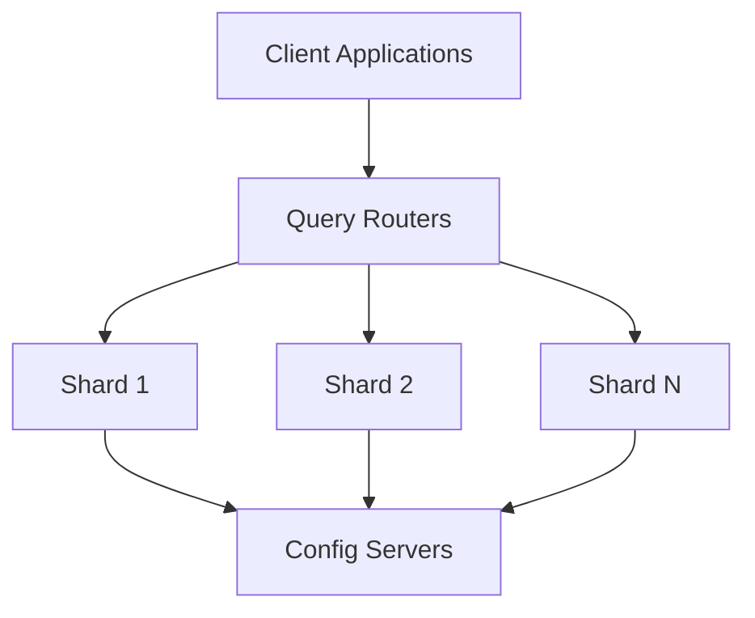

# MongoDB - Sharding

Sharding is the process of storing data records across multiple machines and is MongoDB's approach to handling data growth. As data size increases, a single machine may not suffice for storage and throughput requirements. Sharding addresses this through horizontal scaling, allowing more machines to support data growth and read/write operations.

## Why Sharding?

- In replication, all writes go to the master node.
- Latency-sensitive queries still go to the master.
- A single replica set is limited to 12 nodes.
- Memory may not be large enough for a large active dataset.
- Local disks may not be big enough.
- Vertical scaling is too expensive.

## Sharding in MongoDB

The following diagram illustrates MongoDB sharding using a sharded cluster:

### Components of Sharding

1. **Shards**: Store data and provide high availability and data consistency. Each shard is a separate replica set in production environments.
2. **Config Servers**: Store the cluster's metadata, containing mappings of the cluster's dataset to the shards. This metadata is used by the query router to direct operations to specific shards. Sharded clusters have exactly 3 config servers in production.
3. **Query Routers**: Interface with client applications, directing operations to the appropriate shard. They process and target operations to shards, returning results to clients. A sharded cluster can have multiple query routers to distribute the client request load.

## Advantages of Sharding

| Advantages                | Description |
|---------------------------|-------------|
| Scalability               | Sharding provides horizontal scalability by distributing data across multiple machines. |
| High Availability         | Sharded clusters can continue to function even if some shards become unavailable. |
| Improved Performance      | By distributing data and queries across multiple shards, sharding can improve read and write performance. |
| Cost-Effective            | Horizontal scaling with sharding is often more cost-effective than vertical scaling. |

## How Sharding Works

When a client application sends a query, the query router directs the query to the appropriate shard based on the cluster's metadata stored in the config servers. Each shard processes the query and returns the result to the query router, which then sends the aggregated result back to the client.

### Setting Up Sharding

To set up sharding in MongoDB, you need to:

1. Start config servers.
2. Start query routers.
3. Add shards to the cluster.
4. Enable sharding for a specific database.
5. Shard collections within the database.

Sharding in MongoDB provides a robust solution for managing large datasets and high-throughput operations by distributing the load across multiple machines.