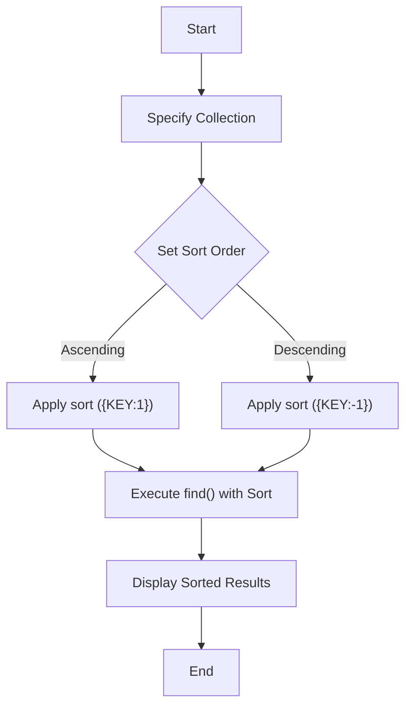

# MongoDB - Sort Records

In this chapter, we will learn how to sort records in MongoDB.

## The sort() Method

To sort documents in MongoDB, you need to use the `sort()` method. The method accepts a document containing a list of fields along with their sorting order. To specify sorting order, `1` and `-1` are used. `1` is used for ascending order while `-1` is used for descending order.

### Syntax

The basic syntax of the `sort()` method is as follows:

```bash
> db.COLLECTION_NAME.find().sort({KEY:1})
```

### Example

Consider the collection `mycol` has the following data:

```json
{ "_id" : ObjectId("507f191e810c19729de860e1"), "title": "MongoDB Overview" }
{ "_id" : ObjectId("507f191e810c19729de860e2"), "title": "NoSQL Overview" }
{ "_id" : ObjectId("507f191e810c19729de860e3"), "title": "Tutorials Point Overview" }
```

The following example will display the documents sorted by title in descending order:

```bash
> db.mycol.find({},{"title":1,_id:0}).sort({"title":-1})
{"title":"Tutorials Point Overview"}
{"title":"NoSQL Overview"}
{"title":"MongoDB Overview"}
```

Please note, if you don't specify the sorting preference, the `sort()` method will display the documents in ascending order.

## Diagram

### Sorting Operation Flow


## Notes

- The `sort()` method is used to order the documents returned in the query result.
- Sorting can be specified in ascending order (`1`) or descending order (`-1`).
- If no sorting preference is specified, documents are sorted in ascending order by default.

## Table of Commands

| Command | Description |
| ------- | ----------- |
| `db.COLLECTION_NAME.find().sort({KEY:1})` | Sorts the documents in ascending order by the specified key. |
| `db.COLLECTION_NAME.find().sort({KEY:-1})` | Sorts the documents in descending order by the specified key. |
| `db.COLLECTION_NAME.find({}, {"title": 1, "_id": 0}).sort({"title": -1})` | Retrieves documents sorted by the `title` field in descending order, displaying only the `title` field. |
| `db.COLLECTION_NAME.find({}, {"title": 1, "_id": 0}).sort({"title": 1})` | Retrieves documents sorted by the `title` field in ascending order, displaying only the `title` field. |
