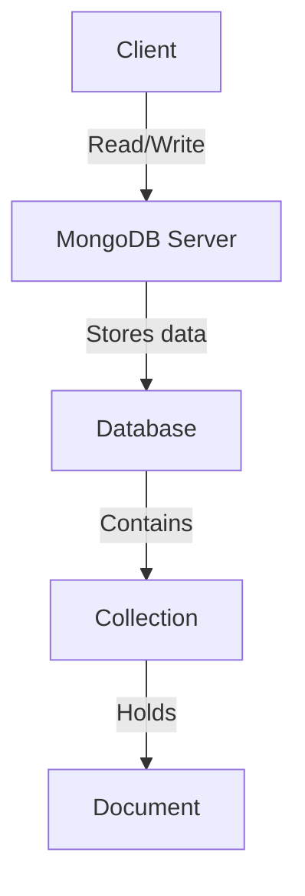

# MongoDB - Overview

MongoDB is a cross-platform, document-oriented database that provides high performance, high availability, and easy scalability. MongoDB works on the concept of collections and documents.

## Database

A database is a physical container for collections. Each database gets its own set of files on the file system. A single MongoDB server typically has multiple databases.

## Collection

A collection is a group of MongoDB documents. It is the equivalent of an RDBMS table. A collection exists within a single database. Collections do not enforce a schema. Documents within a collection can have different fields. Typically, all documents in a collection are of similar or related purpose.

## Document

A document is a set of key-value pairs. Documents have dynamic schema. Dynamic schema means that documents in the same collection do not need to have the same set of fields or structure, and common fields in a collection's documents may hold different types of data.

> **Note:** MongoDB documents have a flexible schema, which allows you to store different types of data within the same collection without needing to predefine a rigid structure.

## Comparison with RDBMS

The following table shows the relationship of RDBMS terminology with MongoDB:

| RDBMS       | MongoDB      |
|-------------|--------------|
| Database    | Database     |
| Table       | Collection   |
| Tuple/Row   | Document     |
| Column      | Field        |
| Table Join  | Embedded Documents |
| Primary Key | Primary Key (Default key `_id` provided by MongoDB itself) |
| mysqld/Oracle | `mongod`    |
| mysql/sqlplus | `mongo`      |

## MongoDB Architecture

### MongoDB Components

- **Client:** The MongoDB client, which sends queries to the server.
- **Server (mongod):** The MongoDB server, which processes requests from clients.
- **Database:** A physical container for collections.
- **Collection:** A grouping of MongoDB documents.
- **Document:** A set of key-value pairs.

## Summary

MongoDB is a flexible, scalable database solution that uses a document-oriented model, making it different from traditional relational databases. It supports dynamic schema, making it easy to store and retrieve various types of data within a single collection.
