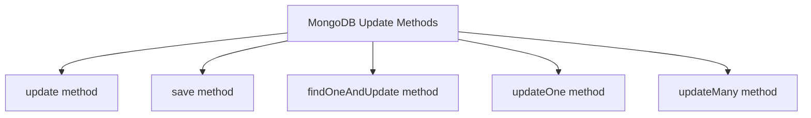

# MongoDB - Update Document

MongoDB's `update()` and `save()` methods are used to update documents in a collection. The `update()` method updates the values in the existing document, while the `save()` method replaces the existing document with the document passed in the `save()` method.

## MongoDB `update()` Method

The `update()` method updates the values in the existing document.

### Syntax

The basic syntax of the `update()` method is as follows:

```shell
db.COLLECTION_NAME.update(SELECTION_CRITERIA, UPDATED_DATA)
```

### Example

Consider the `mycol` collection has the following data:

```json
{ "_id" : ObjectId(5983548781331adf45ec5), "title":"MongoDB Overview"}
{ "_id" : ObjectId(5983548781331adf45ec6), "title":"NoSQL Overview"}
{ "_id" : ObjectId(5983548781331adf45ec7), "title":"Tutorials Point Overview"}
```

The following example sets the new title 'New MongoDB Tutorial' for the documents whose title is 'MongoDB Overview'.

```shell
db.mycol.update({'title':'MongoDB Overview'}, {$set:{'title':'New MongoDB Tutorial'}})
```

```shell
WriteResult({ "nMatched" : 1, "nUpserted" : 0, "nModified" : 1 })
```

```shell
db.mycol.find()
{ "_id" : ObjectId(5983548781331adf45ec5), "title":"New MongoDB Tutorial"}
{ "_id" : ObjectId(5983548781331adf45ec6), "title":"NoSQL Overview"}
{ "_id" : ObjectId(5983548781331adf45ec7), "title":"Tutorials Point Overview"}
```

### Note
By default, MongoDB will update only a single document. To update multiple documents, you need to set the `multi` parameter to true.

```shell
db.mycol.update({'title':'MongoDB Overview'}, {$set:{'title':'New MongoDB Tutorial'}}, {multi:true})
```

## MongoDB `save()` Method

The `save()` method replaces the existing document with the new document passed in the `save()` method.

### Syntax

The basic syntax of the MongoDB `save()` method is shown below:

```shell
db.COLLECTION_NAME.save({_id:ObjectId(), NEW_DATA})
```

### Example

The following example replaces the document with the `_id` '5983548781331adf45ec5'.

```shell
db.mycol.save({
   "_id" : ObjectId("507f191e810c19729de860ea"), 
   "title":"Tutorials Point New Topic",
   "by":"Tutorials Point"
})
```

```shell
WriteResult({
   "nMatched" : 0,
   "nUpserted" : 1,
   "nModified" : 0,
   "_id" : ObjectId("507f191e810c19729de860ea")
})
```

```shell
db.mycol.find()
{ "_id" : ObjectId("507f191e810c19729de860ea"), "title":"Tutorials Point New Topic", "by":"Tutorials Point"}
{ "_id" : ObjectId("507f191e810c19729de860e6"), "title":"NoSQL Overview"}
{ "_id" : ObjectId("507f191e810c19729de860e7"), "title":"Tutorials Point Overview"}
```

## MongoDB `findOneAndUpdate()` Method

The `findOneAndUpdate()` method updates the values in the existing document.

### Syntax

The basic syntax of the `findOneAndUpdate()` method is as follows:

```shell
db.COLLECTION_NAME.findOneAndUpdate(SELECTION_CRITERIA, UPDATED_DATA)
```

### Example

Assume we have created a collection named `empDetails` and inserted three documents in it as shown below:

```json
db.empDetails.insertMany([
    {
        "First_Name": "Radhika",
        "Last_Name": "Sharma",
        "Age": "26",
        "e_mail": "radhika_sharma.123@gmail.com",
        "phone": "9000012345"
    },
    {
        "First_Name": "Rachel",
        "Last_Name": "Christopher",
        "Age": "27",
        "e_mail": "Rachel_Christopher.123@gmail.com",
        "phone": "9000054321"
    },
    {
        "First_Name": "Fathima",
        "Last_Name": "Sheik",
        "Age": "24",
        "e_mail": "Fathima_Sheik.123@gmail.com",
        "phone": "9000054321"
    }
])
```

The following example updates the age and email values of the document with the name 'Radhika'.

```shell
db.empDetails.findOneAndUpdate(
    {First_Name: 'Radhika'},
    { $set: { Age: '30', e_mail: 'radhika_newemail@gmail.com'}}
)
```

```json
{
    "_id" : ObjectId("5dd6636870fb13eec3963bf5"),
    "First_Name" : "Radhika",
    "Last_Name" : "Sharma",
    "Age" : "30",
    "e_mail" : "radhika_newemail@gmail.com",
    "phone" : "9000012345"
}
```

## MongoDB `updateOne()` Method

This method updates a single document that matches the given filter.

### Syntax

The basic syntax of the `updateOne()` method is as follows:

```shell
db.COLLECTION_NAME.updateOne(<filter>, <update>)
```

### Example

```shell
db.empDetails.updateOne(
    {First_Name: 'Radhika'},
    { $set: { Age: '30', e_mail: 'radhika_newemail@gmail.com'}}
)
```

```shell
{ "acknowledged" : true, "matchedCount" : 1, "modifiedCount" : 0 }
```

## MongoDB `updateMany()` Method

The `updateMany()` method updates all the documents that match the given filter.

### Syntax

The basic syntax of the `updateMany()` method is as follows:

```shell
db.COLLECTION_NAME.updateMany(<filter>, <update>)
```

### Example

```shell
db.empDetails.updateMany(
    {Age: { $gt: "25" }},
    { $set: { Age: '00'}}
)
```

```shell
{ "acknowledged" : true, "matchedCount" : 2, "modifiedCount" : 2 }
```

### Viewing Updated Documents

You can see the updated values if you retrieve the contents of the document using the `find` method as shown below:

```shell
db.empDetails.find()
{ "_id" : ObjectId("5dd6636870fb13eec3963bf5"), "First_Name" : "Radhika", "Last_Name" : "Sharma", "Age" : "00", "e_mail" : "radhika_newemail@gmail.com", "phone" : "9000012345" }
{ "_id" : ObjectId("5dd6636870fb13eec3963bf6"), "First_Name" : "Rachel", "Last_Name" : "Christopher", "Age" : "00", "e_mail" : "Rachel_Christopher.123@gmail.com", "phone" : "9000054321" }
{ "_id" : ObjectId("5dd6636870fb13eec3963bf7"), "First_Name" : "Fathima", "Last_Name" : "Sheik", "Age" : "24", "e_mail" : "Fathima_Sheik.123@gmail.com", "phone" : "9000054321" }
```

## Diagram



## Note

- The `update()` method updates the values in the existing document based on the selection criteria.
- The `save()` method replaces the entire document.
- The `findOneAndUpdate()` method finds a single document and updates it.
- The `updateOne()` method updates one document that matches the filter.
- The `updateMany()` method updates all documents that match the filter.

## Table of MongoDB Update Methods

| Method               | Description                                 |
|----------------------|---------------------------------------------|
| `update()`           | Updates values in the existing document     |
| `save()`             | Replaces the existing document              |
| `findOneAndUpdate()` | Finds and updates a single document         |
| `updateOne()`        | Updates one document that matches the filter|
| `updateMany()`       | Updates all documents that match the filter |
