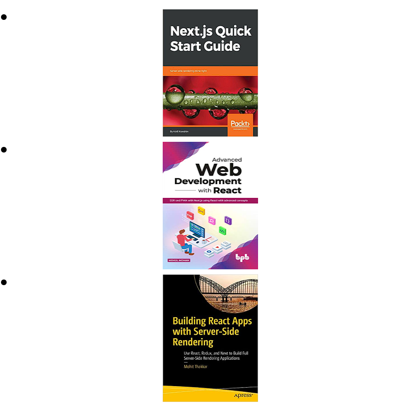

The following resources contain additional information on Next.js. Please use them to get more in-depth knowledge on this topic.

## Useful Links on Next.js

Next.js Official Site [− Your main resource for Next.js documentation and examples etc.](https://nextjs.org/)

## Useful Books on Next.js 

   - Next.js Quick Start Guide: Server-side rendering done
   - Advanced Web Development with React: SSR and PWA with Next.js using React with advanced concepts
   - Building React Apps with Server-Side Rendering: Use React, Redux, and Next to Build Full Server-Side Rendering Applications