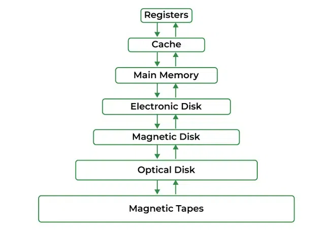
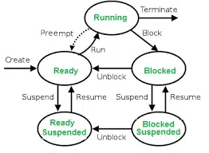
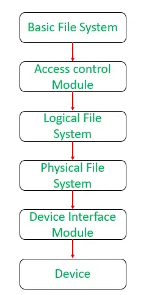
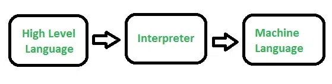
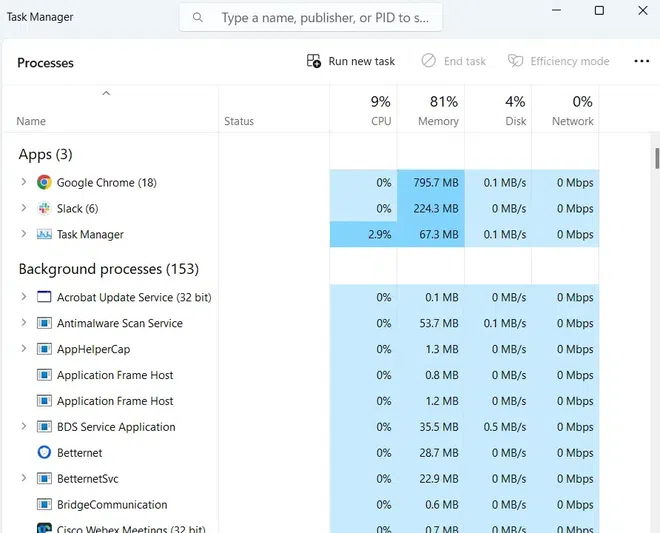

# Functions of Operating System

An Operating System acts as a communication bridge (interface) between the user and computer hardware. The purpose of an operating system is to provide a platform on which a user can execute programs conveniently and efficiently.

An operating system is a piece of software that manages the allocation of Computer Hardware. The coordination of the hardware must be appropriate to ensure the correct working of the computer system and to prevent user programs from interfering with the proper working of the system.

The main goal of the Operating System is to make the computer environment more convenient to use and the secondary goal is to use the resources most efficiently.

## What is an Operating System?

An operating system is a program that manages a computer’s hardware. It also provides a basis for application programs and acts as an intermediary between the computer user and computer hardware. The main task an operating system carries out is the allocation of resources and services, such as the allocation of memory, devices, processors, and information. The operating system also includes programs to manage these resources, such as a traffic controller, a scheduler, a memory management module, I/O programs, and a file system. The operating system simply provides an environment within which other programs can do useful work.

## Why are Operating Systems Used?

Operating System is used as a communication channel between the computer hardware and the user. It works as an intermediate between system hardware and end-user. Operating System handles the following responsibilities:

- It controls all the computer resources.

- It provides valuable services to user programs.

- It coordinates the execution of user programs.

- It provides resources for user programs.

- It provides an interface (virtual machine) to the user.

- It hides the complexity of software.

- It supports multiple execution modes.

- It monitors the execution of user programs to prevent errors.

## Functions of an Operating System

### Memory Management

The operating system manages the Primary Memory or Main Memory. Main memory is fast storage and it can be accessed directly by the CPU. For a program to be executed, it should be first loaded in the main memory. An operating system manages the allocation and deallocation of memory to various processes and ensures that the other process does not consume the memory allocated to one process. An Operating System performs the following activities for Memory Management:

- It keeps track of primary memory, i.e., which bytes of memory are used by which user program.

- In multiprogramming, the OS decides the order in which processes are granted memory access, and for how long.

- It allocates the memory to a process when the process requests it and deallocates the memory when the process has terminated or is performing an I/O operation.

                              

### Processor Management

In a multi-programming environment, the OS decides the order in which processes have access to the processor, and how much processing time each process has. This function of OS is called Process Scheduling. An Operating System performs the following activities for Processor Management:

- Manages the processor’s work by allocating various jobs to it and ensuring that each process receives enough time from the processor to function properly.

- Keeps track of the status of processes. The program which performs this task is known as a traffic controller.

- Allocates the CPU (processor) to a process.

- Deallocates the processor when a process is no longer required.

                               

### Device Management

An OS manages device communication via its respective drivers. It performs the following activities for device management:

- Keeps track of all devices connected to the system. Designates a program responsible for every device known as the Input/Output controller.

- Decides which process gets access to a certain device and for how long.

- Allocates devices effectively and efficiently.

- Deallocates devices when they are no longer required.

- Controls the working of input-output devices, receives requests from these devices, performs specific tasks, and communicates back to the requesting process.

### File Management

A file system is organized into directories for efficient or easy navigation and usage. These directories may contain other directories and other files. An Operating System carries out the following file management activities:

- Keeps track of where information is stored, user access settings, the status of every file, and more. These facilities are collectively known as the file system.

- Keeps track of information regarding the creation, deletion, transfer, copy, and storage of files in an organized way.

- Maintains the integrity of the data stored in these files, including the file directory structure, by protecting against unauthorized access.

                             

### User Interface or Command Interpreter

The user interacts with the computer system through the operating system. Hence OS acts as an interface between the user and the computer hardware. This user interface is offered through a set of commands or a graphical user interface (GUI). Through this interface, the user interacts with the applications and the machine hardware.

                               

### Booting the Computer

The process of starting or restarting the computer is known as booting. If the computer is switched off completely and if turned on then it is called cold booting. Warm booting is a process of using the operating system to restart the computer.

### Security

The operating system uses password protection to protect user data and similar other techniques. It also prevents unauthorized access to programs and user data. The operating system provides various techniques which assure the integrity and confidentiality of user data:

- Protection against unauthorized access through login.

- Protection against intrusion by keeping the firewall active.

- Protecting the system memory against malicious access.

- Displaying messages related to system vulnerabilities.

### Control Over System Performance

Operating systems play a pivotal role in controlling and optimizing system performance. They act as intermediaries between hardware and software, ensuring that computing resources are efficiently utilized. One fundamental aspect is resource allocation, where the OS allocates CPU time, memory, and I/O devices to different processes, striving to provide fair and optimal resource utilization. Process scheduling, a critical function, helps decide which processes or threads should run when, preventing any single task from monopolizing the CPU and enabling effective multitasking.

                         

### Job Accounting

The operating system keeps track of time and resources used by various tasks and users. This information can be used to track resource usage for a particular user or group of users. In a multitasking OS where multiple programs run simultaneously, the OS determines which applications should run in which order and how time should be allocated to each application.

### Error-Detecting Aids

The operating system constantly monitors the system to detect errors and avoid malfunctioning computer systems. From time to time, the operating system checks the system for any external threat or malicious software activity. It also checks the hardware for any type of damage. This process displays several alerts to the user so that the appropriate action can be taken against any damage caused to the system.

### Coordination Between Other Software and Users

Operating systems also coordinate and assign interpreters, compilers, assemblers, and other software to the various users of the computer systems. In simpler terms, think of the operating system as the traffic cop of your computer. It directs and manages how different software programs can share your computer’s resources without causing chaos. It ensures that when you want to use a program, it runs smoothly without crashing or causing problems for others.

### Performs Basic Computer Tasks

The management of various peripheral devices such as the mouse, keyboard, and printer is carried out by the operating system. Today most operating systems are plug-and-play. These operating systems automatically recognize and configure the devices with no user interference.

### Network Management

- **Network Communication:** Operating systems help computers talk to each other and the internet. They manage how data is packaged and sent over the network, making sure it arrives safely and in the right order.

- **Settings and Monitoring:** They let you set up your network connections, like Wi-Fi or Ethernet, and keep an eye on how your network is doing. They make sure your computer is using the network efficiently and securely, like adjusting the speed of your internet or protecting your computer from online threats.

## Services Provided by an Operating System

The Operating System provides certain services to the users which can be listed in the following manner:

- **User Interface:** Almost all operating systems have a user interface (UI). This interface can take several forms such as command-line interface (CLI), batch interface, or graphical user interface (GUI).

- **Program Execution:** Responsible for the execution of all types of programs whether it be user programs or system programs.

- **Handling Input/Output Operations:** Responsible for handling all sorts of inputs, i.e., from the keyboard, mouse, desktop, etc.

- **Manipulation of File System:** Responsible for making decisions regarding the storage of all types of data or files.

- **Resource Allocation:** Ensures the proper use of all the resources available by deciding which resource to be used by whom for how much time.

- **Accounting:** Tracks an account of all the functionalities taking place in the computer system at a time.

- **Information and Resource Protection:** Uses all the information and resources available on the machine in the most protected way.

- **Communication:** Implements communication between one process to another process to exchange information.

- **System Services:** Provides various system services, such as printing, time and date management, and event logging.

- **Error Detection:** Needs to detect and correct errors constantly to ensure correct and consistent computing.

## Characteristics of Operating System

- **Virtualization:** Provides virtualization capabilities, allowing multiple operating systems or instances of an operating system to run on a single physical machine.

- **Networking:** Provides networking capabilities, allowing the computer system to connect to other systems and devices over a network.

- **Scheduling:** Provides scheduling algorithms that determine the order in which tasks are executed on the system.

- **Interprocess Communication:** Provides mechanisms for applications to communicate with each other, allowing them to share data and coordinate their activities.

- **Performance Monitoring:** Provides tools for monitoring system performance, including CPU usage, memory usage, disk usage, and network activity.

- **Backup and Recovery:** Provides backup and recovery mechanisms to protect data in the event of system failure or data loss.

- **Debugging:** Provides
