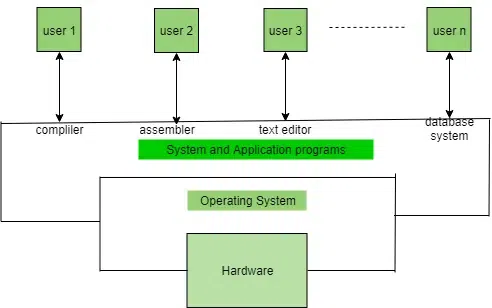

# What is an Operating System?

Operating System lies in the category of system software. It basically manages all the resources of the computer. An operating system acts as an interface between the software and different parts of the computer or the computer hardware. The operating system is designed in such a way that it can manage the overall resources and operations of the computer.

Operating System is a fully integrated set of specialized programs that handle all the operations of the computer. It controls and monitors the execution of all other programs that reside in the computer, which also includes application programs and other system software of the computer. Examples of Operating Systems are Windows, Linux, Mac OS, etc.

An Operating System (OS) is a collection of software that manages computer hardware resources and provides common services for computer programs. The operating system is the most important type of system software in a computer system.

## What is an Operating System Used for?

The operating system helps in improving the computer software as well as hardware. Without OS, it became very difficult for any application to be user-friendly. The Operating System provides a user with an interface that makes any application attractive and user-friendly. The operating System comes with a large number of device drivers that make OS services reachable to the hardware environment. Each and every application present in the system requires the Operating System. The operating system works as a communication channel between system hardware and system software. The operating system helps an application with the hardware part without knowing about the actual hardware configuration. It is one of the most important parts of the system and hence it is present in every device, whether large or small device.

                            

## Functions of the Operating System

- **Resource Management**: The operating system manages and allocates memory, CPU time, and other hardware resources among the various programs and processes running on the computer.

- **Process Management**: The operating system is responsible for starting, stopping, and managing processes and programs. It also controls the scheduling of processes and allocates resources to them
  .
- **Memory Management**: The operating system manages the computer’s primary memory and provides mechanisms for optimizing memory usage.

- **Security**: The operating system provides a secure environment for the user, applications, and data by implementing security policies and mechanisms such as access controls and encryption.

- **Job Accounting**: It keeps track of time and resources used by various jobs or users.

- **File Management**: The operating system is responsible for organizing and managing the file system, including the creation, deletion, and manipulation of files and directories.

- **Device Management**: The operating system manages input/output devices such as printers, keyboards, mice, and displays. It provides the necessary drivers and interfaces to enable communication between the devices and the computer.

- **Networking**: The operating system provides networking capabilities such as establishing and managing network connections, handling network protocols, and sharing resources such as printers and files over a network.

- **User Interface**: The operating system provides a user interface that enables users to interact with the computer system. This can be a Graphical User Interface (GUI), a Command-Line Interface (CLI), or a combination of both.

- **Backup and Recovery**: The operating system provides mechanisms for backing up data and recovering it in case of system failures, errors, or disasters.

- **Virtualization**: The operating system provides virtualization capabilities that allow multiple operating systems or applications to run on a single physical machine. This can enable efficient use of resources and flexibility in managing workloads.

- **Performance Monitoring**: The operating system provides tools for monitoring and optimizing system performance, including identifying bottlenecks, optimizing resource usage, and analyzing system logs and metrics.

- **Time-Sharing**: The operating system enables multiple users to share a computer system and its resources simultaneously by providing time-sharing mechanisms that allocate resources fairly and efficiently.

- **System Calls**: The operating system provides a set of system calls that enable applications to interact with the operating system and access its resources. System calls provide a standardized interface between applications and the operating system, enabling portability and compatibility across different hardware and software platforms.

- **Error-detecting Aids**: These contain methods that include the production of dumps, traces, error messages, and other debugging and error-detecting methods.

## Objectives of Operating Systems

Let us now see some of the objectives of the operating system, which are mentioned below.

- **Convenient to use**: One of the objectives is to make the computer system more convenient to use in an efficient manner.

- **User Friendly**: To make the computer system more interactive with a more convenient interface for the users.

- **Easy Access**: To provide easy access to users for using resources by acting as an intermediary between the hardware and its users.

- **Management of Resources**: For managing the resources of a computer in a better and faster way.

- **Controls and Monitoring**: By keeping track of who is using which resource, granting resource requests, and mediating conflicting requests from different programs and users.

- **Fair Sharing of Resources**: Providing efficient and fair sharing of resources between the users and programs.

## Types of Operating Systems

- **Batch Operating System**: A Batch Operating System is a type of operating system that does not interact with the computer directly. There is an operator who takes similar jobs having the same requirements and groups them into batches.

- **Time-sharing Operating System**: Time-sharing Operating System is a type of operating system that allows many users to share computer resources (maximum utilization of the resources).

- **Distributed Operating System**: Distributed Operating System is a type of operating system that manages a group of different computers and makes appear to be a single computer. These operating systems are designed to operate on a network of computers. They allow multiple users to access shared resources and communicate with each other over the network. Examples include Microsoft Windows Server and various distributions of Linux designed for servers.

- **Network Operating System**: Network Operating System is a type of operating system that runs on a server and provides the capability to manage data, users, groups, security, applications, and other networking functions.

- **Real-time Operating System**: Real-time Operating System is a type of operating system that serves a real-time system and the time interval required to process and respond to inputs is very small. These operating systems are designed to respond to events in real time. They are used in applications that require quick and deterministic responses, such as embedded systems, industrial control systems, and robotics.

- **Multiprocessing Operating System**: Multiprocessor Operating Systems are used in operating systems to boost the performance of multiple CPUs within a single computer system. Multiple CPUs are linked together so that a job can be divided and executed more quickly.

- **Single-User Operating Systems**: Single-User Operating Systems are designed to support a single user at a time. Examples include Microsoft Windows for personal computers and Apple macOS.

- **Multi-User Operating Systems**: Multi-User Operating Systems are designed to support multiple users simultaneously. Examples include Linux and Unix.

- **Embedded Operating Systems**: Embedded Operating Systems are designed to run on devices with limited resources, such as smartphones, wearable devices, and household appliances. Examples include Google’s Android and Apple’s iOS.

- **Cluster Operating Systems**: Cluster Operating Systems are designed to run on a group of computers, or a cluster, to work together as a single system. They are used for high-performance computing and for applications that require high availability and reliability. Examples include Rocks Cluster Distribution and OpenMPI.

## How to Check the Operating System?

There are so many factors to be considered while choosing the best Operating System for our use. These factors are mentioned below.

- **Price Factor**: Price is one of the factors to choose the correct Operating System as there are some OS that is free, like Linux, but there is some more OS that is paid like Windows and macOS.

- **Accessibility Factor**: Some Operating Systems are easy to use like macOS and iOS, but some OS are a little bit complex to understand like Linux. So, you must choose the Operating System in which you are more accessible.

- **Compatibility Factor**: Some Operating Systems support very less applications whereas some Operating Systems supports more application. You must choose the OS, which supports the applications which are required by you.

- **Security Factor**: The security Factor is also a factor in choosing the correct OS, as macOS provide some additional security while Windows has little fewer security features.

## Examples of Operating Systems

- **Windows**: GUI-based, PC

- **GNU/Linux**: Personal, Workstations, ISP, File, and print server, Three-tier client/Server

- **macOS**: Used for Apple’s personal computers and workstations (MacBook, iMac)

- **Android**: Google’s Operating System for smartphones/tablets/smartwatches

- **iOS**: Apple’s OS for iPhone, iPad, and iPod Touch
