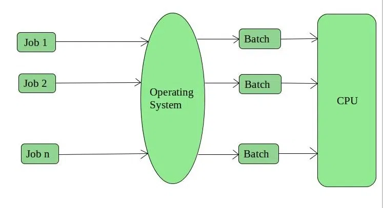
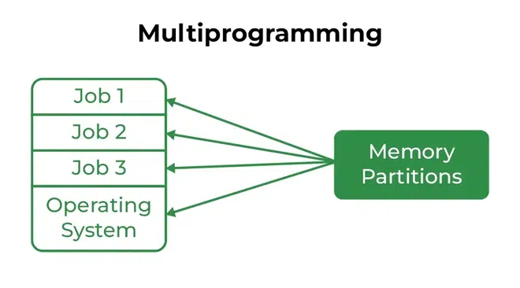
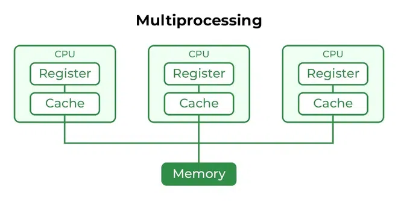
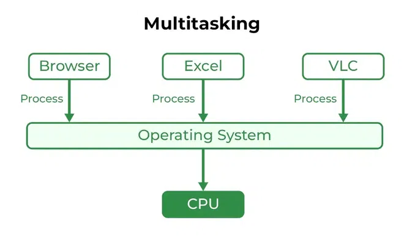
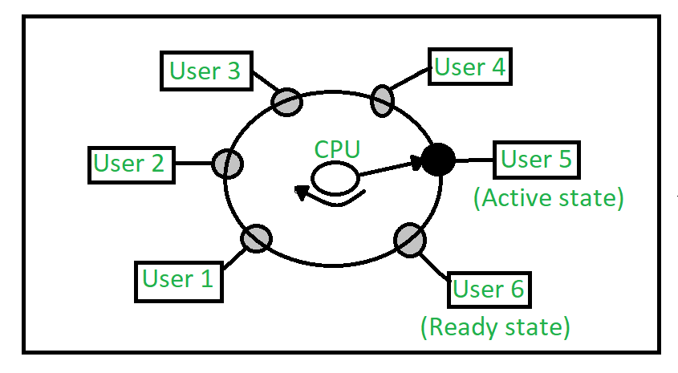
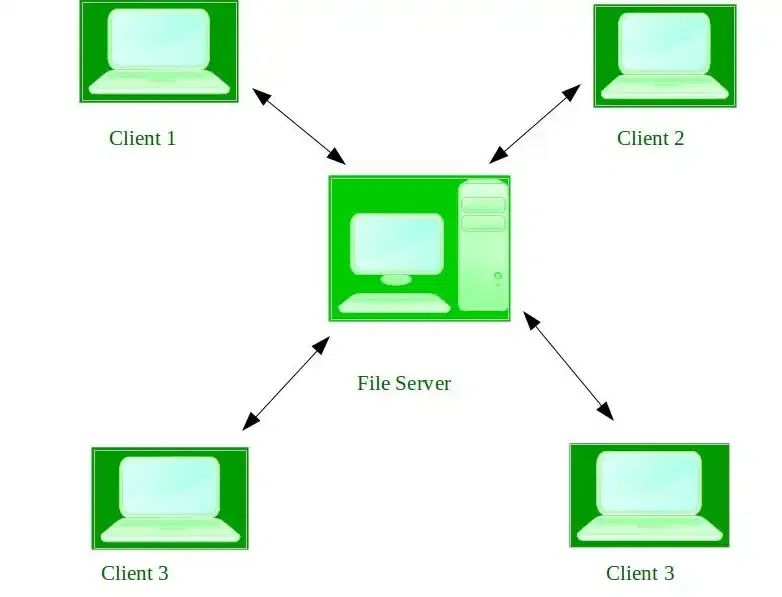

# Types of Operating Systems

## Pre-Requisite: What is an Operating System?

An Operating System performs all the basic tasks like managing files, processes, and memory. Thus operating system acts as the manager of all the resources, i.e. resource manager. Thus, the operating system becomes an interface between the user and the machine. It is one of the most required software that is present in the device.

Operating System is a type of software that works as an interface between the system program and the hardware. There are several types of Operating Systems, many of which are mentioned below. Let’s have a look at them.

## Types of Operating Systems

There are several types of Operating Systems which are mentioned below.

1. [Batch Operating System](#batch-operating-system)

2. [Multi-Programming System](#multi-programming-operating-system)

3. [Multi-Processing System](#multi-processing-operating-system)

4. [Multi-Tasking Operating System](#multi-tasking-operating-system)

5. [Time-Sharing Operating System](#time-sharing-operating-system)

6. [Distributed Operating System](#distributed-operating-system)

7. [Network Operating System](#network-operating-system)

8. [Real-Time Operating System](#real-time-operating-system)

### Batch Operating System

This type of operating system does not interact with the computer directly. There is an operator which takes similar jobs having the same requirement and groups them into batches. It is the responsibility of the operator to sort jobs with similar needs.

                              

#### Advantages of Batch Operating System

- Multiple users can share the batch systems.

- The idle time for the batch system is very less.

- It is easy to manage large work repeatedly in batch systems.

#### Disadvantages of Batch Operating System

- The computer operators should be well known with batch systems.

- Batch systems are hard to debug.

- It is sometimes costly.

- The other jobs will have to wait for an unknown time if any job fails.

- In batch operating system the processing time for jobs is commonly difficult to accurately predict while they are in the queue.

- It is difficult to accurately predict the exact time required for a job to complete while it is in the queue.

#### Examples of Batch Operating Systems

- Payroll Systems, Bank Statements, etc.

### Multi-Programming Operating System

Multiprogramming Operating Systems can be simply illustrated as more than one program is present in the main memory and any one of them can be kept in execution. This is basically used for better execution of resources.

                                 

#### Advantages of Multi-Programming Operating System

- Multi Programming increases the Throughput of the System.

- It helps in reducing the response time.

#### Disadvantages of Multi-Programming Operating System

- There is not any facility for user interaction of system resources with the system.

### Multi-Processing Operating System

Multi-Processing Operating System is a type of Operating System in which more than one CPU is used for the execution of resources. It betters the throughput of the System.

                               

#### Advantages of Multi-Processing Operating System

- It increases the throughput of the system.

- As it has several processors, so, if one processor fails, we can proceed with another processor.

#### Disadvantages of Multi-Processing Operating System

- Due to the multiple CPU, it can be more complex and somehow difficult to understand.

### Multi-Tasking Operating System

Multitasking Operating System is simply a multiprogramming Operating System with having facility of a Round-Robin Scheduling Algorithm. It can run multiple programs simultaneously.

                           

#### Types of Multi-Tasking Systems

- Preemptive Multi-Tasking

- Cooperative Multi-Tasking

#### Advantages of Multi-Tasking Operating System

- Multiple Programs can be executed simultaneously in Multi-Tasking Operating System.

- It comes with proper memory management.

#### Disadvantages of Multi-Tasking Operating System

- The system gets heated in case of heavy programs multiple times.

### Time-Sharing Operating System

Each task is given some time to execute so that all the tasks work smoothly. Each user gets the time of the CPU as they use a single system. These systems are also known as Multitasking Systems. The task can be from a single user or different users also. The time that each task gets to execute is called quantum. After this time interval is over OS switches over to the next task.

                              

#### Advantages of Time-Sharing OS

- Each task gets an equal opportunity.

- Fewer chances of duplication of software.

- CPU idle time can be reduced.

- Resource Sharing: Time-sharing systems allow multiple users to share hardware resources such as the CPU, memory, and peripherals, reducing the cost of hardware and increasing efficiency.

- Improved Productivity: Time-sharing allows users to work concurrently, thereby reducing the waiting time for their turn to use the computer. This increased productivity translates to more work getting done in less time.

- Improved User Experience: Time-sharing provides an interactive environment that allows users to communicate with the computer in real time, providing a better user experience than batch processing.

#### Disadvantages of Time-Sharing OS

- Reliability problem.

- One must have to take care of the security and integrity of user programs and data.

- Data communication problem.

- High Overhead: Time-sharing systems have a higher overhead than other operating systems due to the need for scheduling, context switching, and other overheads that come with supporting multiple users.

- Complexity: Time-sharing systems are complex and require advanced software to manage multiple users simultaneously. This complexity increases the chance of bugs and errors.

- Security Risks: With multiple users sharing resources, the risk of security breaches increases. Time-sharing systems require careful management of user access, authentication, and authorization to ensure the security of data and software.

#### Examples of Time-Sharing OS with explanation

- **IBM VM/CMS**: IBM VM/CMS is a time-sharing operating system that was first introduced in 1972. It is still in use today, providing a virtual machine environment that allows multiple users to run their own instances of operating systems and applications.

- **TSO (Time Sharing Option)**: TSO is a time-sharing operating system that was first introduced in the 1960s by IBM for the IBM System/360 mainframe computer. It allowed multiple users to access the same computer simultaneously, running their own applications.

- **Windows Terminal Services**: Windows Terminal Services is a time-sharing operating system that allows multiple users to access a Windows server remotely. Users can run their own applications and access shared resources, such as printers and network storage, in real-time.

### Distributed Operating System

These types of operating system is a recent advancement in the world of computer technology and are being widely accepted all over the world and, that too, at a great pace. Various autonomous interconnected computers communicate with each other using a shared communication network. Independent systems possess their own memory unit and CPU. These are referred to as loosely coupled systems or distributed systems. These systems’ processors differ in size and function. The major benefit of working with these types of the operating system is that it is always possible that one user can access the files or software which are not actually present on his system but some other system connected within this network i.e., remote access is enabled within the devices connected in that network.

                                

#### Advantages of Distributed Operating System

- Failure of one will not affect the other network communication, as all systems are independent of each other.
- Electronic mail increases the data exchange speed.
- Since resources are being shared, computation is highly fast and durable.
- Load on host computer reduces.
- These systems are easily scalable as many systems can be easily added to the network.
- Delay in data processing reduces.

#### Disadvantages of Distributed Operating System

- Failure of the main network will stop the entire communication.
- To establish distributed systems the language is used not well-defined yet.
- These types of systems are not readily available as they are very expensive. Not only that the underlying software is highly complex and not understood well yet.

#### Examples of Distributed Operating Systems

- LOCUS, etc.

#### Issues in Distributed OS

- Networking causes delays in the transfer of data between nodes of a distributed system. Such delays may lead to an inconsistent view of data located in different nodes, and make it difficult to know the chronological order in which events occurred in the system.
- Control functions like scheduling, resource allocation, and deadlock detection have to be performed in several nodes to achieve computation speedup and provide reliable operation when computers or networking components fail.
- Messages exchanged by processes present in different nodes may travel over public networks and pass through computer systems that are not controlled by the distributed operating system. An intruder may exploit this feature to tamper with messages, or create fake messages to fool the authentication procedure and masquerade as a user of the system.

### Network Operating System

These systems run on a server and provide the capability to manage data, users, groups, security, applications, and other networking functions. These types of operating systems allow shared access to files, printers, security, applications, and other networking functions over a small private network. One more important aspect of Network Operating Systems is that all the users are well aware of the underlying configuration, of all other users within the network, their individual connections, etc. and that’s why these computers are popularly known as tightly coupled systems.

                                    

#### Advantages of Network Operating System

- Highly stable centralized servers.

- Security concerns are handled through servers.

- New technologies and hardware up-gradation are easily integrated into the system.

- Server access is possible remotely from different locations and types of systems.

#### Disadvantages of Network Operating System

- Servers are costly.

- User has to depend on a central location for most operations.

- Maintenance and updates are required regularly.

#### Examples of Network Operating Systems

- Microsoft Windows Server 2003, Microsoft Windows Server 2008, UNIX, Linux, Mac OS X, Novell NetWare, BSD, etc.

### Real-Time Operating System

These types of OSs serve real-time systems
