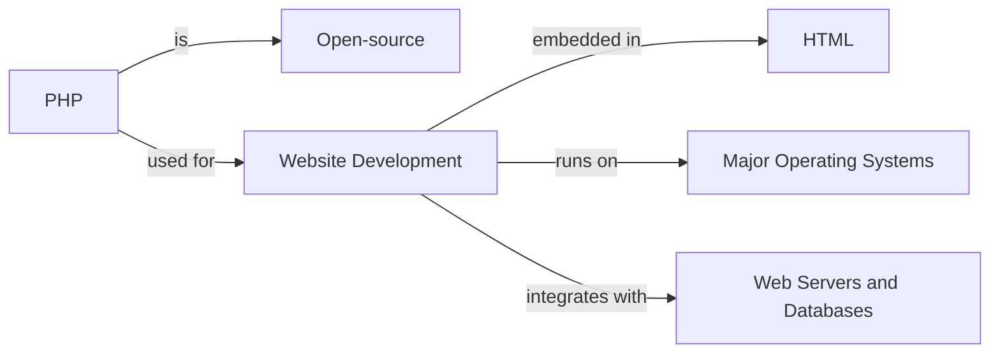

# PHP Tutorial

## What is PHP?

PHP is an open-source general-purpose scripting language widely used for website development. It is developed by Rasmus Lerdorf. PHP stands for a recursive acronym PHP: Hypertext Preprocessor.

PHP is the world’s most popular server-side programming language. Its latest version PHP 8.2.8 was released on July 4th, 2023.

PHP is a server-side scripting language embedded in HTML. It is cross-platform, capable of running on all major operating systems and most web server programs such as Apache, IIS, lighttpd, and nginx.

A large number of reusable classes and libraries are available on PEAR and Composer. PEAR (PHP Extension and Application Repository) is a distribution system for reusable PHP libraries or classes. Composer is a dependency management tool in PHP.

### Why Learn PHP?

PHP is one of the most preferred languages for creating interactive websites and web applications. PHP scripts can be easily embedded into HTML. With PHP, you can build:

- Web Pages and Web-Based Applications
- Content Management Systems
- E-commerce Applications, etc.

Several PHP-based web frameworks have been developed to speed up web application development. Examples include WordPress, Laravel, Symfony, etc.

### Advantages of Using PHP

PHP is a MUST for students and working professionals to become great Software Engineers, especially when they are working in the Web Development Domain.

Some notable advantages of using PHP are:

- Multi-paradigm language supporting imperative, functional, object-oriented, and procedural programming methodologies.
- Integrated with popular databases including MySQL, PostgreSQL, Oracle, Sybase, Informix, and Microsoft SQL Server.
- Zippy in execution, especially when compiled as an Apache module on the Unix side.
- Supports a number of protocols such as POP3, IMAP, and LDAP.
- Forgiving with a familiar C-like syntax.
- Practical nature characterized by Simplicity, Efficiency, Security, Flexibility, and Familiarity.

### Hello World Using PHP

```php
<?php
   echo "Hello, World!";
?>
```

### Audience

This PHP tutorial is designed for programmers completely unaware of PHP concepts but with a basic understanding of computer programming.

### Prerequisites

Before proceeding with this tutorial, you need a basic understanding of computer programming. Knowledge of HTML, CSS, JavaScript, and databases is an added advantage.

<details>
    <summary>Frequently Asked Questions about PHP</summary>

    1. Do I Need Prior Programming Experience to Learn PHP?
    2. Is PHP Free to Use?
    3. What are the Applications of PHP?
    4. How Do I Install PHP?
    5. What Tools and Technologies Work Well with PHP?
    6. Can PHP Be Used for Both Frontend and Backend Development?
    7. Are There Security Concerns with PHP?
    8. What Are the Latest Features and Updates in PHP?
    9. How Long Will it Take to Master PHP?
    10. What Resources Do I Need to Learn PHP?

</details>


