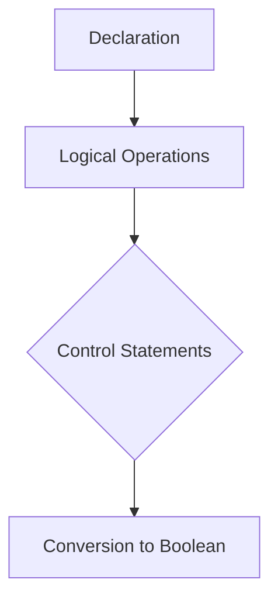

# PHP - Boolean

In PHP, a boolean (bool) is a built-in scalar data type used to express truth values, which can be either True or False. Boolean literals use the constants True or False, which are case-insensitive.

## Declaration and Usage

You can declare a boolean variable as follows:

```php
$a = true;
```

Logical operators like `<`, `>`, `==`, `!=`, etc., return boolean values.

Example:

```php
$gender = "Male";
var_dump($gender == "Male");
```

Output:

```
bool(true)
```

## Boolean Values in Control Statements

Boolean values are integral to control statements such as if, while, for, and foreach. The behavior of these statements depends on the true/false value returned by boolean expressions.

Example:

```php
$mark = 60;

if ($mark > 50) {
   echo "pass";
} else {
   echo "fail";
}
```

## Converting Values to Boolean

Use the `(bool)` casting operator to convert values to boolean. In a logical context, values are automatically interpreted as boolean.

- Non-zero numbers are considered true, except for 0 (+0.0 or -0.0) which is false.
- Non-empty strings are true, empty string "" is false.
- Non-empty arrays are true, empty array is false.

Example:

```php
$a = 10;
echo "$a: ";
var_dump((bool)$a);

$a = 0;
echo "$a: ";
var_dump((bool)$a);

$a = "Hello";
echo "$a: ";
var_dump((bool)$a);

$a = "";
echo "$a: ";
var_dump((bool)$a);

$a = array();
echo "$a: ";
var_dump((bool)$a);
```

Output:

```
10: bool(true)
0: bool(false)
Hello: bool(true)
: bool(false)
Array: bool(false)
```



This diagram illustrates the flow of boolean handling in PHP, from declaration to usage in control statements and conversion of values to boolean.
