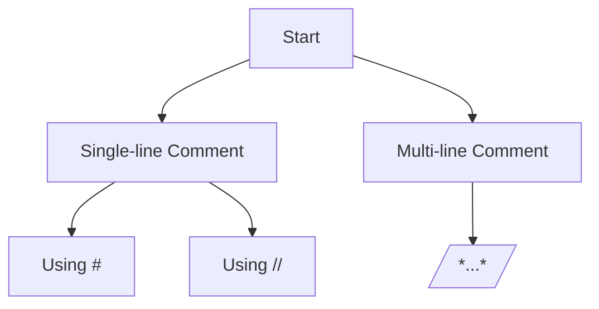

# PHP - Comments

## Introduction

A comment in any computer program (such as a PHP program) is explanatory text that is ignored by the language compiler/interpreter. Its purpose is to help the user understand the logic used in the program algorithm.

Although placing comments in the code is not essential, it is a highly recommended practice. The comments also serve as program documentation. Comments are also useful when the code needs to be debugged and modified.

## Types of Comments in PHP

There are two commenting formats in PHP:

- Single-line Comments
- Multi-line Comments

### Single-line Comments

Single-line comments are generally used for short explanations or notes relevant to the local code. PHP uses two notations for inserting a single-line comment in a program.

#### Single-line Comments Using "#"

A line in PHP code starting with the "#" symbol is treated as a single-line comment.

```php
<?php
   # Single line comment starting with # symbol
   echo 'Hello World';
?>
```

#### Single-line Comments Using "//"

PHP also supports C style of single-line comments with the "//" symbol. A line starting with the double oblique symbol is treated as a comment.

```php
<?php
   // Single line comment starting with // symbol
   echo 'Hello World';
?>
```

A comment that starts with the symbol "#" or "//" need not be closed. The effect of these symbols lasts till the end of the physical line.

### Multi-line Comments

Multi-line comments are generally used to provide pseudocode algorithms and more detailed explanations when necessary.

The multiline style of commenting is the same as in C. One or more lines embedded inside the "/*" and "*/" symbols are treated as a comment.

#### Example of Multi-line Comment in PHP

Here is the example of a multi-line comment.

```php
<?php

   /* This is a multiline comment example
   program to add two numbers
   Variables used - $x for first number, 
   $y for second number */
   
   $x=10;
   $y=20;
   print "Total = ". $x+$y;
?>
```

Note that you can put even a single line inside the "/* .. */" symbols. However, if there is a "/*" symbol in the program, it must have a closing end-of-comment marker "*/". If not, an error will be displayed as follows:

```
PHP Parse error:  Unterminated comment starting line 3 in /home/cg/root/65ded9eeb52fc/main.php on line 3
```

## PHP Comments Diagram



::: Note

Placing comments in your code is a good practice. It helps in understanding and maintaining the code, especially when debugging or modifying it later. Comments serve as a form of documentation for your program, making it easier for others (or yourself) to understand the logic behind the code.

:::

## Table of PHP Comment Types

| Comment Type        | Symbol(s)    | Example                           |
|---------------------|--------------|-----------------------------------|
| Single-line Comment | #            | `# This is a single-line comment` |
| Single-line Comment | //           | `// This is a single-line comment`|
| Multi-line Comment  | /* ... */    | `/* This is a multi-line comment */`|
