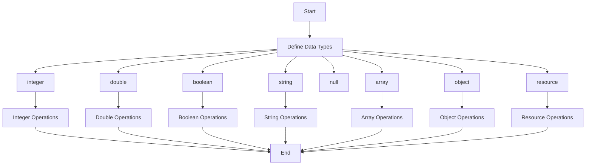

# PHP – Data Types

The term "data types" refers to the classification of data into distinct categories. PHP has a total of eight data types that we use to construct our variables:

1. **Integers**: Whole numbers, without a decimal point, like 4195.
2. **Doubles**: Floating-point numbers like 3.14159 or 49.1.
3. **Booleans**: Have only two possible values, either true or false.
4. **NULL**: Special type that only has one value: NULL.
5. **Strings**: Sequences of characters, like 'PHP supports string operations.'
6. **Arrays**: Named and indexed collections of other values.
7. **Objects**: Instances of programmer-defined classes, which can package up both other kinds of values and functions that are specific to the class.
8. **Resources**: Special variables that hold references to resources external to PHP (such as database connections).

The first five are simple types, and the next two (arrays and objects) are compound types. The compound types can package up other arbitrary values of arbitrary type, whereas the simple types cannot.

## Integer Data Type in PHP

A whole number without a decimal point (like 4195) is of int type in PHP. Integer data types correspond to simple whole numbers, both positive and negative. They can be represented in decimal, hexadecimal, octal, or binary notation.

To use octal notation, a number is preceded with "0o" or "0O". To use hexadecimal notation, precede the number with "0x". To use binary notation, precede the number with "0b".

Here are some examples:

| Notation             | Examples              |
|----------------------|-----------------------|
| Decimal Integer      | 201, 4195, -15        |
| Octal Integer        | 0010, 0O12, -0O21     |
| Hexadecimal Integer  | 0x10, -0x100          |
| Binary Integer       | 0b10101, -0b100       |

Integers can be assigned to variables or used in expressions.

## Double Data Type in PHP

Double variables represent floating point numbers (also known as "floats", "doubles", or "real numbers") with a fractional component. They can be positive, negative, or zero.

PHP also allows the use of scientific notation to represent floating-point numbers with more digits after the decimal point. The symbol "E" or "e" is used to separate the integer and fractional part.

Here are some examples:

| Notation           | Examples                    |
|---------------------|-----------------------------|
| Decimal             | 1.55, -123.0                |
| Scientific Notation | 1.2e3, 2.33e-4, 7E-10, 1.0E5|

By default, doubles print with the minimum number of decimal places needed.

## Boolean Data Type in PHP

The bool type in PHP has only two values: true or false. It is used to express a truth value.

You can also use the integer values "1" and "0" to represent True and False Boolean values. 

Here are some examples:

```php
$bool1 = true;
$bool2 = false;
$bool3 = 1;
$bool4 = 0;
```

Interpreting other data types as Booleans follows certain rules:

- If the value is a number, it is False only if the value is equal to zero, otherwise, the value is True.
- If the value is a string, it is False if the string is empty or is the string "0", and is True otherwise.
- Values of type NULL are always False.
- If the value is an array, it is False if it contains no other values; True otherwise.

Do not use double as Booleans.

## String Data Type in PHP

A string in PHP is a sequence of characters. PHP supports both single-quoted and double-quoted string formation. Double-quoted strings replace variables with their values and interpret certain character sequences.

Here are some examples:

```php
$string1 = "This is a string in double quotes";
$string2 = 'This is a somewhat longer, singly quoted string';
```

PHP also supports Heredoc and Nowdoc representations of string data type.

### Heredoc Representation

You can assign multiple lines to a single string variable using heredoc.

```php
$channel =<<<_XML_

   <channel>
      <title>What's For Dinner</title>
      <link>http://menu.example.com/ </link>
      <description>Choose what to eat tonight.</description>
   </channel>
_XML_;

echo <<< END
   This uses the "here document" syntax to output multiple lines with 
   variable interpolation. Note that the here document terminator must
   appear on a line with just a semicolon. no extra whitespace!
END;

print $channel;
```

### Nowdoc Representation

All the rules for heredoc identifiers also apply to nowdoc identifiers. A nowdoc is specified just like a heredoc, but there is no parsing inside a nowdoc. You can use the nowdoc construct for embedding large blocks of text without having to use any escape characters.

```php
echo <<<'IDENTIFIER'
   As the cat cleared its throat with a refined "Meow",
   the squirrel chirped excitedly about its latest
   discovery of a hidden stash of peanut treasure!
IDENTIFIER;
```

## Null Data Type in PHP

In PHP, null represents a special type that only has one value: NULL. Undefined and unset() variables will resolve to the value "null". Programmers use the Null data type in PHP to initialize variables or to indicate that a value is missing.

To give a variable the NULL value, simply assign it like this −

```php
$my_var = NULL;
```

The special constant NULL is capitalized by convention, but actually, it is case insensitive; you could just as well have typed −

```php
$my_var = null;
```

## Array Data Type in PHP

An array in PHP is an ordered map, where a key is associated with one or more values. PHP arrays can be defined using the array() function or with square brackets.

Here are some examples:

```php
$arr1 = array("foo" => "bar", "bar" => "foo");
$arr2 = ["foo" => "bar", "bar" => "foo"];
$arr3 = ["foo", "bar", "hello", "world"];
```

In a multi-dimensional array, each element in the main array can also be an array. Values in the multi-dimensional array are accessed using multiple indexes.

## Object Data Type in PHP

An object type is an instance of a programmer-defined class, which can package up both other kinds of values and functions that are specific to the class.

To create a new object, use the new statement to instantiate a class.

```php
class Foo {
   function bar() {
      echo "Hello World."; 
   }
}
$obj = new Foo;
$obj->bar();
```

## Resource Data Type in PHP

Resources are special variables that hold references to resources external to PHP (such as a file stream or database connections).

Here is an example of file resource −

```php
$fp = fopen("foo.txt", "w");
```

## Example: The gettype() Function

The gettype() function is helpful to find out the type of data stored in a variable.

```php
$x = 10;
echo gettype($x) . "\n";

$y = 10.55;
echo gettype($y) . "\n";

$z = [1,2,3,4,5];
echo gettype($z);
```

```
Output:
integer
double
array
```

The data types of variables in PHP are determined at runtime based on the values that are assigned to them.



This mermaid diagram outlines the flow of data types in PHP and their respective operations.
