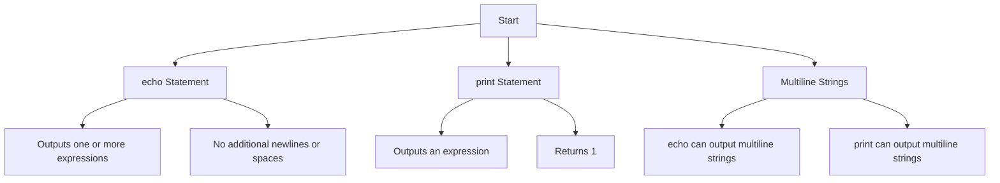

# PHP - Echo/Print

## Introduction

In PHP, both `echo` and `print` statements are used to render the output either on the browser or the PHP console. Both of them are not functions but language constructs. Hence, parentheses should not be used with either of them.

## The "echo" Statement in PHP

The `echo` statement is used with the following syntax:

```php
echo(string ...$expressions): void
```

The `echo` statement outputs one or more expressions, with no additional newlines or spaces.

### Example

Here is an example of how the `echo` statement works in PHP:

```php
<?php
   $name = "Rajesh";
   echo "Hello " . $name . " How are you?";
?>
```

It will produce the following output:

```
Hello Rajesh How are you?
```

Since a double-quoted string is similar to a single-quoted string in PHP, the following statement produces the same output:

```php
echo 'Hello ' . $name . ' How are you?';
```

### Example

A double-quoted string outputs the value of the variable. Hence, the following statement inserts the value of `$name` variable before printing the output.

```php
<?php
   $name = "Rajesh";
   echo "Hello $name How are you?";
?>
```

It will produce the following output:

```
Hello Rajesh How are you?
```

### Example

But, a single-quoted string will output `$name` as it is.

```php
<?php
   $name = "Rajesh";
   echo 'Hello $name How are you?';
?>
```

It will produce the following output:

```
Hello $name How are you?
```

A string passed to an `echo` statement can either be passed individually as multiple arguments or concatenated together and passed as a single argument. So, both the following statements are valid:

```php
echo 'Hello ', 'how ', 'are ', 'you?', "\n";
echo 'Hello ' . 'how ' . 'are ' . 'you?' . "\n";
```

### Example

Note that the output of the two successive `echo` statements will be rendered in the same line if the newline character is not used. Take a look at the following example:

```php
<?php
   echo "hello";
   echo "world";
?>
```

It will produce the following output:

```
helloworld
```

## The "print" Statement in PHP

The `print` statement is similar to `echo`, but it outputs an expression.

```php
print(string $expression): int
```

Like `echo`, `print` is also a language construct. Its argument is an expression but it is not put in parentheses.

The major difference is that the `print` statement in PHP accepts a single argument only and always returns 1.

### Example

Take a look at this following example:

```php
<?php
   $name = "Rajesh";

   print "Hello " . $name . " How are you?\n";
   print "Hello $name How are you?";
?>
```

It will produce the following output:

```
Hello Rajesh How are you?
Hello Rajesh How are you?
```

## Output Multiline Strings Using Print/Echo

Both `echo` and `print` statements can output multiline strings spanning over more than one line in the editor. Take a look at the following example:

```php
<?php
   print "
   Multi-line
   string can be output  
   by echo as well as 
   print statement in PHP
   ";  
?>
```

It will produce the following output:

```
Multi-line
string can be output
by echo as well as
print statement in PHP
```

The output will remain the same if we replace `print` with `echo`.

## PHP Echo/Print Diagram



:::note

Understanding the differences and similarities between `echo` and `print` helps in effectively rendering output in PHP. Both constructs are essential for displaying information in PHP scripts.

:::