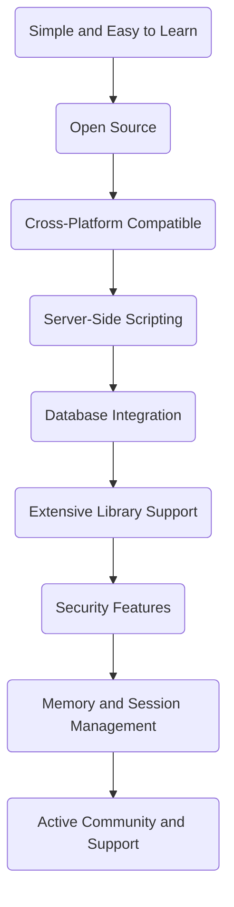

# PHP - Features

PHP (Hypertext Preprocessor) is an open-source server-side scripting language primarily used for web development. Let's explore some of its key features:

## PHP Features

### Simple and Easy to Learn

PHP has a syntax that's simpler compared to languages like C, Java, and Perl. This makes it easier for developers, especially those familiar with other languages, to understand and work with. It offers a wide range of pre-defined functions, enabling rapid web application development.

### Open Source

PHP is free and open-source, encouraging a large and active developer community. This community contributes to its development, offers support through forums and tutorials, and shares valuable resources like documentation.

### Cross-Platform Compatible

PHP is compatible with various operating systems (Windows, Linux, macOS, UNIX) and databases (MySQL, PostgreSQL, MongoDB). This cross-platform compatibility allows PHP-based applications to run seamlessly across different environments without modifications.

### Server-Side Scripting

PHP excels in server-side scripting, processing scripts on the web server and delivering HTML to the client's web browser. This facilitates dynamic webpage creation, session management, form handling, and database interactions essential for online applications.

### Database Integration

PHP offers robust support for database interaction, including built-in functions for database connectivity and a database abstraction layer for seamless application-database communication. This makes it easy to develop database-driven web applications.

### Extensive Library Support

PHP provides extensive libraries for various functionalities such as image processing, encryption, PDF generation, XML/JSON parsing, session management, and more. These libraries streamline development and enhance application capabilities.

### Security Features

PHP incorporates security features like data encryption functions (e.g., Sha1, MD5), input validation functions (e.g., filter_var), and secure communication protocols (HTTPS). Third-party security applications further enhance PHP's security capabilities.

### Memory and Session Management

PHP ensures efficient memory management and session handling, optimizing performance and resource utilization. Its code runs in its memory space, leading to faster execution compared to other scripting languages.

### Active Community and Support

With a vibrant developer community, PHP receives continuous updates, support, and contributions. Developers can easily seek help, share knowledge, and collaborate on projects, ensuring PHP remains modern, secure, and well-supported.

:::note
Explore the [PHP Manual](https://www.php.net/manual/en/) for detailed documentation and guides on PHP features.
:::

## PHP Features Diagram

