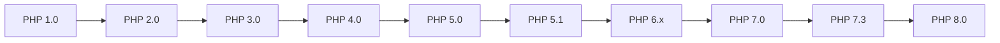

# PHP - History

PHP started as a small open-source project that gradually evolved as more people discovered its usefulness. Here's a brief overview of its history and major milestones:

## Early Days

Rasmus Lerdorf released the first version of PHP in 1994. Originally, PHP stood for "Personal Home Page" as it was used to maintain his personal homepage. Over time, database support was added, and it became known as "Personal Home Page/Forms Interpreter" or PHP/FI, capable of building dynamic web applications.

## PHP 3 and Beyond

In 1997, Zeev Suraski and Andi Gutmans rewrote the parser, laying the foundation for PHP 3. The language was renamed to PHP: Hypertext Preprocessor, reflecting its recursive nature. The Zend Engine, a compiler and runtime environment for PHP, powered PHP 4 released in May 2000.

## PHP 5

PHP 5, released in 2004, introduced significant features like Object-Oriented Programming (OOP) support, PHP Data Objects (PDO), and performance enhancements.

## PHP 7

PHP 7, developed in 2015, brought new language features including return type declarations and scalar types in parameter and return type declarations.

## PHP 8

PHP 8, the latest major version released in November 2020, introduced notable features such as Just-in-time (JIT) Compilation, the "match" expression, union types, mixed type, static return type, and attributes for adding metadata to PHP classes.

:::note
Explore the [PHP Manual](https://www.php.net/manual/en/) for detailed documentation and guides on PHP versions and features.
:::

## Major Version Timeline

Here's a summary of important milestones in PHP's release history:

| Version | Description |
| ------- | ----------- |
| 1.0     | (8 June 1995) Officially called "Personal Home Page Tools (PHP Tools)". |
| 2.0     | (1 November 1997) Officially called "PHP/FI 2.0". |
| 3.0     | (6 June 1998) Development expanded to multiple developers. |
| 4.0     | (22 May 2000) Introduced Zend Engine. |
| 5.0     | (13 July 2004) Zend Engine II with new features. |
| 5.1     | (24 November 2005) Performance improvements and PDO introduction. |
| 6.x     | Not released. Abandoned version with native Unicode support plan. |
| 7.0     | (3 December 2015) Zend Engine 3, new syntax, and features. |
| 7.3     | (6 December 2018) Flexible Heredoc/Nowdoc syntax. |
| 8.0     | (26 November 2020) JIT compilation, new operators, and types. |

