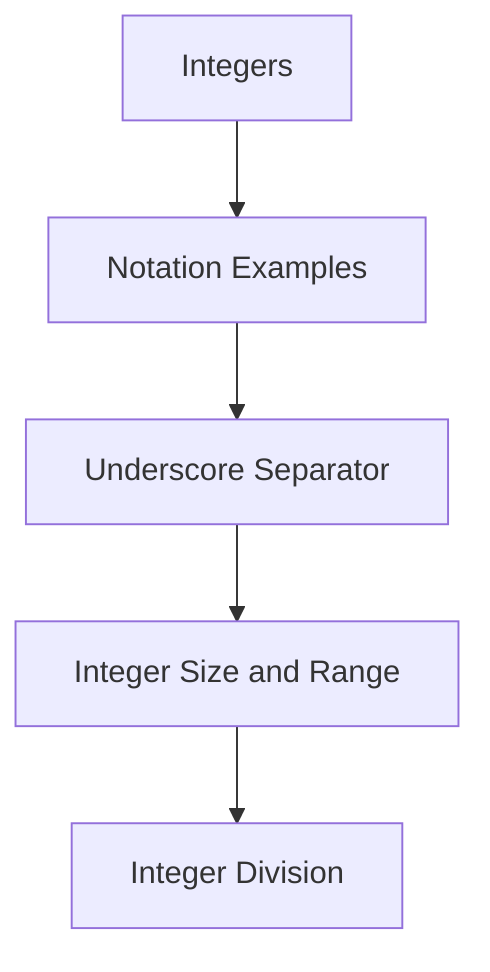

# PHP - Integers

In PHP, an integer (int) is a built-in scalar data type representing whole numbers without decimal points. Integers can be represented in decimal (base 10), hexadecimal (base 16), octal (base 8), or binary (base 2) notation.

## Integer Notation Examples

Example:

```php
$a = 1234;
echo "1234 is an Integer in decimal notation: $a\n";

$b = 0123; 
echo "0o123 is an integer in Octal notation: $b\n";

$c = 0x1A; 
echo "0xaA is an integer in Hexadecimal notation: $c\n";

$d = 0b1111;
echo "0b1111 is an integer in binary notation: $d";
```

Output:

```
1234 is an Integer in decimal notation: 1234
0o123 is an integer in Octal notation: 83
0xaA is an integer in Hexadecimal notation: 26
0b1111 is an integer in binary notation: 15
```

## Underscore Separator in Integer Literals

From PHP 7.4.0 onwards, integer literals may contain underscores (_) as separators between digits for better readability.

Example:

```php
$a = 1_234_567; 
echo "1_234_567 is an Integer with _ as separator: $a";
```

Output:

```
1_234_567 is an Integer with _ as separator: 1234567
```

## Integer Size and Range

PHP does not support unsigned integers. The size of an int is platform-dependent. On 32-bit systems, the maximum value is about two billion. 64-bit platforms usually have a maximum value of about 9E18.

Constants like PHP_INT_SIZE, PHP_INT_MAX, and PHP_INT_MIN provide information about integer size, maximum, and minimum values.

## Integer Division

PHP doesn't have a specific operator for integer division. Division between an integer and a float always results in a float. To obtain integral division, use `intval()` or `intdiv()`.

Example:

```php
$x = 10;
$y = 3.5;
$z = $x / $y;
var_dump($z);  // float(2.857142857142857)

$z = intdiv($x, $y);
var_dump($z);  // int(3)
```

## Mermaid Diagram



This diagram illustrates different aspects of integers in PHP, including notation examples, underscore separator usage, size and range, and integer division.
