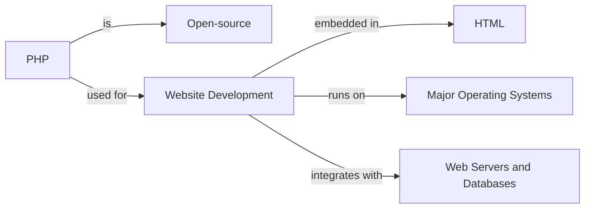

# PHP - Introduction

PHP started out as a small open-source project that evolved as more and more people found out how useful it was. Rasmus Lerdorf released the first version of PHP way back in 1994. Initially, PHP was supposed to be an abbreviation for "Personal Home Page", but it now stands for the recursive initialism "PHP: Hypertext Preprocessor".

Lerdorf began PHP development in 1993 by writing several Common Gateway Interface (CGI) programs in C, which he used to maintain in his personal homepage. Later on, He extended them to work with web forms and to communicate with databases. This implementation of PHP was "Personal Home Page/Forms Interpreter" or PHP/FI.

Today, PHP is the world’s most popular server-side programming language for building web applications. Over the years, it has gone through successive revisions and versions.

## PHP Versions

- **PHP 1.0:** Developed by Rasmus Lerdorf in 1994 as a simple set of CGI binaries written in C.
- **PHP 2.0 (PHP/FI):** Introduced in April 1996, included built-in support for DBM, mSQL, and Postgres95 databases, cookies, user-defined function support.
- **PHP 3.0:** Developed by Zeev Suraski and Andi Gutmans, provided a mature interface for multiple databases, protocols, APIs, object-oriented programming support, and consistent language syntax.
- **PHP 4.0:** Released in May 2000 powered by Zend Engine, had support for many web servers, HTTP sessions, output buffering, secure ways of handling user input, and several new language constructs.
- **PHP 5.0:** Released in July 2004, driven by Zend Engine 2.0 with a new object model and other new features.
- **PHP 7.0:** Released in Dec 2015 with improved performance, reduced memory usage, Return and Scalar Type Declarations, and Anonymous Classes.
- **PHP 8.0:** Released on 26 November 2020 with substantial improvements including Just-in-time compilation (JIT).

## PHP Application Areas

PHP is one of the most widely used languages over the web. Here are some of its application areas:

- Server-side scripting embedded in HTML.
- Managing dynamic content, databases, session tracking, building e-commerce sites.
- Outputting rich file types (images, PDF files), encrypting data, sending emails.
- Running on all major operating system platforms and web server programs.
- Handling system functions, forms, cookies, database operations, access control, encryption, and more.
- Providing a large number of reusable classes and libraries available on "PEAR" and "Composer".

