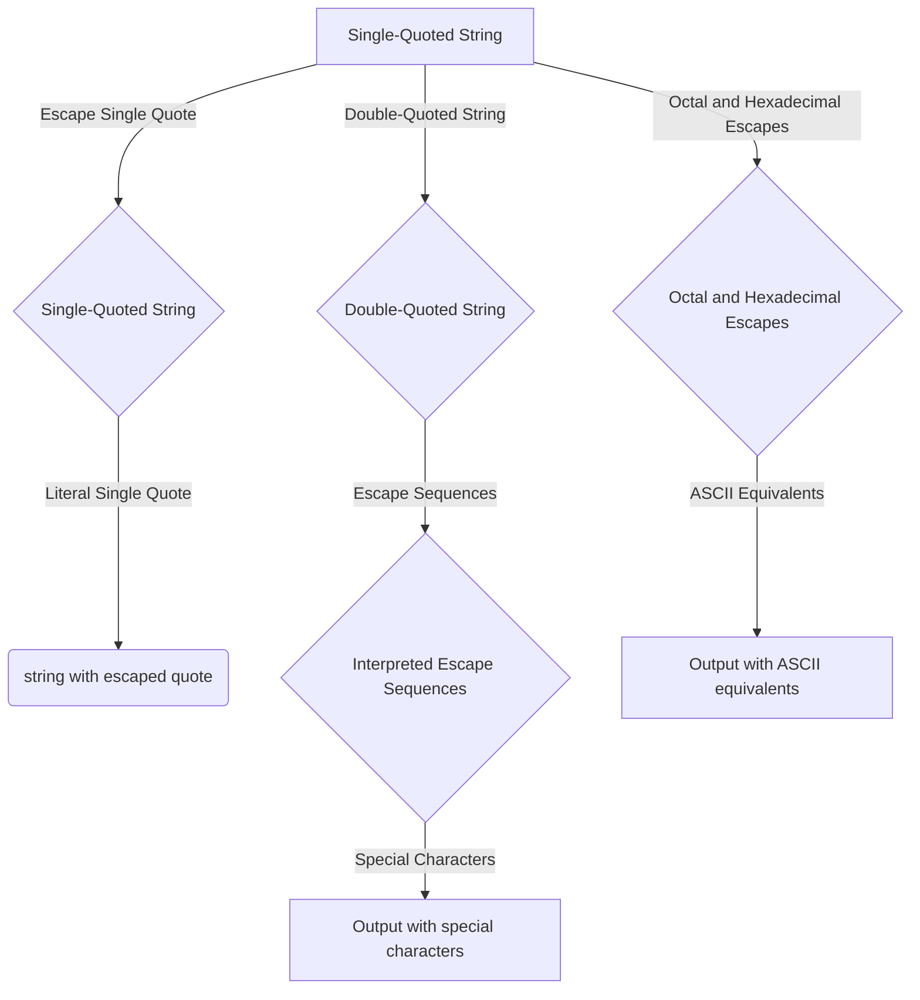

# PHP - Strings

A string in PHP is a sequence of characters, represented as either single-quoted or double-quoted strings. PHP treats strings as arrays of bytes, where each character is a byte. It's important to note that PHP does not offer native Unicode support and supports a 256-character set.

## Single-Quoted Strings

A single-quoted string is a sequence of characters enclosed in single quotes (').

Example:

```php
$str = 'this is a simple string';
```

To include a literal single quote in a single-quoted string, escape it with a backslash (\).

Example:

```php
$str = 'This is a \'simple\' string';
echo $str;
```

Output:

```
This is a 'simple' string
```

## Double-Quoted Strings

A double-quoted string is a sequence of characters enclosed in double quotes (").

Example:

```php
$str = "this is a simple string";
```

Double-quoted strings interpret certain escape sequences like "\r" and "\n" for special characters.

### Escape Sequences in Double-Quoted Strings

| Sequence | Meaning                  |
|----------|--------------------------|
| \n       | linefeed (LF)            |
| \r       | carriage return (CR)     |
| \t       | horizontal tab (HT)      |
| \v       | vertical tab (VT)        |
| \e       | escape (ESC)             |
| \f       | form feed (FF)           |
| \\       | backslash                |
| \$       | dollar sign              |
| \"       | double-quote             |

Example:

```php
$str = "Hello\nWorld!";
echo $str;
```

Output:

```
Hello
World!
```

## Octal and Hexadecimal Escapes

PHP supports escaping octal and hexadecimal characters to their ASCII equivalents using "\nnn" and "\xhh" respectively.

Example:

```php
$str = "\120\110\120";
echo "PHP with Octal: ". $str;

$str = "\x50\x48\x50";
echo "PHP with Hexadecimal: ". $str;
```

Output:

```
PHP with Octal: PHP
PHP with Hexadecimal: PHP
```

## String Concatenation and Special Characters

To concatenate strings in PHP, use the dot (.) operator.

Example:

```php
$string1 = "Hello World";
$string2 = "1234";

echo $string1 . " " . $string2;
```

Output:

```
Hello World 1234
```

## String Functions

PHP provides various string functions for string manipulation:

- `strlen()`: Returns the length of a string.
- `strpos()`: Searches for a string or character within a string.

For example:

```php
echo strlen("Hello world!"); // Outputs: 12
echo strpos("Hello world!", "world"); // Outputs: 6
```


