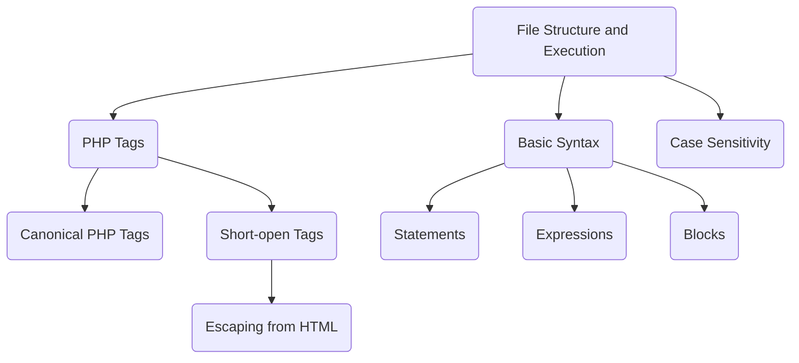

# PHP - Syntax

The syntax rules of PHP are similar to the C language. PHP is primarily a server-side scripting language used for web development. Let's dive into the details of PHP syntax.

## PHP Syntax Overview

### File Structure and Execution

A PHP code is typically stored in a text file with a ".php" extension. When opened in a browser with an HTTP protocol URL, the PHP code is executed by the server. PHP files may contain HTML, CSS, JavaScript, and PHP code blocks.

### PHP Tags

#### Canonical PHP Tags

The most universally effective PHP tag style is:

```php
<?php
   // One or more PHP statements
?>
```

Using this style ensures correct interpretation of PHP tags.

#### Short-open (SGML-style) Tags

Short tags look like this:

```php
<?php
   // One or more PHP statements
?>
```

To enable short tags, you must either configure PHP with "--enable-short-tags" or set "short_open_tag=on" in php.ini.

#### Escaping from HTML

PHP code can be embedded within HTML documents using PHP tags. For example:

```php
<p>This is a HTML statement</p>
<?php echo "This is a PHP statement."; ?>
<p>This is another HTML statement.</p>
```

PHP skips blocks outside PHP tags based on conditions, enhancing code readability and efficiency.

### Basic Syntax

#### Statements

PHP statements are expressions terminated by semicolons (;). For example:

```php
$greeting = "Welcome to PHP!";
```

#### Expressions

Expressions in PHP are combinations of tokens like numbers, strings, variables, constants, and keywords such as "if", "else", "while", "for", etc.

#### Blocks

Blocks of statements are enclosed in curly braces ({}) to create logical structures. For example:

```php
if (3 == 2 + 1) {
   echo "Good - I haven't totally";
   echo "lost my mind.";
}
```

### Case Sensitivity

PHP is case sensitive, meaning variable names, function names, and other identifiers must match case exactly.

:::note
PHP syntax is crucial for building dynamic and interactive web applications. Refer to the [PHP Manual](https://www.php.net/manual/en/language.basic-syntax.php) for detailed syntax rules and examples.
:::

## PHP Syntax Diagram

