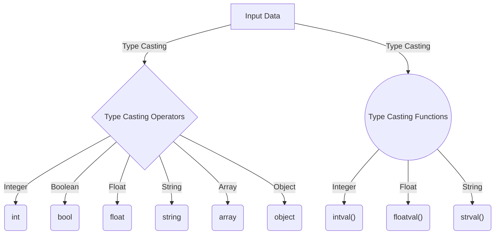

# PHP - Type Casting

The term "Type Casting" refers to the conversion of one type of data to another. Since PHP is a weakly typed language, the parser coerces certain data types into others while performing certain operations. For example, a string containing digits is converted to an integer if it is one of the operands involved in an addition operation.

## Implicit Type Casting

Here is an example of coercive or implicit type casting:

```php
<?php
$a = 10;
$b = '20';
$c = $a + $b;
echo "c = " . $c;
?>
```

In this case, $b is a string variable cast into an integer to enable addition. It will produce the following output:

```
c = 30
```

Let's take another example where an integer variable $a is converted to a string for concatenation with a string variable:

```php
<?php
$a = 10;
$b = '20';
$c = $a . $b;
echo "c = " . $c;
?>
```

It will produce the following output:

```
c = 1020
```

In addition to coercive type conversion, PHP provides ways to explicitly cast one type of data to another using type casting operators or functions.

## Type Casting Operators

To convert an expression of one type to another, you can use type casting operators. Here are some examples:

- `(int)` or `(integer)` casts to an integer.
- `(bool)` or `(boolean)` casts to a boolean.
- `(float)` or `(double)` or `(real)` casts to a float.
- `(string)` casts to a string.
- `(array)` casts to an array.
- `(object)` casts to an object.

### Casting to Integer

You can convert a float value to an integer using `(int)`:

```php
<?php
$a = 9.99;
$b = (int)$a;
var_dump($b);
?>
```

It will produce the following output:

```
int(9)
```

The float value is not rounded to the nearest integer; instead, it returns the integer part.

#### String to Integer Conversion

The `(int)` operator also converts a string to an integer. If the string contains only digits, the conversion is straightforward:

```php
<?php
$a = "99";
$b = (int)$a;
var_dump($b);
?>
```

Output:

```
int(99)
```

Even if the string contains a floating-point number, `(int)` returns just the integer part. However, if the string is alphanumeric, the conversion behaves differently:

- If the string starts with digits followed by non-numeric characters, only the initial digits are considered.
- If the string starts with non-numeric characters and digits are in the middle, the operator returns "0".

```php
<?php
$a = "10 Rs.";
$b = (int)$a;
var_dump($b);

$a = "$100";
$b = (int)$a;
var_dump($b);
?>
```

Output:

```
int(10)
int(0)
```

### Casting to Float Type

You can use `(float)` or `(double)` to explicitly convert to a float:

```php
<?php
$a = 100;
$b = (double)$a;
var_dump($b);
?>
```

Output:

```
float(100)
```

A string containing a valid numeric representation may also be cast to float using these operators.

#### Handling Scientific Notation

Strings with scientific notation can also be converted to float:

```php
<?php
$a = "1.23E01";
$b = (double)$a;
var_dump($b);

$a = "5.5E-5";
$b = (float)$a;
var_dump($b);
?>
```

Output:

```
float(12.3)
float(5.5E-5)
```

Non-numeric characters after the floating-point numbers are ignored. If the string starts with non-numeric characters, the conversion returns "0".

### Casting to String Type

You can cast expressions evaluating to floating-point or integer to string using `(string)`:

```php
<?php
$a = 100;
$b = (string)$a;
var_dump($b);

$x = 55.50;
$y = (string)$x;
var_dump($y);
?>
```

Output:

```
string(3) "100"
string(4) "55.5"
```

### Casting to Bool Type

Non-zero numbers (integer or float) cast to true with `(bool)`. A value of "0" returns false. Strings are always cast to true.

```php
<?php
$a = 100;
$b = (bool)$a;

$x = 0;
$y = (bool)$x;

$m = "Hello";
$n = (bool)$m;

var_dump($b);
var_dump($y);
var_dump($n);
?>
```

Output:

```
bool(true)
bool(false)
bool(true)
```

## Type Casting Functions

PHP includes built-in functions for type casting:

- `intval()`
- `floatval()`
- `strval()`

### The `intval()` Function

This function gets the integer value of a variable.

```php
<?php
echo intval(42) . PHP_EOL;
echo intval(4.2) . PHP_EOL;
echo intval('42') . PHP_EOL;

echo intval(042) . PHP_EOL;        // Octal number
echo intval('042', 0) . PHP_EOL;   // Octal number
echo intval('42', 8) . PHP_EOL;    // Octal

echo intval(0x1A) . PHP_EOL;       // Hexadecimal
echo intval('0x1A', 16) . PHP_EOL; // Hexadecimal
echo intval('0x1A', 0) . PHP_EOL;  // Hexadecimal

echo intval(false) . PHP_EOL;
echo intval(true) . PHP_EOL;
?>
```

Output:

```
42
4
42
34
34
34
26
26
26
0
1
```

### The `floatval()` Function

This function gets the float value of an expression.

```php
<?php
echo floatval(42) . PHP_EOL;
echo floatval(4.2) . PHP_EOL;
echo floatval('42') . PHP_EOL;

echo floatval('99.90 Rs') . PHP_EOL;
echo floatval('$100.50') . PHP_EOL;
echo floatval('ABC123!@#') . PHP_EOL;

echo (true) . PHP_EOL;
echo (false) . PHP_EOL;
?>
```

Output:

```
42
4.2
42
99.9
0
0
1
```

The `doubleval()` function is an alias of `floatval()` and returns similar results.

### The `strval()` Function

This function gets the string value of a variable.

```php
<?php
echo strval(42) . PHP_EOL;
echo strval(4.2) . PHP_EOL;
echo strval(4.2E5) . PHP_EOL;

echo strval(NULL) . PHP_EOL;

echo (true) . PHP_EOL;
echo (false) . PHP_EOL;
?>
```

Output:

```
42
4.2
420000

1
```

If the value being converted to a string is an object that implements the `__toString()` method, `strval()` uses that method.

```php
<?php
class myclass {
   public function __toString() {
      return __CLASS__;
   }
}
echo strval(new myclass);
?>
```

Output:

```
myclass
```

