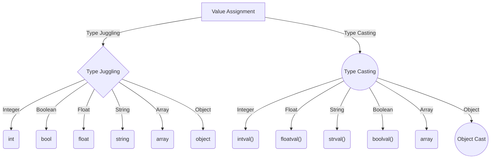

# PHP - Type Juggling

PHP is known as a dynamically typed language. The type of a variable in PHP changes dynamically based on the value assigned to it. This feature is called "type juggling" in PHP.

## Dynamic Typing in PHP

In languages like C, C++, and Java, you need to declare the variable and its type before using it. However, in PHP, explicit type declaration of a variable is neither needed nor supported. The type of a PHP variable is decided by the value assigned to it, and not the other way around.

Here's an example demonstrating type juggling in PHP:

```php
<?php
$var = "Hello";
echo "The variable \$var is of " . gettype($var) . " type\n";

$var = 10;
echo "The variable \$var is of " . gettype($var) . " type\n";

$var = true;
echo "The variable \$var is of " . gettype($var) . " type\n";

$var = [1, 2, 3, 4];
echo "The variable \$var is of " . gettype($var) . " type\n";
?>
```

Output:

```
The variable $var is of string type
The variable $var is of integer type
The variable $var is of boolean type
The variable $var is of array type
```

In this example, the type of "$var" changes dynamically as per the value assigned to it. This behavior is characteristic of type juggling in PHP.

## Type Juggling in Expressions

Type juggling also occurs during the evaluation of expressions. For instance, when a string variable containing digits is involved in an addition operation, it is automatically converted to an integer:

```php
<?php
$var1 = 100;
$var2 = "100";
$var3 = $var1 + $var2;
var_dump($var3);
?>
```

Output:

```
int(200)
```

## Handling Non-Numeric Strings

If a string starts with digits, trailing non-numeric characters are ignored during calculations. However, a notice is issued by the PHP parser:

```php
<?php
$var1 = 100;
$var2 = "100 days";
$var3 = $var1 + $var2;
var_dump($var3);
?>
```

Output:

```
int(200)

PHP Warning:  A non-numeric value encountered in /path/to/file.php on line X
```

## Type Casting vs Type Juggling

It's important to note the difference between "type casting" and "type juggling" in PHP.

- **Type Juggling**: PHP automatically converts types from one to another when necessary. For example, if an integer value is assigned to a variable, it becomes an integer.
- **Type Casting**: Type casting occurs when the user explicitly defines the data type in which they want to cast a variable.

Here's an example demonstrating type casting operators:

```php
<?php
$var1 = 100;
$var2 = (boolean)$var1;
$var3 = (string)$var1;
$var4 = (array)$var1;
$var5 = (object)$var1;
var_dump($var2, $var3, $var4, $var5);
?>
```

Output:

```
bool(true)
string(3) "100"
array(1) {
  [0]=>
  int(100)
}
object(stdClass)#1 (1) {
  ["scalar"]=>
  int(100)
}
```

Casting a variable to a string can also be done by enclosing it in double quotes:

```php
<?php
$var1 = 100.50;
$var2 = (string)$var1;
$var3 = "$var1";
var_dump($var2, $var3);
?>
```

Output:

```
string(5) "100.5"
string(5) "100.5"
```


