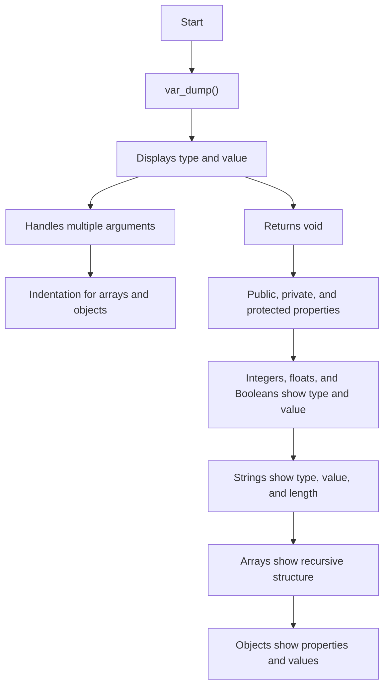

# PHP var_dump() Function

## Introduction

One of the built-in functions in PHP is the `var_dump()` function. This function displays structured information such as type and the value of one or more expressions given as arguments to this function.

```php
var_dump(mixed $value, mixed ...$values): void
```

This function returns all the public, private, and protected properties of the objects in the output. The dump information about arrays and objects is properly indented to show the recursive structure.

For the built-in integer, float, and Boolean variables, the `var_dump()` function shows the type and value of the argument variable.

## Examples

### Example 1: Integer Variable

For example, here is an integer variable:

```php
<?php
   $x = 10;  
   var_dump($x);
?>
```

The dump information is as follows:

```
int(10)
```

### Example 2: Float Variable

Let's see how it behaves for a float variable:

```php
<?php
   $x = 10.25;  
   var_dump($x);
?>
```

The `var_dump()` function returns the following output:

```
float(10.25)
```

### Example 3: Boolean Variable

If the expression is a Boolean value:

```php
<?php
   $x = true;  
   var_dump($x);
?>
```

It will produce the following output:

```
bool(true)
```

### Example 4: String Variable

For a string variable, the `var_dump()` function returns the length of the string also.

```php
<?php
   $x = "Hello World"; 
   var_dump($x);  
?>
```

It will produce the following output:

```
string(11) "Hello World"
```

Here we can use the `<pre>` HTML tag that displays preformatted text. Text in a `<pre>` element is displayed in a fixed-width font, and the text preserves both the spaces and the line breaks.

```php
<?php
   echo "<pre>";
   $x = "Hello World"; 
   var_dump($x);  
   echo "</pre>";
?>
```

It will produce the following output:

```
string(11) "Hello World"
```

### Example 5: Studying the Array Structure Using var_dump()

The `var_dump()` function is useful to study the array structure. In the following example, we have an array with one of the elements of the array being another array. In other words, we have a nested array situation.

```php
<?php
   $x = array("Hello", false, 99.99, array(10, 20, 30));
   var_dump($x);
?>
```

It will produce the following output:

```
array(4) {
  [0]=>
  string(5) "Hello"
  [1]=>
  bool(false)
  [2]=>
  float(99.99)
  [3]=>
  array(3) {
    [0]=>
    int(10)
    [1]=>
    int(20)
    [2]=>
    int(30)
  }
}
```

### Example 6: Associative Array

Since `$x` is an indexed array in the previous example, the index starting with `0` along with its value is dumped. In case the array is an associative array, the key-value pair information is dumped.

```php
<?php
   $x = array(
      "Hello", false, 99.99, 
      array(1 => 10, 2 => 20, 3 => 30)
   );
   var_dump($x);
?>
```

Here, you will get the following output:

```
array(4) {
  [0]=>
  string(5) "Hello"
  [1]=>
  bool(false)
  [2]=>
  float(99.99)
  [3]=>
  array(3) {
    [1]=>
    int(10)
    [2]=>
    int(20)
    [3]=>
    int(30)
  }
}
```

### Example 7: Object Properties

The `var_dump()` function can also reveal the properties of an object representing a class. In the following example, we have declared a `Point` class with two private properties `x` and `y`. The class constructor initializes the object `p` with the parameters passed to it.

The `var_dump()` function provides the information about the object properties and their corresponding values.

```php  
<?php  
   class Point {
      private int $x;
      private int $y;

      public function __construct(int $x, int $y = 0) {
         $this->x = $x;
         $this->y = $y;
      }
   }

   $p = new Point(4, 5);
   var_dump($p); 
?>
```

It will produce the following output:

```
object(Point)#1 (2) {
  ["x":"Point":private]=>
  int(4)
  ["y":"Point":private]=>
  int(5)
}
```

## Dumping All Defined Variables

There is a similar built-in function for producing dump in PHP, named `get_defined_vars()`.

```php
var_dump(get_defined_vars());
```

It will dump all the defined variables to the browser.

## Diagram



:::note

Understanding the `var_dump()` function helps in debugging and studying the structure of variables in PHP. It's an essential tool for PHP developers to inspect and debug their code.

:::