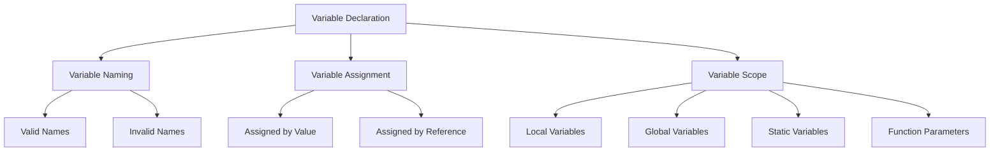

# PHP - Variables

## Introduction

A variable in PHP is a named memory location that holds data belonging to one of the data types. PHP uses the convention of prefixing a dollar sign (`$`) to the name of a variable. Variable names in PHP are case-sensitive and follow the same rules as other labels in PHP.

### Variable Naming

A valid variable name starts with a letter or underscore, followed by any number of letters, numbers, or underscores. Examples of valid variable names in PHP are:

- `$name`
- `$rate_of_int`
- `$Age`
- `$mark1`

Examples of invalid variable names are:

- `name` (not having `$` prefix)
- `$rate of int` (whitespace not allowed)
- `$Age#1` (invalid character `#`)
- `$11` (name not starting with alphabet)

### Variable Assignment

Variables are assigned with the `=` operator, with the variable on the left-hand side and the expression to be evaluated on the right.

## Dynamic Typing in PHP

PHP is a dynamically typed language, meaning there is no need to specify the type of a variable. The type of a variable is decided by the value assigned to it. The value of a variable is the value of its most recent assignment.

```php
<?php
   $x = 10;
   echo "Data type of x: " . gettype($x) . "\n";

   $x = 10.55;
   echo "Data type of x now: " . gettype($x) . "";
?>
```

It will produce the following output:

```
Data type of x: integer
Data type of x now: double
```

## Automatic Type Conversion

PHP does a good job of automatically converting types from one to another when necessary.

```php
<?php
   $x = 10;
   $y = "20";

   echo "x + y is: ", $x+$y;
?>
```

It will produce the following output:

```
x + y is: 30
```

## Variables Assignment

### Assigned by Value

In PHP, variables are always assigned by value. If an expression is assigned to a variable, the value of the original expression is copied into it. Changes to the original variable after assignment do not affect the copied value.

```php
<?php
   $x = 10;
   $y = 20;
   $z = $x + $y;
   echo "(before) z = ". $z . "\n";

   $y = 5;
   echo "(after) z = ". $z . "";
?>
```

It will produce the following output:

```
(before) z = 30
(after) z = 30
```

### Assigned by Reference

You can also assign values to PHP variables by reference. The new variable references or points to the original variable. Changes to the new variable affect the original and vice versa.

```php
<?php
   $x = 10;
   $y = &$x;
   $z = $x + $y;
   echo "x = ". $x . " y = " . $y . " z = ". $z . "\n";

   $y = 20;
   $z = $x + $y;
   echo "x = ". $x . " y = " . $y . " z = ". $z . "";
?>
```

It will produce the following output:

```
x = 10 y = 10 z = 20
x = 20 y = 20 z = 40
```

## Variable Scope

Scope defines the range of availability a variable has to the program in which it is declared. PHP variables can have one of four scope types:

- Local Variables
- Global Variables
- Static Variables
- Function Parameters

## Variable Naming Rules

- Variable names must begin with a letter or underscore character.
- A variable name can consist of numbers, letters, and underscores but cannot contain characters like `+`, `-`, `%`, `(`, `)`, `.` , `&`, etc.
- There is no size limit for variable names.

## PHP Variables Diagram



:::note

Understanding variable types, naming conventions, and scope is crucial for effective PHP programming. This knowledge helps in writing clear, maintainable, and bug-free code.
:::

## Table of PHP Variable Types

| Variable Type         | Description                                         |
|-----------------------|-----------------------------------------------------|
| Local Variables       | Declared inside a function, accessible only within that function |
| Global Variables      | Declared outside of any function, accessible globally |
| Static Variables      | Retain their value even after the function exits   |
| Function Parameters   | Variables passed to a function                     |
