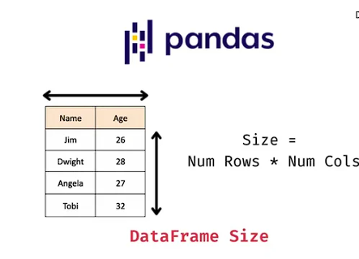

### What is a DataFrame?

A Pandas DataFrame is a 2-dimensional data structure, similar to a 2-dimensional array or a table with rows and columns.



Create a simple Pandas DataFrame:

```python
import pandas as pd

data = {
    "calories": [420, 380, 390],
    "duration": [50, 40, 45]
}

# Load data into a DataFrame object:
df = pd.DataFrame(data)

print(df) 
```

Result:

```
     calories  duration
0       420        50
1       380        40
2       390        45
```

Locate Row
As you can see from the result above, the DataFrame is like a table with rows and columns.

Pandas uses the `loc` attribute to return one or more specified row(s).

Example: Return row 0

```python
# Refer to the row index:
print(df.loc[0])
```

Result:

```
calories    420
duration     50
Name: 0, dtype: int64
```

Note: This example returns a Pandas Series.

Example: Return row 0 and 1

```python
# Use a list of indexes:
print(df.loc[[0, 1]])
```

Result:

```
     calories  duration
0       420        50
1       380        40
```

Note: When using `[]`, the result is a Pandas DataFrame.


Named Indexes
With the `index` argument, you can name your own indexes.

Example: Add a list of names to give each row a name

```python
import pandas as pd

data = {
    "calories": [420, 380, 390],
    "duration": [50, 40, 45]
}

df = pd.DataFrame(data, index = ["day1", "day2", "day3"])

print(df) 
```

Result:

```
             calories  duration
day1       420        50
day2       380        40
day3       390        45
```

Locate Named Indexes
Use the named index in the `loc` attribute to return the specified row(s).

Example: Return "day2"

```python
# Refer to the named index:
print(df.loc["day2"])
```

Result:

```
calories    380
duration     40
Name: day2, dtype: int64
```

Load Files Into a DataFrame
If your data sets are stored in a file, Pandas can load them into a DataFrame.

Example: Load a comma-separated file (CSV file) into a DataFrame

```python
import pandas as pd

df = pd.read_csv('data.csv')

print(df) 
```

