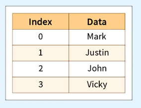

## What is a Series?
A Pandas Series is similar to a column in a table. It is a one-dimensional array that can hold data of any type.





## Example: Creating a Pandas Series
To create a simple Pandas Series from a list, you can use the following code:

```python
import pandas as pd

a = [1, 7, 2]

myvar = pd.Series(a)

print(myvar)
```

## Labels
By default, the values in a Pandas Series are labeled with their index numbers. The first value has index 0, the second value has index 1, and so on. You can use these labels to access specific values in the Series.

## Example: Accessing Values by Index
To return the first value of the Series, you can use the following code:

```python
print(myvar[0])
```

## Creating Custom Labels
You can also create your own labels for the values in a Pandas Series using the `index` argument.

## Example: Creating Custom Labels
To create your own labels for the values in a Series, you can use the following code:

```python
import pandas as pd

a = [1, 7, 2]

myvar = pd.Series(a, index=["x", "y", "z"])

print(myvar)
```

## Accessing Values by Label
Once you have created custom labels for the values in a Series, you can access specific values by referring to their labels.

## Example: Accessing Values by Label
To return the value associated with the label "y", you can use the following code:

```python
print(myvar["y"])
```

## Key/Value Objects as Series
You can also create a Pandas Series using a key/value object, such as a dictionary.

## Example: Creating a Series from a Dictionary
To create a simple Pandas Series from a dictionary, you can use the following code:

```python
import pandas as pd

calories = {"day1": 420, "day2": 380, "day3": 390}

myvar = pd.Series(calories)

print(myvar)
```

Note: The keys of the dictionary become the labels in the Series.

## Selecting Specific Items from a Dictionary
If you only want to include specific items from the dictionary in the Series, you can use the `index` argument to specify the desired items.

## Example: Selecting Specific Items from a Dictionary
To create a Series using only the data from "day1" and "day2" in the dictionary, you can use the following code:

```python
import pandas as pd

calories = {"day1": 420, "day2": 380, "day3": 390}

myvar = pd.Series(calories, index=["day1", "day2"])

print(myvar)
```

## DataFrames
In Pandas, data sets are usually represented as multi-dimensional tables called DataFrames. A Series is similar to a column, while a DataFrame represents the entire table.

## Example: Creating a DataFrame from Series
To create a DataFrame from two Series, you can use the following code:

```python
import pandas as pd

data = {
    "calories": [420, 380, 390],
    "duration": [50, 40, 45]
}

myvar = pd.DataFrame(data)

print(myvar)
```

**You will learn more about DataFrames in the next chapter.**
