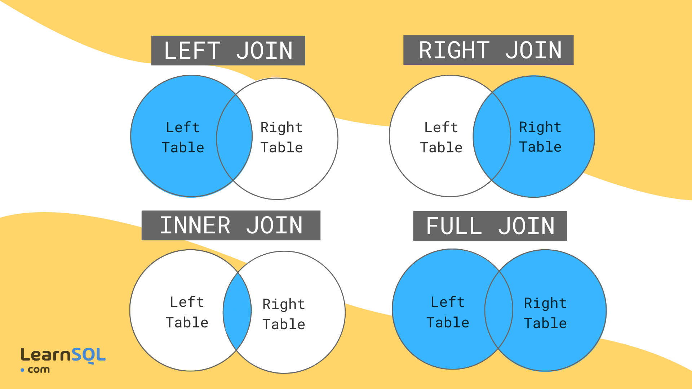

Understanding and effectively using SQL joins can be challenging for many users. This often leads to inefficient queries or incorrect data retrieval, causing frustration and hindering productivity.

### Syntax
```sql
SELECT columns
FROM table1
INNER JOIN table2
ON table1.common_column = table2.common_column;
```

## Advantages of SQL Aggregate Functions

**1. Readability and Simplicity**
The BETWEEN operator makes SQL queries more readable and easier to write. Instead of using multiple comparison operators, you can express a range condition concisely.

**2. Inclusive Range**
The BETWEEN operator is inclusive, meaning it includes both the start and end values of the range. This simplifies the logic when you want to include boundary values in your results.

**3. Versatility**
The BETWEEN operator works with different data types, including numbers, dates, and strings, making it a versatile tool for various use cases.

**4. Performance**
In many cases, using the BETWEEN operator can be more efficient than using multiple AND conditions. Database engines often optimize range queries, especially if indexes are in place.

### Types of Joins 
**1.Right Join**
A RIGHT JOIN returns all rows from the right table (table2) and the matched rows from the left table (table1). If no match is found, NULL values are returned for columns from the left table.


**2.Left Join**
A LEFT JOIN returns all rows from the left table (table1) and the matched rows from the right table (table2). If no match is found, NULL values are returned for columns from the right table.

**3.Inner Join**
An INNER JOIN returns rows that have matching values in both tables.
**4.Full Join**
A FULL JOIN returns all rows when there is a match in either table. If there is no match, the result is NULL on the side where there is no match.



### Conclusion
Joins are fundamental in SQL for combining data from multiple tables. Understanding the different types of joins and their use cases is essential for effective database querying and data manipulation.


