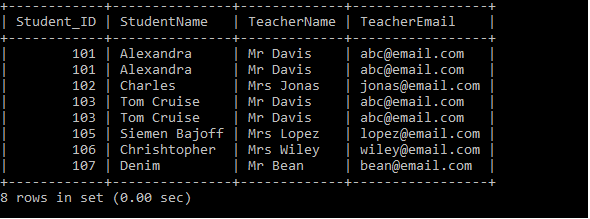

# Introduction to SQL WHERE Clause

The WHERE clause in SQL is used to filter records from a result set. It specifies the conditions that must be met for the rows to be included in the result. The WHERE clause is often used in SELECT, UPDATE, DELETE, and other SQL statements to narrow down the data returned or affected.

# Syntax 
`SELECT column1, column2, ...
FROM table_name
WHERE condition;`

# Operators Used in the Where Clause
1. `= : Equal`.
2. `> : Greater than`.	
3. `< : Less than`.
4. `>= : Greater than or equal`.	
5. `<= : Less than or equal`.
6. `<> : Not equal. Note: In some versions of SQL this operator may be written as !=`.
7. `BETWEEN : Between a certain range`.
8. `LIKE : Search for a pattern`.	
9. `IN : To specify multiple possible values for a column`.
# Advantage of SQL WHERE Clause

**1. Filtering Rows:** The WHERE clause evaluates each row in the table to determine if it meets the specified condition(s). Only rows that satisfy the condition are included in the result set.

**2. Conditions:** Conditions in the WHERE clause can use comparison operators like =, <> (not equal), >, <, >=, <=.
Logical operators such as AND, OR, and NOT can be used to combine multiple conditions.
**3. Pattern Matching:** The LIKE operator can be used for pattern matching. For example, LIKE 'A%' matches any string that starts with the letter 'A'.
**4. Range Checks:** The BETWEEN operator checks if a value is within a range of values. For example, BETWEEN 10 AND 20.
**5. Null Values:** The IS NULL and IS NOT NULL operators are used to filter records with null values.

# Example of Where Clause in SQL

Syntax: SELECT * from <Table_Name>;
Example : SELECT * from Students where marks >50;

**Where Clause use in Update Statement**
`UPDATE employees SET salary = salary * 1.10
WHERE performance_rating = 'Excellent';`

**Where Clause use in Delete Statement**
`DELETE FROM employees
WHERE last_login < '2023-01-01';`

**Where Clause use in Like Statement**
`SELECT * FROM customers
WHERE name LIKE 'J%';`

**Where Clause use in Between Statement**
`SELECT * FROM orders
WHERE order_date BETWEEN '2023-01-01' AND '2023-12-31';`

**Where Clause use in IS NULL Statement**

`SELECT * FROM employees
WHERE manager_id IS NULL;`

# Conclusion
The WHERE clause in SQL is a powerful tool for filtering data in various SQL statements. It allows you to specify conditions that rows must meet to be included in the result set, thereby enabling precise data retrieval and manipulation. By using comparison operators, logical operators, pattern matching, range checks, and handling null values, you can create complex queries tailored to your specific data requirements. Mastering the WHERE clause is essential for efficient database management and analysis, providing the ability to focus on relevant data and perform targeted updates and deletions.