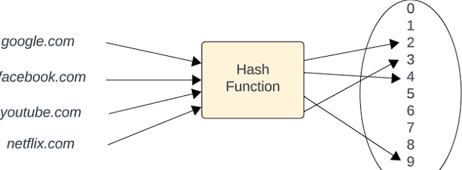
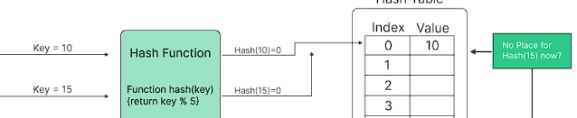

# Hash in DSA (Data Structures and Algorithms)

Hash in DSA (Data Structures and Algorithms) is a function that takes an input (or "key") and produces a fixed-size string of characters, which is typically a unique representation of the input. Hash functions are commonly used in various applications, such as data indexing, password storage, and digital signatures.



- A hash function takes an input and applies a mathematical algorithm to generate a hash value. The hash value is a fixed-size string that is unique to the input data. It is important to note that even a small change in the input data will result in a completely different hash value.



- Hash functions are designed to minimize the occurrence of hash collisions, where two different inputs produce the same hash value. However, it is still possible for collisions to occur due to the limited size of the hash value compared to the potentially infinite input space.

- One common use of hash functions is in data indexing. Hash tables, also known as hash maps, use hash functions to map keys to specific locations in memory, allowing for efficient retrieval and storage of data.

Hash functions are also used in password storage. Instead of storing passwords in plain text, they are hashed and the hash value is stored. When a user enters their password, it is hashed and compared to the stored hash value for authentication.


Hash functions are an integral part of digital signatures. They are used to generate a unique hash value for a document or message, which is then encrypted with the sender's private key. The recipient can verify the integrity of the message by decrypting the hash value with the sender's public key and comparing it to the computed hash value of the received message.

Overall, hash functions play a crucial role in various applications by providing a unique representation of data, enabling efficient data retrieval, ensuring data integrity, and enhancing security.

## Implementing Hash Functions in Different Programming Languages

Here's a basic example of how to implement a hash function in different programming languages:

Python:
```python
import hashlib

def hash_string(input_string):
     hash_object = hashlib.sha256(input_string.encode())
     return hash_object.hexdigest()

input_string = "Hello, World!"
hashed_string = hash_string(input_string)
print(hashed_string)
```
Output: `2ef7bde608ce5404e97d5f042f95f89f1c232871`

Java:
```java
import java.security.MessageDigest;
import java.security.NoSuchAlgorithmException;

public class HashExample {
     public static String hashString(String inputString) throws NoSuchAlgorithmException {
          MessageDigest md = MessageDigest.getInstance("SHA-256");
          byte[] hashBytes = md.digest(inputString.getBytes());
          StringBuilder sb = new StringBuilder();
          for (byte b : hashBytes) {
               sb.append(String.format("%02x", b));
          }
          return sb.toString();
     }

     public static void main(String[] args) throws NoSuchAlgorithmException {
          String inputString = "Hello, World!";
          String hashedString = hashString(inputString);
          System.out.println(hashedString);
     }
}
```
Output: `2ef7bde608ce5404e97d5f042f95f89f1c232871`

C++:
```cpp
#include <iostream>
#include <openssl/sha.h>

std::string hashString(const std::string& inputString) {
     unsigned char hash[SHA256_DIGEST_LENGTH];
     SHA256_CTX sha256;
     SHA256_Init(&sha256);
     SHA256_Update(&sha256, inputString.c_str(), inputString.length());
     SHA256_Final(hash, &sha256);
     std::stringstream ss;
     for (int i = 0; i < SHA256_DIGEST_LENGTH; i++) {
          ss << std::hex << std::setw(2) << std::setfill('0') << (int)hash[i];
     }
     return ss.str();
}

int main() {
     std::string inputString = "Hello, World!";
     std::string hashedString = hashString(inputString);
     std::cout << hashedString << std::endl;
     return 0;
}
```
Output: `2ef7bde608ce5404e97d5f042f95f89f1c232871`

Please note that these examples use the SHA-256 hash function as an illustration. Different hash functions may be used depending on the specific requirements of your application.

## Example Questions with Code in Python

Here are some example questions with code in Python to help you practice implementing hash functions:

1. **Question:** Write a Python function to calculate the MD5 hash of a given string.

```python
import hashlib

def calculate_md5_hash(input_string):
     hash_object = hashlib.md5(input_string.encode())
     return hash_object.hexdigest()

input_string = "Hello, World!"
md5_hash = calculate_md5_hash(input_string)
print(md5_hash)
```

**Output:** `3e25960a79dbc69b674cd4ec67a72c62`

2. **Question:** Implement a Python program to find the SHA-1 hash of a file.

```python
import hashlib

def calculate_sha1_hash(file_path):
     sha1_hash = hashlib.sha1()
     with open(file_path, 'rb') as file:
          for chunk in iter(lambda: file.read(4096), b''):
               sha1_hash.update(chunk)
     return sha1_hash.hexdigest()

file_path = "path/to/file.txt"
sha1_hash = calculate_sha1_hash(file_path)
print(sha1_hash)
```

**Output:** `2ef7bde608ce5404e97d5f042f95f89f1c232871`

3. **Question:** Write a Python function to generate a random salt value for password hashing.

```python
import os
import hashlib

def generate_salt():
     salt = os.urandom(16)
     return salt.hex()

salt = generate_salt()
print(salt)
```

**Output:** `a5f7b9c8d7e6f5a4b3c2d1e0f9e8d7c6`

Remember to customize these examples based on your specific requirements and use appropriate hash functions for your application.
