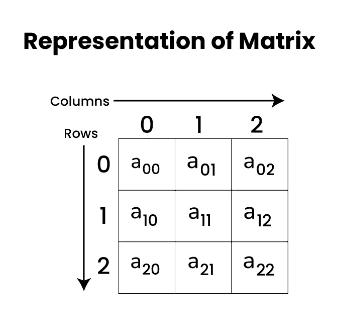

**Matrix Data Structure** is a two-dimensional array arranged in rows and columns. It is commonly used to represent mathematical matrices and is fundamental in various fields like mathematics, computer graphics, and data processing. Matrices allow for efficient storage and manipulation of data in a structured format

## Components of Matrix Data Structure
- Size: A matrix has a specific size, defined by its number of rows and columns.
- Element: A matrix’s row and column indices serve to identify each entry, which is referred to as an element.
- Operations: Scalar multiplication and the operations of addition, subtraction, and multiplication on matrices are also supported.
- Determinant: A square matrix’s determinant is a scalar number that may be used to solve systems of linear equations and carry out other linear algebraic operations.
- Inverse: If a square matrix has an inverse, it may be used to solve linear equation systems and carry out other linear algebraic operations.
- Transpose: By flipping a matrix along its main diagonal and switching the rows and columns, you may create the transpose of the matrix.
- Rank: In many applications, including the solution of linear equations and linear regression analysis, the rank of a matrix—a measure of its linearly independent rows or columns—is utilized

## Applications of Matrix Data Structure
- Linear Algebra: Matrices are widely used in linear algebra, a branch of mathematics that deals with linear equations, vector spaces, and linear transformations. Matrices are used to represent linear equations and to solve systems of linear equations.
- Optimization: Matrices are used in optimization problems, such as linear programming, to represent the constraints and objective functions of the problem.
- Statistics: Matrices are used in statistics to represent data and to perform operations such as correlation and regression.
- Signal Processing: Matrices are used in signal processing to represent signals and to perform operations such as filtering and transformation.
- Network Analysis: Matrices are used in network analysis to represent graphs and to perform operations such as finding the shortest path between two nodes.
- Quantum Mechanics: Matrices are used in quantum mechanics to represent states and operations in quantum systems.


## Representation of Matrix Data Structure:



As you can see from the above image, the elements are organized in rows and columns. As shown in the above image the cell x[0][0] is the first element of the first row and first column. The value in the first square bracket represents the row number and the value inside the second square bracket represents the column number. (i.e, x[row][column]).

## Declaration of Matrix Data Structure :

Declaration of a Matrix or two-dimensional array is very much similar to that of a one-dimensional array, given as follows.
``` python
# Defining number of rows and columns in matrix
number_of_rows = 3
number_of_columns = 3
# Declaring a matrix of size 3 X 3, and initializing it with value zero
rows, cols = (3, 3)
arr = [[0]*cols]*rows
print(arr)
```

## Initializing Matrix Data Structure:
In initialization, we assign some initial value to all the cells of the matrix. Below is the implementation to initialize a matrix in different languages:

``` python
# Initializing a 2-D array with values
arr = [[1, 2, 3], [4, 5, 6], [7, 8, 9]];
```

## Operations on Matrix Data Structure:

We can perform a variety of operations on the Matrix Data Structure. Some of the most common operations are:

- Access elements of Matrix
- Traversal of a Matrix
- Searching in a Matrix
- Sorting a Matrix

## 1. Access elements of Matrix Data Structure:

Like one-dimensional arrays, matrices can be accessed randomly by using their indices to access the individual elements. A cell has two indices, one for its row number, and the other for its column number. We can use arr[i][j] to access the element which is at the ith row and jth column of the matrix.

```python
# Initializing a 2-D array with values
arr = [[1, 2, 3], [4, 5, 6], [7, 8, 9]]

# Accessing elements of 2-D array
print("First element of first row:", arr[0][0])
print("Third element of second row:", arr[1][2])
print("Second element of third row:", arr[2][1])
```

## 2. Traversal of a Matrix Data Structure:
We can traverse all the elements of a matrix or two-dimensional array by using two for-loops.

``` python
arr = [[1, 2, 3, 4], [5, 6, 7, 8], [9, 10, 11, 12]]
```
```python
# Traversing over all the rows
for i in range(0, 3):
    # Traversing over all the columns of each row
    for j in range(0, 4):
        print(arr[i][j], end=" ")
    print("")
```

Output
``` python
1 2 3 4 
5 6 7 8 
9 10 11 12 
```
## 3. Searching in a Matrix Data Structure:

We can search an element in a matrix by traversing all the elements of the matrix.

Below is the implementation to search an element in a matrix:

```python
# Python code for above approach
def searchInMatrix(arr, x):
    # m=4,n=5
    for i in range(0, 4):
        for j in range(0, 5):
            if(arr[i][j] == x):
                return 1
    return

x = 8
arr = [[0, 6, 8, 9, 11],
       [20, 22, 28, 29, 31],
       [36, 38, 50, 61, 63],
       [64, 66, 100, 122, 128]]
if(searchInMatrix(arr, x)):
    print("YES")
else:
    print("NO")

    # This code is contributed by dhairyagothi.
```

Output
```python
YES
```

## 4. Sorting Matrix Data Structure:
We can sort a matrix in two-ways:

- Sort the matrix row-wise
- Sort the matrix column-wise

## Advantages of Matrix Data Structure:
- It helps in 2D Visualization.
- It stores multiple elements of the same type using the same name.
- It enables access to items at random.
- Any form of data with a fixed size can be stored.
- It is easy to implement.

## Disadvantages of Matrix Data Structure:
- Space inefficient when we need to store very few elements in the matrix.
- The matrix size should be needed beforehand.
- Insertion and deletion operations are costly if shifting occurs.
- Resizing a matrix is time-consuming.
