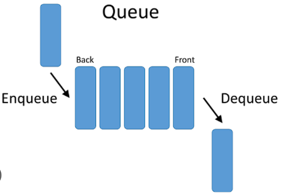

### Introduction to Queue

A queue is a linear data structure that follows the First In First Out (FIFO) principle. This means that the first element added to the queue will be the first one to be removed. Queues are used in various applications such as process scheduling, breadth-first search, and more.



### Queue Operations

1. **Enqueue**: Add an element to the end of the queue.
2. **Dequeue**: Remove the element from the front of the queue.
3. **Peek**: Retrieve the element from the front of the queue without removing it.
4. **isEmpty**: Check if the queue is empty.
5. **Size**: Get the number of elements in the queue.

### Pseudocode

#### Basic Operations

1. **Enqueue**:

    ```text
    function enqueue(queue, element):
         queue.append(element)
    ```

2. **Dequeue**:

    ```text
    function dequeue(queue):
         if isEmpty(queue):
              return "Queue Underflow"
         return queue.pop(0)
    ```

3. **Peek**:

    ```text
    function peek(queue):
         if isEmpty(queue):
              return "Queue is empty"
         return queue[0]
    ```

4. **isEmpty**:

    ```text
    function isEmpty(queue):
         return len(queue) == 0
    ```

5. **Size**:
    ```text
    function size(queue):
         return len(queue)
    ```

### Implementation in Python, C++, and Java

#### Python Implementation

```python
class Queue:
     def __init__(self):
          self.elements = []

     def enqueue(self, element):
          self.elements.append(element)

     def dequeue(self):
          if self.is_empty():
                return "Queue Underflow"
          return self.elements.pop(0)

     def peek(self):
          if self.is_empty():
                return "Queue is empty"
          return self.elements[0]

     def is_empty(self):
          return len(self.elements) == 0

     def size(self):
          return len(self.elements)

# Example usage
queue = Queue()
queue.enqueue(10)
queue.enqueue(20)
print(queue.dequeue())    # Output: 10
print(queue.peek())   # Output: 20
print(queue.is_empty())  # Output: False
print(queue.size())   # Output: 1
```

#### C++ Implementation

```cpp
#include <iostream>
#include <vector>

class Queue {
private:
     std::vector<int> elements;

public:
     void enqueue(int element) {
          elements.push_back(element);
     }

     int dequeue() {
          if (is_empty()) {
                std::cerr << "Queue Underflow" << std::endl;
                return -1;
          }
          int front = elements.front();
          elements.erase(elements.begin());
          return front;
     }

     int peek() {
          if (is_empty()) {
                std::cerr << "Queue is empty" << std::endl;
                return -1;
          }
          return elements.front();
     }

     bool is_empty() {
          return elements.empty();
     }

     int size() {
          return elements.size();
     }
};

// Example usage
int main() {
     Queue queue;
     queue.enqueue(10);
     queue.enqueue(20);
     std::cout << queue.dequeue() << std::endl;    // Output: 10
     std::cout << queue.peek() << std::endl;   // Output: 20
     std::cout << std::boolalpha << queue.is_empty() << std::endl;  // Output: false
     std::cout << queue.size() << std::endl;   // Output: 1
     return 0;
}
```

#### Java Implementation

```java
import java.util.ArrayList;

public class Queue {
     private ArrayList<Integer> elements;

     public Queue() {
          elements = new ArrayList<>();
     }

     public void enqueue(int element) {
          elements.add(element);
     }

     public int dequeue() {
          if (is_empty()) {
                System.out.println("Queue Underflow");
                return -1;
          }
          return elements.remove(0);
     }

     public int peek() {
          if (is_empty()) {
                System.out.println("Queue is empty");
                return -1;
          }
          return elements.get(0);
     }

     public boolean is_empty() {
          return elements.isEmpty();
     }

     public int size() {
          return elements.size();
     }

     // Example usage
     public static void main(String[] args) {
          Queue queue = new Queue();
          queue.enqueue(10);
          queue.enqueue(20);
          System.out.println(queue.dequeue());    // Output: 10
          System.out.println(queue.peek());   // Output: 20
          System.out.println(queue.is_empty());  // Output: false
          System.out.println(queue.size());   // Output: 1
     }
}
```

### Complexity

- **Time Complexity**:

  - Enqueue: $O(1)$
  - Dequeue: $O(1)$
  - Peek: $O(1)$
  - isEmpty: $O(1)$
  - Size: $O(1)$

- **Space Complexity**: $O(n)$, where $n$ is the number of elements in the queue.

### Example

Consider a queue with the following operations:

1. Enqueue 10
2. Enqueue 20
3. Dequeue
4. Peek
5. Check if empty
6. Get size

**Operations**:

- Enqueue 10: Queue becomes [10]
- Enqueue 20: Queue becomes [10, 20]
- Dequeue: Removes 10, Queue becomes [20]
- Peek: Returns 20, Queue remains [20]
- isEmpty: Returns false
- Size: Returns 1

### Conclusion

A queue is a fundamental data structure used in computer science for various applications where the FIFO (First In First Out) principle is required. It is simple to implement and provides efficient operations for adding and removing elements. Understanding and using queues effectively can help solve many algorithmic problems.

