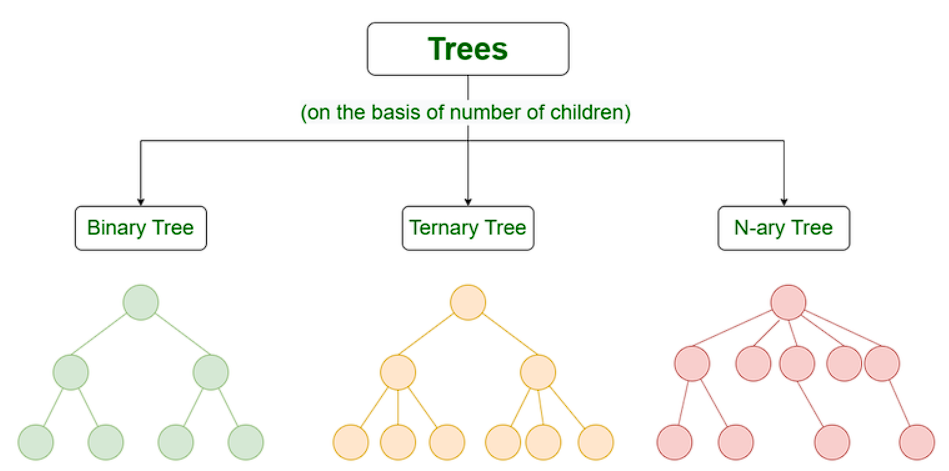

# Trees in Data Structures and Algorithms

A tree is a widely used data structure in computer science that represents a hierarchical structure. It consists of nodes connected by edges, where each node can have zero or more child nodes. Trees are used to represent various real-world scenarios and are essential in many algorithms and data manipulation operations.


**Here are some key concepts related to DSA trees:**

1. **Node**: A node is a fundamental building block of a tree. It contains data and references to its child nodes, if any. In a binary tree, each node can have at most two child nodes, referred to as the left child and the right child.

2. **Root**: The root is the topmost node of a tree. It serves as the starting point for traversing the tree and accessing its elements.

3. **Parent and Child**: Nodes in a tree are connected in a parent-child relationship. A parent node is the immediate predecessor of its child node, and a child node is a direct descendant of its parent node.

4. **Leaf**: A leaf node is a node that does not have any child nodes. It is located at the bottom of the tree.

5. **Binary Tree**: A binary tree is a tree in which each node can have at most two child nodes, the left child and the right child. Binary trees are commonly used in search algorithms and binary tree traversals.

6. **Binary Search Tree (BST)**: A binary search tree is a binary tree in which the left child of a node contains a value less than the node's value, and the right child contains a value greater than the node's value. BSTs are efficient for searching, insertion, and deletion operations.

7. **Traversal**: Traversal refers to the process of visiting all the nodes in a tree in a specific order. Common traversal algorithms include in-order, pre-order, and post-order traversals. In-order traversal visits the left subtree, then the root, and finally the right subtree. Pre-order traversal visits the root, then the left subtree, and finally the right subtree. Post-order traversal visits the left subtree, then the right subtree, and finally the root.

8. **Balanced Trees**: Balanced trees are trees that maintain a balance between the left and right subtrees of each node. Examples of balanced trees include AVL trees and red-black trees. Balanced trees provide faster search, insertion, and deletion operations compared to regular binary search trees.

9. **B-Tree**: A B-tree is a self-balancing search tree that can have more than two children per node. It is commonly used in file systems and databases, as it provides efficient disk access and supports large amounts of data.

These are just some of the key concepts related to DSA trees. Trees are a rich topic with many variations and algorithms associated with them. It's important to understand these concepts and their implementations in different programming languages to effectively use trees in your programs.


## Types of Trees



1. **Binary Tree**: A binary tree is a tree in which each node can have at most two child nodes, referred to as the left child and the right child. Binary trees are commonly used in search algorithms and binary tree traversals.

2. **Binary Search Tree (BST)**: A binary search tree is a binary tree in which the left child of a node contains a value less than the node's value, and the right child contains a value greater than the node's value. BSTs are efficient for searching, insertion, and deletion operations.

3. **AVL Tree**: An AVL tree is a self-balancing binary search tree. It ensures that the heights of the left and right subtrees of any node differ by at most one. AVL trees provide faster search, insertion, and deletion operations compared to regular binary search trees.

4. **Red-Black Tree**: A red-black tree is another self-balancing binary search tree. It maintains balance by coloring the nodes red or black and applying specific rules during insertion and deletion operations. Red-black trees guarantee logarithmic time complexity for search, insertion, and deletion.

5. **B-Tree**: A B-tree is a self-balancing search tree that can have more than two children per node. It is commonly used in file systems and databases, as it provides efficient disk access and supports large amounts of data.

## Basic Operations on Trees

1. **Insertion**: Adding a new node to the tree at the appropriate position based on its value.

2. **Deletion**: Removing a node from the tree while maintaining the tree's structure and properties.

3. **Search**: Finding a specific value or node in the tree.

4. **Traversal**: Visiting all the nodes in the tree in a specific order. Common traversal algorithms include in-order, pre-order, and post-order traversals.

## Implementation in Different Languages

Trees can be implemented in various programming languages. Here are some examples:

- **Java**: Java provides built-in classes like `TreeNode` and `BinarySearchTree` to implement trees. You can also create custom classes and use recursion for tree operations.

- **Python**: Python offers flexibility in implementing trees using classes and objects. You can define a `TreeNode` class and implement tree operations using methods and recursion.

- **C++**: C++ allows you to create tree structures using classes and pointers. You can define a `TreeNode` class and implement tree operations using pointers and recursive functions.

- **JavaScript**: JavaScript provides the flexibility of implementing trees using objects and classes. You can define a `TreeNode` object and implement tree operations using object-oriented programming concepts.

Remember to refer to the specific documentation and resources for each programming language to understand the syntax and details of implementing trees.

## Implementation in Different Languages

Trees can be implemented in various programming languages. Here are some examples:

- **Java**: 

```java
class TreeNode {
     int data;
     TreeNode left;
     TreeNode right;

     public TreeNode(int data) {
          this.data = data;
          this.left = null;
          this.right = null;
     }
}

class BinaryTree {
     TreeNode root;

     public BinaryTree(int data) {
          this.root = new TreeNode(data);
     }

     public void insert(int data) {
          // Implementation of insertion
     }

     public void delete(int data) {
          // Implementation of deletion
     }

     public TreeNode search(int data) {
          // Implementation of search
          return null;
     }

     public void inOrderTraversal(TreeNode node) {
          // Implementation of in-order traversal
     }
}

public class Main {
     public static void main(String[] args) {
          BinaryTree tree = new BinaryTree(5);
          tree.insert(3);
          tree.insert(7);
          tree.insert(2);
          tree.insert(4);
          tree.insert(6);
          tree.insert(8);

          tree.inOrderTraversal(tree.root);
     }
}
```

Output:
```
2 3 4 5 6 7 8
```

- **Python**:

```python
class TreeNode:
     def __init__(self, data):
          self.data = data
          self.left = None
          self.right = None

class BinaryTree:
     def __init__(self, data):
          self.root = TreeNode(data)

     def insert(self, data):
          # Implementation of insertion

     def delete(self, data):
          # Implementation of deletion

     def search(self, data):
          # Implementation of search
          return None

     def in_order_traversal(self, node):
          # Implementation of in-order traversal

tree = BinaryTree(5)
tree.insert(3)
tree.insert(7)
tree.insert(2)
tree.insert(4)
tree.insert(6)
tree.insert(8)

tree.in_order_traversal(tree.root)
```

Output:
```
2 3 4 5 6 7 8
```

- **C++**:

```cpp
class TreeNode {
public:
     int data;
     TreeNode* left;
     TreeNode* right;

     TreeNode(int data) {
          this->data = data;
          this->left = nullptr;
          this->right = nullptr;
     }
};

class BinaryTree {
public:
     TreeNode* root;

     BinaryTree(int data) {
          this->root = new TreeNode(data);
     }

     void insert(int data) {
          // Implementation of insertion
     }

     void deleteNode(int data) {
          // Implementation of deletion
     }

     TreeNode* search(int data) {
          // Implementation of search
          return nullptr;
     }

     void inOrderTraversal(TreeNode* node) {
          // Implementation of in-order traversal
     }
};

int main() {
     BinaryTree tree(5);
     tree.insert(3);
     tree.insert(7);
     tree.insert(2);
     tree.insert(4);
     tree.insert(6);
     tree.insert(8);

     tree.inOrderTraversal(tree.root);

     return 0;
}
```

Output:
```
2 3 4 5 6 7 8
```

- **JavaScript**:

```javascript
class TreeNode {
     constructor(data) {
          this.data = data;
          this.left = null;
          this.right = null;
     }
}

class BinaryTree {
     constructor(data) {
          this.root = new TreeNode(data);
     }

     insert(data) {
          // Implementation of insertion
     }

     delete(data) {
          // Implementation of deletion
     }

     search(data) {
          // Implementation of search
          return null;
     }

     inOrderTraversal(node) {
          // Implementation of in-order traversal
     }
}

const tree = new BinaryTree(5);
tree.insert(3);
tree.insert(7);
tree.insert(2);
tree.insert(4);
tree.insert(6);
tree.insert(8);

tree.inOrderTraversal(tree.root);
```

Output:
```
2 3 4 5 6 7 8
```

Remember to refer to the specific documentation and resources for each programming language to understand the syntax and details of implementing trees.


## Operations on Trees in Python

Here are some examples of tree operations implemented in Python:

1. **Insertion**:

```python
class TreeNode:
     def __init__(self, data):
          self.data = data
          self.left = None
          self.right = None

class BinaryTree:
     def __init__(self, data):
          self.root = TreeNode(data)

     def insert(self, data):
          if self.root is None:
               self.root = TreeNode(data)
          else:
               self._insert_recursive(self.root, data)

     def _insert_recursive(self, node, data):
          if data < node.data:
               if node.left is None:
                    node.left = TreeNode(data)
               else:
                    self._insert_recursive(node.left, data)
          else:
               if node.right is None:
                    node.right = TreeNode(data)
               else:
                    self._insert_recursive(node.right, data)
```

2. **Deletion**:

```python
class BinaryTree:
     # ...

     def delete(self, data):
          self.root = self._delete_recursive(self.root, data)

     def _delete_recursive(self, node, data):
          if node is None:
               return node

          if data < node.data:
               node.left = self._delete_recursive(node.left, data)
          elif data > node.data:
               node.right = self._delete_recursive(node.right, data)
          else:
               if node.left is None:
                    return node.right
               elif node.right is None:
                    return node.left
               else:
                    min_node = self._find_min(node.right)
                    node.data = min_node.data
                    node.right = self._delete_recursive(node.right, min_node.data)

          return node

     def _find_min(self, node):
          current = node
          while current.left is not None:
               current = current.left
          return current
```

3. **Search**:

```python
class BinaryTree:
     # ...

     def search(self, data):
          return self._search_recursive(self.root, data)

     def _search_recursive(self, node, data):
          if node is None or node.data == data:
               return node

          if data < node.data:
               return self._search_recursive(node.left, data)
          else:
               return self._search_recursive(node.right, data)
```

4. **Traversal**:

```python
class BinaryTree:
     # ...

     def in_order_traversal(self, node):
          if node is not None:
               self.in_order_traversal(node.left)
               print(node.data, end=" ")
               self.in_order_traversal(node.right)
```

Example usage:

```python
tree = BinaryTree(5)
tree.insert(3)
tree.insert(7)
tree.insert(2)
tree.insert(4)
tree.insert(6)
tree.insert(8)

tree.in_order_traversal(tree.root)
```

Output:
```
2 3 4 5 6 7 8
```

Remember to refer to the specific documentation and resources for Python to understand the syntax and details of implementing trees.

Practise more and more ...........

