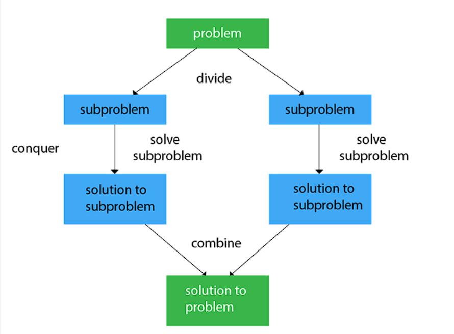

The divide and conquer algorithm is a problem-solving technique that involves breaking down a complex problem into smaller subproblems, solving them independently, and then combining the solutions to solve the original problem. This approach is particularly useful for solving problems that can be divided into similar, smaller subproblems.

### Steps of the Divide and Conquer Algorithm

1. **Divide**: The first step is to divide the problem into smaller subproblems. This can be done recursively until the subproblems become simple enough to be solved directly.

2. **Conquer**: Once the problem is divided into subproblems, solve each subproblem independently. This can be done by applying the same divide and conquer algorithm recursively.

3. **Combine**: Finally, combine the solutions of the subproblems to obtain the solution to the original problem. This step may involve merging, sorting, or any other operation that combines the subproblem solutions.

### Example: Merge Sort

One classic example of the divide and conquer algorithm is the merge sort algorithm. It follows the steps mentioned above to sort an array of elements.

1. **Divide**: The array is divided into two halves recursively until each subarray contains only one element.

2. **Conquer**: Each subarray is sorted independently using the merge sort algorithm.

3. **Combine**: The sorted subarrays are then merged together to obtain the final sorted array.

The merge sort algorithm has a time complexity of O(n log n) and is widely used for sorting large datasets efficiently.

### Example: Binary Search

Another example of the divide and conquer algorithm is the binary search algorithm. It is used to search for a specific element in a sorted array.

1. **Divide**: The array is divided into two halves, and the middle element is compared with the target element.

2. **Conquer**: Based on the comparison, the search is continued in either the left or right half of the array recursively.

3. **Combine**: The search is completed when the target element is found or when the search space is reduced to zero.

The binary search algorithm has a time complexity of O(log n) and is much more efficient than linear search for large arrays.

By using the divide and conquer algorithm, complex problems can be efficiently solved by breaking them down into smaller, manageable subproblems. This technique is widely used in various algorithms and data structures in the field of computer science.

Applications of Divide and Conquer Approach:
### Following algorithms are based on the concept of the Divide and Conquer Technique:

- **Binary Search:** The binary search algorithm is a searching algorithm, which is also called a half-interval search or logarithmic search. It works by comparing the target value with the middle element existing in a sorted array. After making the comparison, if the value differs, then the half that cannot contain the target will eventually eliminate, followed by continuing the search on the other half. We will again consider the middle element and compare it with the target value. The process keeps on repeating until the target value is met. If we found the other half to be empty after ending the search, then it can be concluded that the target is not present in the array.
- **Quicksort:** It is the most efficient sorting algorithm, which is also known as partition-exchange sort. It starts by selecting a pivot value from an array followed by dividing the rest of the array elements into two sub-arrays. The partition is made by comparing each of the elements with the pivot value. It compares whether the element holds a greater value or lesser value than the pivot and then sort the arrays recursively.
- **Merge Sort:** It is a sorting algorithm that sorts an array by making comparisons. It starts by dividing an array into sub-array and then recursively sorts each of them. After the sorting is done, it merges them back.
- **Closest Pair of Points:** It is a problem of computational geometry. This algorithm emphasizes finding out the closest pair of points in a metric space, given n points, such that the distance between the pair of points should be minimal.
- **Strassen's Algorithm:** It is an algorithm for matrix multiplication, which is named after Volker Strassen. It has proven to be much faster than the traditional algorithm when works on large matrices.
- **Cooley-Tukey Fast Fourier Transform (FFT) algorithm:** The Fast Fourier Transform algorithm is named after J. W. Cooley and John Turkey. It follows the Divide and Conquer Approach and imposes a complexity of O(nlogn).
- **Karatsuba algorithm for fast multiplication:** It is one of the fastest multiplication algorithms of the traditional time, invented by Anatoly Karatsuba in late 1960 and got published in 1962. It multiplies two n-digit numbers in such a way by reducing it to at most single-digit.

### Advantages of Divide And Conquer 

- Divide and Conquer tend to successfully solve one of the biggest problems, such as the Tower of Hanoi, a mathematical puzzle. It is challenging to solve complicated problems for which you have no basic idea, but with the help of the divide and conquer approach, it has lessened the effort as it works on dividing the main problem into two halves and then solve them recursively. This algorithm is much faster than other algorithms.
- It efficiently uses cache memory without occupying much space because it solves simple subproblems within the cache memory instead of accessing the slower main memory.
- It is more proficient than that of its counterpart Brute Force technique.
- Since these algorithms inhibit parallelism, it does not involve any modification and is handled by systems incorporating parallel processing.
## Disadvantages of Divide and Conquer
- Since most of its algorithms are designed by incorporating recursion, so it necessitates high memory management.
- An explicit stack may overuse the space.
- It may even crash the system if the recursion is performed rigorously greater than the stack present in the CPU.