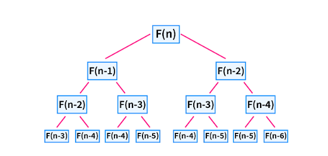

Dynamic programming is a technique used in computer programming to solve complex problems by breaking them down into smaller overlapping subproblems. It is particularly useful when the problem can be divided into smaller subproblems that can be solved independently, and the solution to the larger problem can be constructed from the solutions of the subproblems.





**Approaches in Dynamic Programming**

There are two main approaches in dynamic programming:

1. Top-down approach (Memoization): This approach involves breaking down the problem into smaller subproblems and solving them recursively. The solutions to the subproblems are stored in a memoization table to avoid redundant computations. The top-down approach is often implemented using recursion with memoization.

2. Bottom-up approach (Tabulation): This approach involves solving the subproblems iteratively, starting from the base cases and working towards the larger problem. The solutions to the subproblems are stored in a tabulation table or array. The bottom-up approach is often implemented using loops or iteration.

Both approaches have their advantages and disadvantages. The top-down approach is more intuitive and easier to implement, but it may suffer from stack overflow issues for large problem sizes. The bottom-up approach is more efficient in terms of space and time complexity, but it may be more challenging to implement for certain problems.

It is important to choose the appropriate approach based on the problem requirements and constraints. Experimentation and analysis are often required to determine the most suitable approach for a specific problem.

**Here are the steps to apply dynamic programming:**

1. Identify the problem: Start by understanding the problem you are trying to solve and determine if it can be broken down into smaller subproblems.

2. Define the recursive relation: Express the problem in terms of its subproblems. This involves identifying the dependencies between the subproblems and how they can be combined to solve the larger problem.

3. Create a memoization table or array: This is used to store the solutions to the subproblems as they are computed. It helps avoid redundant computations by storing the results of previously solved subproblems.

4. Define the base cases: Determine the simplest subproblems that can be solved directly without further recursion. These are the base cases that will terminate the recursive calls.

5. Implement the recursive function: Write a recursive function that uses the memoization table to solve the subproblems. The function should check if the solution to a subproblem is already available in the table before computing it.

6. Fill the memoization table: Start solving the subproblems from the base cases and work your way up to the larger problem. As each subproblem is solved, store its solution in the memoization table.

7. Return the solution: Once all the subproblems have been solved, the solution to the original problem can be found in the memoization table.

**Dynamic programming has several advantages:**

- Optimal substructure: Dynamic programming guarantees that the solution to the larger problem is constructed optimally from the solutions of the subproblems. This can lead to more efficient and optimal solutions.

- Overlapping subproblems: Dynamic programming avoids redundant computations by storing the solutions to subproblems in a memoization table. This can greatly improve the efficiency of the algorithm.

However, dynamic programming also has some disadvantages:

- Increased space complexity: The memoization table used in dynamic programming can consume additional memory, especially for problems with a large number of subproblems. This can be a concern in memory-constrained environments.

- Complexity of identifying subproblems: Identifying the subproblems and their dependencies can be challenging for certain problems. It requires careful analysis and understanding of the problem domain.

Dynamic programming can be applied to a wide range of problems, including optimization problems, graph algorithms, string algorithms, and more. It is commonly used in areas such as algorithm design, artificial intelligence, and operations research.


## Example 

Here's an example of dynamic programming in Python:

```python
def fibonacci(n):
    # Create a memoization table to store computed values
    memo = {}

    # Base cases
    memo[0] = 0
    memo[1] = 1

    # Recursive function to compute Fibonacci numbers
    def fib(n):
        # Check if value is already computed
        if n in memo:
            return memo[n]

        # Compute and store the value
        memo[n] = fib(n-1) + fib(n-2)
        return memo[n]

    return fib(n)

# Test the function
print(fibonacci(5))  # Output: 5
print(fibonacci(10))  # Output: 55
```

In this example, we use dynamic programming to efficiently compute Fibonacci numbers. We create a memoization table to store the computed values and avoid redundant computations. The recursive function `fib` checks if the value is already computed in the memoization table before computing it. This approach significantly improves the efficiency of the algorithm.


Dynamic programming (DP) is a powerful technique used in computer programming to solve complex problems by breaking them down into smaller, overlapping subproblems. It is particularly useful when the problem exhibits optimal substructure and overlapping subproblems.

