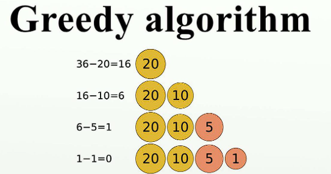

The Greedy algorithm is a simple and intuitive approach used to solve optimization problems. It follows the greedy principle of making locally optimal choices at each step to find a global optimum solution.


To implement a Greedy algorithm, follow these steps:

1. Understand the problem: Identify the objective or goal you want to achieve.

2. Define the problem as subproblems: Break down the problem into smaller, independent subproblems.

3. Determine the greedy choice: Make a locally optimal choice at each step that leads to the overall optimal solution.

4. Verify feasibility: Check if the chosen option satisfies constraints and requirements.

5. Update the solution: Include the chosen option in the current solution.

6. Repeat steps 3-5: Continue making greedy choices until the problem is solved or the desired solution is obtained.


### Types of Greedy Algorithms

1. Activity Selection: This algorithm selects a maximum number of compatible activities that can be performed in a given time frame. It prioritizes activities based on their finish times or other criteria.

2. Fractional Knapsack: This algorithm solves the fractional knapsack problem, where items can be divided into fractions. It selects items based on their value-to-weight ratio, maximizing the total value while considering the capacity constraint.

3. Huffman Coding: This algorithm is used for data compression. It assigns variable-length codes to characters based on their frequency of occurrence, with more frequent characters having shorter codes.

4. Dijkstra's Algorithm: This algorithm finds the shortest path in a weighted graph from a source vertex to all other vertices. It selects the vertex with the minimum distance at each step, gradually expanding the shortest path tree.

5. Prim's Algorithm: This algorithm finds the minimum spanning tree of a connected weighted graph. It starts with an arbitrary vertex and greedily adds the edge with the minimum weight that connects the current tree to a new vertex.

6. Kruskal's Algorithm: This algorithm also finds the minimum spanning tree of a connected weighted graph. It sorts the edges in non-decreasing order of their weights and greedily adds the edges that do not form a cycle.

7. Coin Change: This algorithm solves the problem of making change for a given amount using the fewest number of coins. It selects the largest denomination coins first until the desired amount is reached.

8. Interval Scheduling: This algorithm schedules a maximum number of tasks with overlapping intervals. It selects tasks based on their finish times or other criteria, maximizing the number of non-overlapping tasks.

These are just a few examples of greedy algorithms. Each algorithm has its own specific problem-solving approach, but they all share the common characteristic of making locally optimal choices at each step to achieve a global optimum solution.


### Advantages of the Greedy algorithm:

- Simplicity: Easy to understand and implement compared to complex algorithms.
- Efficiency: Provides fast and efficient solutions in many cases.
- Intuitive: Follows a natural and intuitive thought process.

### Disadvantages of the Greedy algorithm:

- Lack of global optimization: Locally optimal choices may not always lead to the globally optimal solution.
- Suboptimal choices: Locally optimal choices may not result in the best overall solution.
- Limited applicability: Not suitable for all problems, especially those requiring a comprehensive approach.

Note that the Greedy algorithm may not always be the best choice. Analyze the problem and consider other approaches for the most efficient solution.

**Here's an example code using the Greedy algorithm:**
#### Codes in Different Languages

<Tabs>
  <TabItem value="Python" label="Python" default>
```Python showLineNumbers
def knapsack_greedy(values, weights, capacity):
    # Create a list of items with their values and weights
    items = list(zip(values, weights))
    
    # Sort the items based on their value-to-weight ratio in descending order
    items.sort(key=lambda x: x[0] / x[1], reverse=True)
    
    # Initialize the total value and total weight
    total_value = 0
    total_weight = 0
    
    # Iterate through the sorted items
    for value, weight in items:
        # Check if adding the current item exceeds the capacity
        if total_weight + weight <= capacity:
            # Add the item to the knapsack
            total_value += value
            total_weight += weight
    
    return total_value

# Example usage
values = [60, 100, 120]
weights = [10, 20, 30]
capacity = 50

max_value = knapsack_greedy(values, weights, capacity)
print("Maximum value:", max_value)

```
</TabItem>
  <TabItem value="cpp" label="C++" >
   ```cpp
   #include <iostream>
#include <vector>
#include <algorithm>
using namespace std;

struct Item {
    int value;
    int weight;
};

bool compare(Item a, Item b) {
    double r1 = (double)a.value / a.weight;
    double r2 = (double)b.value / b.weight;
    return r1 > r2;
}

int knapsack_greedy(vector<int>& values, vector<int>& weights, int capacity) {
    vector<Item> items(values.size());
    for (size_t i = 0; i < values.size(); ++i) {
        items[i] = {values[i], weights[i]};
    }

    sort(items.begin(), items.end(), compare);

    int total_value = 0;
    int total_weight = 0;

    for (auto& item : items) {
        if (total_weight + item.weight <= capacity) {
            total_value += item.value;
            total_weight += item.weight;
        }
    }

    return total_value;
}

int main() {
    vector<int> values = {60, 100, 120};
    vector<int> weights = {10, 20, 30};
    int capacity = 50;

    int max_value = knapsack_greedy(values, weights, capacity);
    cout << "Maximum value: " << max_value << endl;

    return 0;
}

   ```
  </TabItem>  
 <TabItem value="Java" label="Java">
``` jsx showLineNumbers
import java.util.ArrayList;
import java.util.Collections;
import java.util.Comparator;
import java.util.List;

class Item {
    int value;
    int weight;

    Item(int value, int weight) {
        this.value = value;
        this.weight = weight;
    }
}

public class KnapsackGreedy {

    public static int knapsackGreedy(int[] values, int[] weights, int capacity) {
        List<Item> items = new ArrayList<>();
        for (int i = 0; i < values.length; i++) {
            items.add(new Item(values[i], weights[i]));
        }

        Collections.sort(items, new Comparator<Item>() {
            public int compare(Item a, Item b) {
                double r1 = (double) a.value / a.weight;
                double r2 = (double) b.value / b.weight;
                return Double.compare(r2, r1);
            }
        });

        int totalValue = 0;
        int totalWeight = 0;

        for (Item item : items) {
            if (totalWeight + item.weight <= capacity) {
                totalValue += item.value;
                totalWeight += item.weight;
            }
        }

        return totalValue;
    }

    public static void main(String[] args) {
        int[] values = {60, 100, 120};
        int[] weights = {10, 20, 30};
        int capacity = 50;

        int maxValue = knapsackGreedy(values, weights, capacity);
        System.out.println("Maximum value: " + maxValue);
    }
}

```
</TabItem>

<TabItem value="JavaScript" label="JavaScript">
``` jsx showLineNumbers
function knapsackGreedy(values, weights, capacity) {
    let items = [];
    for (let i = 0; i < values.length; i++) {
        items.push({ value: values[i], weight: weights[i] });
    }

    items.sort((a, b) => (b.value / b.weight) - (a.value / a.weight));

    let totalValue = 0;
    let totalWeight = 0;

    for (let item of items) {
        if (totalWeight + item.weight <= capacity) {
            totalValue += item.value;
            totalWeight += item.weight;
        }
    }

    return totalValue;
}

// Example usage
let values = [60, 100, 120];
let weights = [10, 20, 30];
let capacity = 50;

let maxValue = knapsackGreedy(values, weights, capacity);
console.log("Maximum value:", maxValue);


```
</TabItem>


</Tabs>

This code demonstrates the Greedy algorithm in action by solving the Knapsack problem. The goal is to maximize the total value of items that can be put into a knapsack with a given capacity. The algorithm selects items based on their value-to-weight ratio, choosing the most valuable items first until the knapsack is full.

### Conclusion

The Greedy algorithm is a powerful and intuitive approach for solving optimization problems. It follows the principle of making locally optimal choices at each step to find a global optimum solution. 

The advantages of the Greedy algorithm include its simplicity, efficiency, and intuitive thought process. It is easy to understand and implement compared to complex algorithms, provides fast and efficient solutions in many cases, and follows a natural thought process.

However, the Greedy algorithm also has its limitations. Locally optimal choices may not always lead to the globally optimal solution, resulting in suboptimal choices. It is not suitable for all problems, especially those requiring a comprehensive approach.

In conclusion, the Greedy algorithm is a valuable tool in solving optimization problems, but it is important to analyze the problem and consider other approaches for the most efficient solution.