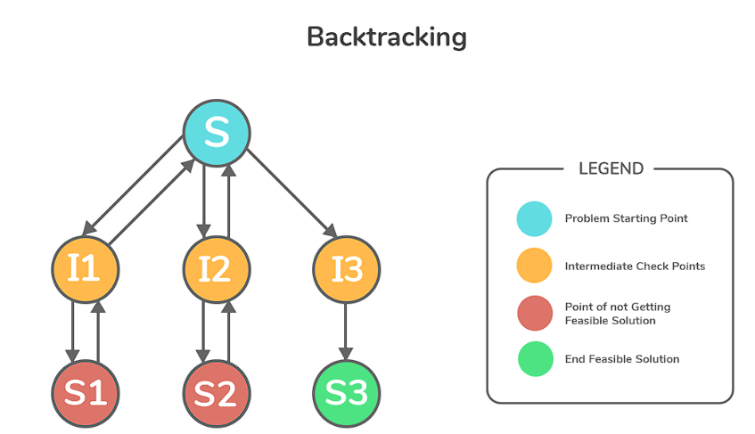

## Backtracking in Python

Backtracking is a technique used to solve problems by exploring all possible solutions. It is especially useful when the problem can be broken down into a series of decisions or choices.


To implement backtracking in Python, you can follow these steps:

1. Define a function that takes the problem and a partial solution as input.
2. Check if the solution is complete. If it is, return the solution.
3. Generate possible candidates for the next step.
4. Iterate through the candidates.
5. Make a choice and update the solution.
6. Recursively call the function with the updated solution.
7. If a valid solution is found, return it.
8. Undo the choice and continue with the next candidate.
9. If no valid solution is found, return None.

Here's an example implementation of the backtracking algorithm in Python:

```python
def backtrack(problem, solution):
    # Base case: if the solution is complete, return it
    if is_solution(problem, solution):
        return solution

    # Generate possible candidates for the next step
    candidates = generate_candidates(problem, solution)

    # Iterate through the candidates
    for candidate in candidates:
        # Make a choice and update the solution
        make_choice(problem, solution, candidate)

        # Recursively backtrack with the updated solution
        result = backtrack(problem, solution)

        # If a valid solution is found, return it
        if result is not None:
            return result

        # Undo the choice and continue with the next candidate
        undo_choice(problem, solution, candidate)

    # If no valid solution is found, return None
    return None
```

You can customize the `is_solution`, `generate_candidates`, `make_choice`, and `undo_choice` functions to fit your specific problem.

Remember, backtracking explores all possible solutions, so it can be computationally expensive for large problem spaces. However, it is a powerful technique for solving problems that can be represented as a series of choices or decisions.


### Example: Permutations of Letters

The task is to find all possible arrangements (permutations) of a given set of letters.

### Explanation:

**Function Definition:**

We define a function permute(letters, current_perm, all_permutations).
letters is the original set of letters.
current_perm is a list to hold the current permutation being built.
all_permutations is a list to store all the final permutations.
Base Case:

If all letters have been used (i.e., len(current_perm) == len(letters)), we've found a complete permutation.
Append the current_perm to the all_permutations list.
Recursive Exploration:

Iterate through the remaining letters in letters.
For each letter:
Add the letter to the current_perm.
Make a recursive call to permute with the updated current_perm and the remaining letters (excluding the chosen letter).
After the recursive call (exploring possibilities with the chosen letter), remove the letter from current_perm to backtrack and explore other options (avoiding duplicates).
Code:

Python
```python
def permute(letters, current_perm=[], all_permutations=[]):
  """Finds all permutations (arrangements) of the given letters."""
  if len(current_perm) == len(letters):
    all_permutations.append(current_perm.copy())  # Append a copy to avoid modification
    return

  for i in range(len(letters)):
    if letters[i] not in current_perm:  # Avoid duplicates
      current_perm.append(letters[i])
      permute(letters, current_perm, all_permutations)
      current_perm.pop()  # Backtrack

# Example usage
letters = ['a', 'b', 'c']
permute(letters, all_permutations=[])
print("All permutations:", all_permutations)

```