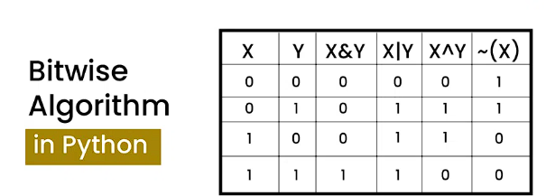

Bitwise algorithms in Data Structures and Algorithms (DSA) involve manipulating individual bits within an integer's binary representation to solve problems efficiently. These algorithms use bitwise operators like AND, OR, XOR, NOT, LEFT SHIFT, and RIGHT SHIFT. They are fundamental in low-level programming, encryption, compression, and optimization tasks due to their direct manipulation of data at the bit level.


### Explanation
Bitwise algorithms operate directly on the binary representation of numbers. For example, the bitwise AND operator (&) compares each bit of two numbers and returns a new number whose bits are set to 1 only if both compared bits are 1. Other operators work similarly, manipulating bits to achieve various outcomes.

## Advantages
- Efficiency: Bitwise operations are extremely fast, as they are directly supported by the processor.
- Low-level control: They provide granular control over data, allowing for optimizations not possible with higher-level abstractions.
- Space-saving: Bitwise operations can be used to compactly store and manipulate data, reducing memory usage.

## Disadvantages
- Readability: Code using bitwise operations can be hard to read and understand, especially for those not familiar with these operations.
- Error-prone: Small mistakes in bitwise operations can lead to significant bugs, as the operations are very low-level.
- Limited applicability: Not all problems benefit from bitwise optimizations; their use is somewhat niche.

## Application in a Problem
Consider the problem of finding the unique number in an array where all numbers except one are repeated twice. A bitwise XOR operation can solve this efficiently.

**Example**
Given an array: [4, 1, 2, 1, 2], find the unique number.

## Step-by-step:

- XOR all the numbers in the array.
- Repeated numbers will cancel each other out because n XOR n = 0.
- The result will be the unique number, as n XOR 0 = n.

## Implementation:
```python
def findUnique(arr):
    unique = 0
    for num in arr:
        unique ^= num
    return unique

arr = [4, 1, 2, 1, 2]
print(findUnique(arr))  # Output: 4
```

In this example, the XOR operation is used to find the unique number efficiently. This showcases the power of bitwise operations in solving specific types of problems with minimal code and high performance.


Bitwise algorithms leverage the fundamental operations of bitwise logic to perform calculations directly on the binary representations of numbers. This approach offers a unique blend of efficiency, precision, and low-level data manipulation capabilities that are unmatched by higher-level algorithmic strategies. While they excel in specific domains such as cryptography, data compression, and systems programming, their utility is somewhat specialized, and they require a good understanding of binary arithmetic to be used effectively.