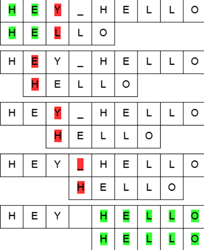

The Pattern Searching Algorithm is a powerful tool used to find occurrences of a pattern within a larger text or string. It is commonly employed in string matching problems, where the goal is to search for a specific pattern or substring within a given text.



This algorithm compares the pattern with each possible substring of the text, starting from the leftmost position. When a match is found, the algorithm reports the index or position of the match. There are several variations of the Pattern Searching Algorithm, including the Naive Pattern Searching Algorithm, Knuth-Morris-Pratt (KMP) Algorithm, Rabin-Karp Algorithm, and Boyer-Moore Algorithm, each with its own advantages and disadvantages.

### Advantages of the Pattern Searching Algorithm:

1. Versatility: The algorithm can be applied to various string matching problems, making it a valuable tool in many applications.
2. Flexibility: Different variations of the algorithm allow for different trade-offs in terms of time complexity, space complexity, and implementation complexity.
3. Efficiency: Depending on the specific variation used, the Pattern Searching Algorithm can achieve efficient search times, particularly in large texts.

### Disadvantages of the Pattern Searching Algorithm:

1. Complexity: Some variations of the algorithm can be complex to understand and implement, especially for beginners.
2. Performance: The performance of the algorithm can vary depending on the specific variation used and the characteristics of the input text and pattern. In some cases, the algorithm may not be the most efficient solution.

Here's an example code problem to illustrate the usage of the Pattern Searching Algorithm:

```python
```python
def pattern_search(text, pattern):
    result = []
    text_length = len(text)
    pattern_length = len(pattern)

    for i in range(text_length - pattern_length + 1):
        j = 0
        while j < pattern_length:
            if text[i + j] != pattern[j]:
                break
            j += 1
        if j == pattern_length:
            result.append(i)

    return result

text = "ABABDABACDABABCABAB"
pattern = "ABABC"
matches = pattern_search(text, pattern)
print("Pattern found at positions:", matches)
```

In this example, we have a text string "ABABDABACDABABCABAB" and we want to search for the pattern "ABABC" within it. The `patternSearch` function implements the Naive Pattern Searching Algorithm. It iterates through the text, comparing each substring of the same length as the pattern with the pattern itself. If a match is found, the starting position of the match is added to the result array. Finally, the function returns the array of positions where the pattern was found.

When we run this code, it will output: "Pattern found at positions: [0, 10]". This means that the pattern "ABABC" was found at positions 0 and 10 within the text string.


The pattern search algorithm, also known as the Naive Pattern Searching Algorithm, is a simple and straightforward approach to finding occurrences of a pattern within a text string. It works by iterating through the text and comparing each substring of the same length as the pattern with the pattern itself.

The algorithm starts by initializing an empty array to store the positions where the pattern is found. Then, it iterates through the text string, comparing each substring of the same length as the pattern with the pattern itself. If a match is found, the starting position of the match is added to the result array.

Once the algorithm has finished iterating through the entire text, it returns the array of positions where the pattern was found. This allows us to determine the locations of all occurrences of the pattern within the text.

The Naive Pattern Searching Algorithm is relatively simple to implement and understand, making it a good starting point for pattern searching tasks. However, it has a time complexity of O((n-m+1)*m), where n is the length of the text and m is the length of the pattern. This means that the algorithm's performance can degrade for large texts or patterns.

There are more advanced pattern searching algorithms, such as the Knuth-Morris-Pratt (KMP) algorithm and the Boyer-Moore algorithm, which offer better time complexity and improved performance in certain scenarios. However, the Naive Pattern Searching Algorithm serves as a foundation for understanding pattern searching concepts and can be a useful starting point for simple cases.