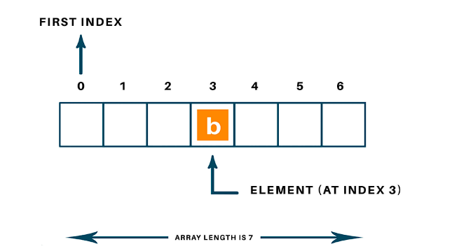

Searching is a fundamental operation in computer science and is widely used in various applications. In the context of Data Structures and Algorithms (DSA), searching refers to the process of finding a specific element within a collection of data.



## Linear Search

Linear search is a simple algorithm that sequentially checks each element in a collection until the target element is found or the end of the collection is reached. It is commonly used for small collections or unsorted data.

```python
def linear_search(arr, target):
    for i in range(len(arr)):
        if arr[i] == target:
            return i
    return -1
```

## Binary Search

Binary search is an efficient algorithm used for searching in sorted collections. It works by repeatedly dividing the search space in half until the target element is found or the search space is empty.

```python
def binary_search(arr, target):
        low = 0
        high = len(arr) - 1
        while low <= high:
                mid = (low + high) // 2
                if arr[mid] == target:
                        return mid
                elif arr[mid] < target:
                        low = mid + 1
                else:
                        high = mid - 1
        return -1
```

## Hash-based Search

Hash-based search utilizes a hash function to map keys to values in a data structure called a hash table. It provides constant-time average case complexity for searching.

```python
hash_map = {
    "apple": 1,
    "banana": 2,
    "orange": 3
}

value = hash_map.get("banana", -1)
print("Value:", value)
```

These are just a few examples of searching algorithms and their implementations in different programming languages. The choice of algorithm depends on factors such as the size of the data, whether it is sorted or unsorted, and the desired time complexity.

Remember to provide appropriate input and handle edge cases when implementing these algorithms to ensure correct results.

## Additional Questions

1. **Question:** Implement a linear search algorithm in C++ to find the index of a target element in an array. Provide the input and output for the following scenario:
    - **Input:** Array: [5, 2, 9, 7, 3], Target: 9
    - **Output:** Index: 2

```cpp
#include <iostream>
using namespace std;

int linearSearch(int arr[], int size, int target) {
     for (int i = 0; i < size; i++) {
          if (arr[i] == target) {
                return i;
          }
     }
     return -1;
}

int main() {
     int arr[] = {5, 2, 9, 7, 3};
     int target = 9;
     int size = sizeof(arr) / sizeof(arr[0]);
     int index = linearSearch(arr, size, target);
     cout << "Index: " << index << endl;
     return 0;
}
```

2. **Question:** Write a binary search algorithm in Java to find the index of a target element in a sorted array. Provide the input and output for the following scenario:
    - **Input:** Array: [1, 3, 5, 7, 9], Target: 5
    - **Output:** Index: 2

```java
public class BinarySearch {
     public static int binarySearch(int[] arr, int target) {
          int low = 0;
          int high = arr.length - 1;
          while (low <= high) {
                int mid = (low + high) / 2;
                if (arr[mid] == target) {
                     return mid;
                } else if (arr[mid] < target) {
                     low = mid + 1;
                } else {
                     high = mid - 1;
                }
          }
          return -1;
     }

     public static void main(String[] args) {
          int[] arr = {1, 3, 5, 7, 9};
          int target = 5;
          int index = binarySearch(arr, target);
          System.out.println("Index: " + index);
     }
}
```

3. **Question:** Implement a hash-based search algorithm in Python to retrieve the value associated with a given key in a dictionary. Provide the input and output for the following scenario:
    - **Input:** Dictionary: ```{"apple": 1, "banana": 2, "orange": 3}```, Key: "banana"
    - **Output:** Value: 2

```python
hash_map = {
     "apple": 1,
     "banana": 2,
     "orange": 3
}

key = "banana"
value = hash_map.get(key, -1)
print("Value:", value)
```

Remember to provide appropriate input and handle edge cases when implementing these algorithms to ensure correct results.


In conclusion, searching is a fundamental operation in computer science and is widely used in various applications. In the context of Data Structures and Algorithms (DSA), there are several types of searching algorithms, including linear search, binary search, and hash-based search. Each algorithm has its own characteristics and is suitable for different scenarios.

Linear search is a simple algorithm that sequentially checks each element in a collection until the target element is found or the end of the collection is reached. It is commonly used for small collections or unsorted data.

Binary search is an efficient algorithm used for searching in sorted collections. It works by repeatedly dividing the search space in half until the target element is found or the search space is empty.

Hash-based search utilizes a hash function to map keys to values in a data structure called a hash table. It provides constant-time average case complexity for searching.

When implementing these algorithms, it is important to provide appropriate input and handle edge cases to ensure correct results.

Overall, understanding and implementing different searching algorithms is crucial for efficient data retrieval and manipulation in various programming scenarios.


Searching is a fundamental operation in computer science and is widely used in various applications. In the context of Data Structures and Algorithms (DSA), searching refers to the process of finding a specific element within a collection of data.

There are several types of searching algorithms commonly used in DSA, including linear search, binary search, hash-based search, and tree-based search. Each algorithm has its own characteristics and is suitable for different scenarios.

Linear Search:

Linear search is a simple algorithm that sequentially checks each element in a collection until the target element is found or the end of the collection is reached.
It is commonly used for small collections or unsorted data.
Here's an example of implementing linear search in JavaScript:
Binary Search:

Binary search is an efficient algorithm used for searching in sorted collections.
It works by repeatedly dividing the search space in half until the target element is found or the search space is empty.
Here's an example of implementing binary search in Python:
Hash-based Search:

Hash-based search utilizes a hash function to map keys to values in a data structure called a hash table.
It provides constant-time average case complexity for searching.
Here's an example of implementing hash-based search in Java using a HashMap:
These are just a few examples of searching algorithms and their implementations in different programming languages. The choice of algorithm depends on factors such as the size of the data, whether it is sorted or unsorted, and the desired time complexity.

Remember to provide appropriate input and handle edge cases when implementing these algorithms to ensure correct results.
