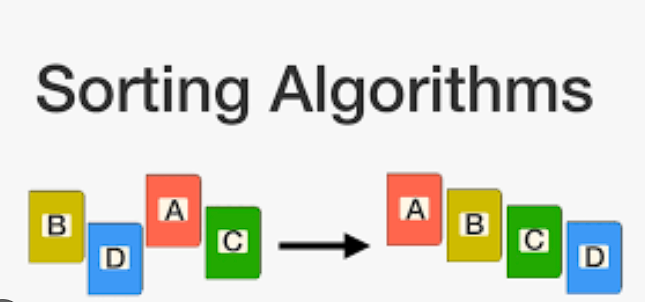
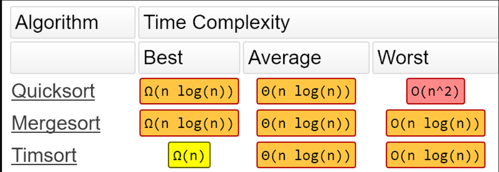

Sorting is a fundamental operation in computer science that arranges a collection of elements in a specific order. There are various sorting algorithms available, each with its own advantages and disadvantages. In this section, we will explore some commonly used sorting algorithms and provide Python code examples for their implementation.



### 1. Bubble Sort

Bubble Sort is a simple comparison-based sorting algorithm. It repeatedly compares adjacent elements and swaps them if they are in the wrong order. This process is repeated until the entire list is sorted.

```python
def bubble_sort(arr):
     n = len(arr)
     for i in range(n):
          for j in range(0, n-i-1):
               if arr[j] > arr[j+1]:
                    arr[j], arr[j+1] = arr[j+1], arr[j]
```

### 2. Selection Sort

Selection Sort is another simple comparison-based sorting algorithm. It divides the input list into two parts: the sorted part at the left end and the unsorted part at the right end. It repeatedly selects the smallest element from the unsorted part and swaps it with the leftmost element of the unsorted part.

```python
def selection_sort(arr):
     n = len(arr)
     for i in range(n):
          min_idx = i
          for j in range(i+1, n):
               if arr[j] < arr[min_idx]:
                    min_idx = j
          arr[i], arr[min_idx] = arr[min_idx], arr[i]
```

### 3. Insertion Sort

Insertion Sort is an efficient comparison-based sorting algorithm that builds the final sorted array one element at a time. It iterates through the input list and for each element, it finds its correct position in the sorted part of the list and shifts the larger elements to the right.

```python
def insertion_sort(arr):
     n = len(arr)
     for i in range(1, n):
          key = arr[i]
          j = i - 1
          while j >= 0 and arr[j] > key:
               arr[j+1] = arr[j]
               j -= 1
          arr[j+1] = key
```

### 4. Merge Sort

Merge Sort is a divide-and-conquer sorting algorithm that divides the input list into smaller sublists, sorts them, and then merges them to obtain a sorted list. It recursively divides the list until each sublist contains only one element, and then merges the sublists in a sorted manner.

```python
def merge_sort(arr):
     if len(arr) <= 1:
          return arr
     
     mid = len(arr) // 2
     left = arr[:mid]
     right = arr[mid:]
     
     left = merge_sort(left)
     right = merge_sort(right)
     
     return merge(left, right)

def merge(left, right):
     result = []
     i = j = 0
     
     while i < len(left) and j < len(right):
          if left[i] < right[j]:
               result.append(left[i])
               i += 1
          else:
               result.append(right[j])
               j += 1
     
     while i < len(left):
          result.append(left[i])
          i += 1
     
     while j < len(right):
          result.append(right[j])
          j += 1
     
     return result
```

### 5. Quick Sort

Quick Sort is a divide-and-conquer sorting algorithm that selects a pivot element and partitions the input list into two sublists, one with elements smaller than the pivot and one with elements greater than the pivot. It then recursively sorts the sublists.

```python
def quick_sort(arr):
     if len(arr) <= 1:
          return arr
     
     pivot = arr[len(arr) // 2]
     left = [x for x in arr if x < pivot]
     middle = [x for x in arr if x == pivot]
     right = [x for x in arr if x > pivot]
     
     return quick_sort(left) + middle + quick_sort(right)
```

### 6. Heap Sort

Heap Sort is a comparison-based sorting algorithm that uses a binary heap data structure. It first builds a max heap from the input list, then repeatedly extracts the maximum element from the heap and places it at the end of the sorted list.

```python
def heap_sort(arr):
     n = len(arr)
     
     for i in range(n // 2 - 1, -1, -1):
          heapify(arr, n, i)
     
     for i in range(n - 1, 0, -1):
          arr[i], arr[0] = arr[0], arr[i]
          heapify(arr, i, 0)

def heapify(arr, n, i):
     largest = i
     left = 2 * i + 1
     right = 2 * i + 2
     
     if left < n and arr[left] > arr[largest]:
          largest = left
     
     if right < n and arr[right] > arr[largest]:
          largest = right
     
     if largest != i:
          arr[i], arr[largest] = arr[largest], arr[i]
          heapify(arr, n, largest)
```


### 7. Radix Sort

Radix Sort is a non-comparative sorting algorithm that sorts integers by grouping them by individual digits. It starts by sorting the numbers based on the least significant digit and progressively moves towards the most significant digit. This process is repeated until the numbers are sorted based on all digits.

```python
def radix_sort(arr):
     # Find the maximum number to determine the number of digits
     max_num = max(arr)
     
     # Perform counting sort for every digit
     exp = 1
     while max_num // exp > 0:
          counting_sort(arr, exp)
          exp *= 10

def counting_sort(arr, exp):
     n = len(arr)
     output = [0] * n
     count = [0] * 10
     
     # Count the occurrences of each digit
     for i in range(n):
          index = arr[i] // exp
          count[index % 10] += 1
     
     # Calculate the cumulative count
     for i in range(1, 10):
          count[i] += count[i - 1]
     
     # Build the output array
     i = n - 1
     while i >= 0:
          index = arr[i] // exp
          output[count[index % 10] - 1] = arr[i]
          count[index % 10] -= 1
          i -= 1
     
     # Copy the sorted elements back to the original array
     for i in range(n):
          arr[i] = output[i]
```

Radix Sort has a time complexity of O(d * (n + k)), where d is the number of digits, n is the number of elements, and k is the range of values. It is often used for sorting integers with a fixed number of digits.



### Conclusion

In this article, we explored various sorting algorithms commonly used in data structures and algorithms. We provided Python code examples for each algorithm, including Bubble Sort, Selection Sort, Insertion Sort, Merge Sort, Quick Sort, Heap Sort, and Radix Sort.

Each sorting algorithm has its own advantages and disadvantages, and the choice of algorithm depends on the specific requirements of the problem at hand. It's important to consider factors such as time complexity, space complexity, stability, and adaptability when selecting a sorting algorithm.

By understanding these sorting algorithms and their implementations, you can effectively organize and arrange collections of elements in a specific order, which is a fundamental operation in computer science.

Remember to analyze the problem, consider the constraints, and choose the most appropriate sorting algorithm for your specific use case.

Happy sorting!
