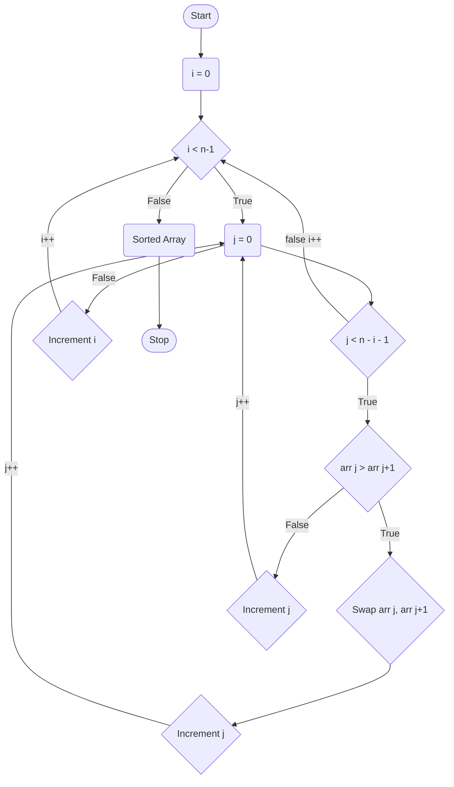

**Bubble Sort** is a simple sorting algorithm that repeatedly steps through the list, compares adjacent elements and swaps them if they are in the wrong order. The pass through the list is repeated until the list is sorted. The algorithm, which is a comparison sort, is named for the way smaller elements <mark>bubble</mark> to the top of the list. Although the algorithm is simple, it is too slow and impractical for most problems even when compared to <mark>insertion sort</mark>. It can be practical if the input is usually in sorted order but may occasionally have some out-of-order elements nearly in position.


<BubbleSortVisualization />

## Algorithm

1. Start from the first element, compare the current element with the next element of the array.
2. If the current element is greater than the next element of the array, swap them.
3. If the current element is less than the next element, move to the next element.
4. Repeat steps 1-3 until the array is sorted.
5. The array is sorted.
6. Exit.
7. The time complexity of the bubble sort is O(n<sup>2</sup>). 
8. The space complexity of the bubble sort is O(1).

## Pseudocode

```plaintext title="Bubble Sort"
procedure bubbleSort( A : list of sortable items )
    n = length(A)
    repeat
        swapped = false
        for i = 1 to n-1 inclusive do
            if A[i-1] > A[i] then
                swap(A[i-1], A[i])
                swapped = true
            end if
        end for
    until not swapped
end procedure
```

## Diagram



## Example

```js title="Bubble Sort"
function bubbleSort(arr) {
  let n = arr.length;
  let swapped;
  do {
    swapped = false;
    for (let i = 0; i < n - 1; i++) {
      if (arr[i] > arr[i + 1]) {
        let temp = arr[i];
        arr[i] = arr[i + 1];
        arr[i + 1] = temp;
        swapped = true;
      }
    }
  } while (swapped);
  return arr;
}

let arr = [64, 34, 25, 12, 22, 11, 90];
console.log(bubbleSort(arr)); // [ 11, 12, 22, 25, 34, 64, 90 ]
```

## Complexity

- **Time Complexity**: O(n<sup>2</sup>) 
  - Best Case: O(n)
  - Average Case: O(n<sup>2</sup>)
  - Worst Case: O(n<sup>2</sup>)
- **Space Complexity**: O(1) 
- **Stable**: Yes 

## Live Example

```js live
function bubbleSort() {
  let arr = [64, 34, 25, 12, 22, 11, 90];
  let n = arr.length;

  for (let i = 0; i < n; i++) {
    for (let j = 0; j < n - i - 1; j++) {
      if (arr[j] > arr[j + 1]) {
        let temp = arr[j];
        arr[j] = arr[j + 1];
        arr[j + 1] = temp;
      }
    }
  }

  return (
    <div>
        <h3>Bubble Sort</h3>
        <p><b>Array:</b> [64, 34, 25, 12, 22, 11, 90]</p>
        <p>
            <b>Sorted Array:</b> [{arr.join(", ")}]
        </p>
    </div>
  )
}
```

## Explanation

In the above example, we have an array of numbers `[64, 34, 25, 12, 22, 11, 90]`. We are using the bubble sort algorithm to sort the array in ascending order. The bubble sort algorithm compares each pair of adjacent items and swaps them if they are in the wrong order. The algorithm repeats this process until the array is sorted. The sorted array is `[11, 12, 22, 25, 34, 64, 90]`. The time complexity of the bubble sort is O(n<sup>2</sup>) and the space complexity is O(1).

:::info Try it yourself
Change the array values and see how the bubble sort algorithm sorts the array.
:::

:::tip 📝 Note
Bubble sort is not a practical sorting algorithm when the input is large. It is not suitable for large datasets due to its O(n<sup>2</sup>) time complexity.

The main advantage of bubble sort is that it is easy to understand and implement. It is often used to teach the concept of sorting algorithms.

Bubble sort is stable, meaning that it preserves the relative order of equal elements.

Bubble sort is not an efficient algorithm for large datasets and is generally not used in practice.

:::

## References

- [Wikipedia](https://en.wikipedia.org/wiki/Bubble_sort)
- [GeeksforGeeks](https://www.geeksforgeeks.org/bubble-sort/)
- [Programiz](https://www.programiz.com/dsa/bubble-sort)
- [TutorialsPoint](https://www.tutorialspoint.com/data_structures_algorithms/bubble_sort_algorithm.htm)
- [StudyTonight](https://www.studytonight.com/data-structures/bubble-sort)
- [w3schools](https://www.w3schools.com/dsa/dsa_algo_bubblesort.php)

## Related

Insertion Sort, Selection Sort, Merge Sort, Quick Sort, etc.


## Quiz

1. What is the time complexity of the bubble sort algorithm?
   - [ ] O(n)
   - [x] O(n<sup>2</sup>)     ✔
   - [ ] O(log n)
   - [ ] O(n!)
  
2. Is bubble sort a stable sorting algorithm?
   - [x] Yes    ✔
   - [ ] No
   - [ ] Maybe
   - [ ] Not sure

3. What is the space complexity of the bubble sort algorithm?
   - [ ] O(n)
   - [x] O(1)   ✔
   - [ ] O(log n)
   - [ ] O(n!)

4. What is the main advantage of bubble sort?
   - [ ] It is the fastest sorting algorithm
   - [x] It is easy to understand and implement     ✔
   - [ ] It is suitable for large datasets
   - [ ] It is used in practice

5. What is the main disadvantage of bubble sort?
   - [ ] It is the fastest sorting algorithm
   - [ ] It is easy to understand and implement
   - [x] It is not suitable for large datasets  ✔
   - [ ] It is used in practice

## Conclusion

In this tutorial, we learned about the bubble sort algorithm. We discussed the algorithm, pseudocode, diagram, example, complexity, and related concepts. We also implemented the bubble sort algorithm in JavaScript and saw a live example. We also discussed the advantages and disadvantages of the bubble sort algorithm. We hope you enjoyed this tutorial and found it helpful. Feel free to share your thoughts in the comments below.