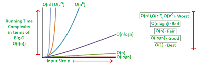
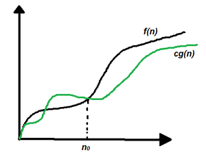

Time Complexity is a measure of the amount of time an algorithm takes to solve a problem as a function of the size of the input to the problem. It is commonly estimated by counting the number of elementary operations performed by the algorithm, where an elementary operation takes a fixed amount of time to perform.

## Why is Time Complexity Important?

Time Complexity is important because it helps us understand the efficiency of an algorithm. It allows us to compare different algorithms and choose the most efficient one for a given problem. It also helps us analyze the performance of an algorithm as the size of the input grows.

## Common Notations for Time Complexity

The most common notations used to represent the time complexity of an algorithm are:

- **Big O Notation (O):** It represents the upper bound of the time complexity of an algorithm. It gives the worst-case time complexity of an algorithm.
- **Omega Notation (Ω):** It represents the lower bound of the time complexity of an algorithm. It gives the best-case time complexity of an algorithm.
- **Theta Notation (Θ):** It represents the average-case time complexity of an algorithm. It gives the tight bound of the time complexity of an algorithm.

### Big O Notation (O)

Big O Notation is used to represent the upper bound of the time complexity of an algorithm. It gives the worst-case time complexity of an algorithm. It is commonly used to analyze the performance of an algorithm as the size of the input grows.



The Big O Notation is written as `O(f(n))`, where `f(n)` is a function that represents the time complexity of the algorithm. It is read as "O of f of n" or "order of f of n".

### Omega Notation (Ω)

Omega Notation is used to represent the lower bound of the time complexity of an algorithm. It gives the best-case time complexity of an algorithm. It is commonly used to analyze the performance of an algorithm as the size of the input grows.



The Omega Notation is written as `Ω(f(n))`, where `f(n)` is a function that represents the time complexity of the algorithm. It is read as "Omega of f of n".

### Theta Notation (Θ)

Theta Notation is used to represent the average-case time complexity of an algorithm. It gives the tight bound of the time complexity of an algorithm. It is commonly used to analyze the performance of an algorithm as the size of the input grows.

The Theta Notation is written as `Θ(f(n))`, where `f(n)` is a function that represents the time complexity of the algorithm. It is read as "Theta of f of n".


## Examples of Time Complexity

Here are some examples of time complexity for different algorithms:

- **Constant Time (O(1)):** An algorithm that takes the same amount of time to run, regardless of the size of the input.
- **Linear Time (O(n)):** An algorithm that takes time proportional to the size of the input.
- **Logarithmic Time (O(log n)):** An algorithm that takes time proportional to the logarithm of the size of the input.
- **Quadratic Time (O(n^2)):** An algorithm that takes time proportional to the square of the size of the input.
- **Exponential Time (O(2^n)):** An algorithm that takes time proportional to an exponential function of the size of the input.
- **Factorial Time (O(n!)):** An algorithm that takes time proportional to the factorial of the size of the input.
- **Polynomial Time (O(n^k)):** An algorithm that takes time proportional to a polynomial function of the size of the input.
- **Sublinear Time (O(log log n)):** An algorithm that takes time proportional to the logarithm of the logarithm of the size of the input.
- **Linearithmic Time (O(n log n)):** An algorithm that takes time proportional to the product of the size of the input and the logarithm of the size of the input.
- **Quasilinear Time (O(n log^k n)):** An algorithm that takes time proportional to the product of the size of the input and the logarithm of the size of the input raised to the power of k.
- **Superpolynomial Time (O(n^k)):** An algorithm that takes time proportional to a function that grows faster than any polynomial function of the size of the input.
- **Subexponential Time (O(2^poly(n))):** An algorithm that takes time proportional to a function that grows slower than any exponential function of the size of the input.
- **Log Factorial Time (O(log n!)):** An algorithm that takes time proportional to the logarithm of the factorial of the size of the input.
- **Exponential Factorial Time (O(2^n!)):** An algorithm that takes time proportional to an exponential function of the factorial of the size of the input.
- **Exponential Exponential Time (O(2^2^n)):** An algorithm that takes time proportional to an exponential function of an exponential function of the size of the input.
- **Exponential Factorial Exponential Time (O(2^n!^2^n)):** An algorithm that takes time proportional to an exponential function of the factorial of an exponential function of the size of the input.
- **Exponential Exponential Factorial Time (O(2^2^n!)):** An algorithm that takes time proportional to an exponential function of an exponential function of the factorial of the size of the input.

## Analyzing Time Complexity

To analyze the time complexity of an algorithm, we can follow these steps:

1. **Count the Operations:** Count the number of elementary operations performed by the algorithm.
2. **Identify the Dominant Term:** Identify the term that grows the fastest as the size of the input grows.
3. **Express the Time Complexity:** Express the time complexity using the Big O notation.
4. **Compare with Other Algorithms:** Compare the time complexity with other algorithms to choose the most efficient one.
5. **Analyze the Best, Worst, and Average Cases:** Analyze the best-case, worst-case, and average-case time complexity of the algorithm.
6. **Optimize the Algorithm:** Optimize the algorithm to improve its time complexity if possible.
7. **Test the Algorithm:** Test the algorithm with different input sizes to verify its time complexity.
8. **Benchmark the Algorithm:** Benchmark the algorithm to measure its actual performance.
9. **Profile the Algorithm:** Profile the algorithm to identify performance bottlenecks and optimize them.
10. **Analyze the Real-World Performance:** Analyze the real-world performance of the algorithm in different environments and scenarios.
11. **Contribute:** If you have any tips to share, feel free to contribute to this section.

## For Example

1. Calculating sum of array elements using loop.

<Tabs>
  <TabItem value="js" label="JavaScipt" default>
   <SolutionAuthor name="@Ajay-Dhangar"/>
    ```js
       function sum(arr) {
         let result = 0;
         for (let i = 0; i < arr.length; i++) {
           result += arr[i];
         }
         return result;
       }
       const arr = [1, 2, 3, 4, 5];
       console.log(sum(arr)); // Output: 15
    ```
  </TabItem>
    <TabItem value="py" label="Python">
        ```py
         def sum(arr):
             result = 0
             for i in arr:
             result += i
             return result
         arr = [1, 2, 3, 4, 5]
         print(sum(arr)) # Output: 15
        ```
    </TabItem>
    <TabItem value="java" label="Java">
        ```java
        class Sum {
            public static void main(String args[]) {
                int arr[] = {1, 2, 3, 4, 5};
                int result = 0;
                for (int i = 0; i < arr.length; i++) {
                    result += arr[i];
                }
                System.out.println(result); // Output: 15
            }
        }
        ```
    </TabItem>
    <TabItem value="c" label="C">
        ```c
        #include <stdio.h>
        int main() {
            int arr[] = {1, 2, 3, 4, 5};
            int result = 0;
            for (int i = 0; i < sizeof(arr)/sizeof(arr[0]); i++) {
                result += arr[i];
            }
            printf("%d\n", result); // Output: 15
            return 0;
        }
        ```
    </TabItem>
    <TabItem value="go" label="Go">
        ```go
        package main
        import "fmt"
        func main() {
            arr := []int{1, 2, 3, 4, 5}
            result := 0
            for i := 0; i < len(arr); i++ {
                result += arr[i]
            }
            fmt.Println(result) // Output: 15
        }
        ```
    </TabItem>
    <TabItem value="cpp" label="C++">
        ```cpp
        #include <iostream>
        using namespace std;
        int main() {
            int arr[] = {1, 2, 3, 4, 5};
            int result = 0;
            for (int i = 0; i < sizeof(arr)/sizeof(arr[0]); i++) {
                result += arr[i];
            }
            cout << result << endl; // Output: 15
            return 0;
        }
        ```
    </TabItem>
    <TabItem value="swift" label="Swift">
        ```swift
        import Foundation
        let arr = [1, 2, 3, 4, 5]
        var result = 0
        for i in arr {
            result += i
        }
        print(result) // Output: 15
        ```
    </TabItem>
    <TabItem value="kotlin" label="Kotlin">
        ```kotlin
        fun main() {
            val arr = intArrayOf(1, 2, 3, 4, 5)
            var result = 0
            for (i in arr) {
                result += i
            }
            println(result) // Output: 15
        }
        ```
    </TabItem>
    <TabItem value="rs" label="Rust">
        ```rs
        fn main() {
            let arr = [1, 2, 3, 4, 5];
            let mut result = 0;
            for i in arr.iter() {
                result += i;
            }
            println!("{}", result); // Output: 15
        }
        ```
    </TabItem>
    <TabItem value="php" label="PHP">
        ```php
        <?php
        $arr = [1, 2, 3, 4, 5];
        $result = 0;
        foreach ($arr as $i) {
            $result += $i;
        }
        echo $result; // Output: 15
        ?>
        ```
    </TabItem>
    <TabItem value="cs" label="C#">
        ```cs
        using System;
        class Sum {
            static void Main() {
                int[] arr = {1, 2, 3, 4, 5};
                int result = 0;
                foreach (int i in arr) {
                    result += i;
                }
                Console.WriteLine(result); // Output: 15
            }
        }
        ```
    </TabItem>
    <TabItem value="ts" label="TypeScript">
        ```ts
        let arr: number[] = [1, 2, 3, 4, 5];
        let result: number = 0;
        for (let i of arr) {
            result += i;
        }
        console.log(result); // Output: 15
        ```
    </TabItem>
    <TabItem value="scala" label="Scala">
        ```scala
        object Sum {
            def main(args: Array[String]): Unit = {
                val arr = Array(1, 2, 3, 4, 5)
                var result = 0
                for (i <- arr) {
                    result += i
                }
                println(result) // Output: 15
            }
        }
        ```
    </TabItem>
    <TabItem value="haskell" label="Haskell">
        ```haskell
        main = do
            let arr = [1, 2, 3, 4, 5]
            let result = sum arr
            print result -- Output: 15
        ```
    </TabItem>
    <TabItem value="r" label="R">
        ```r
        arr <- c(1, 2, 3, 4, 5)
        result <- sum(arr)
        print(result) # Output: 15
        ```
    </TabItem>
    <TabItem value="perl" label="Perl">
        ```perl
        my @arr = (1, 2, 3, 4, 5);
        my $result = 0;
        foreach my $i (@arr) {
            $result += $i;
        }
        print $result; # Output: 15
        ```
    </TabItem>
    <TabItem value="lua" label="Lua">
        ```lua
        arr = {1, 2, 3, 4, 5}
        result = 0
        for i = 1, #arr do
            result = result + arr[i]
        end
        print(result) -- Output: 15
        ```
    </TabItem>
</Tabs>

Each of the above code snippets has a time complexity of `O(n)` because the number of iterations in the loop is directly proportional to the size of the input array.

**Exlpanation:** The time complexity of the given code is `O(n)` because the loop iterates through the array elements one by one, and the number of iterations is directly proportional to the size of the input array. Therefore, the time complexity is linear, i.e., `O(n)`.


:::info 
**Note:** The time complexity of an algorithm can be different for different programming languages, but the underlying logic and analysis remain the same. 
:::

## Conclusion

Time Complexity is an important concept in computer science and programming. It helps us understand the efficiency of algorithms and make informed decisions about choosing the most efficient algorithm for a given problem. By analyzing the time complexity of algorithms, we can optimize them for better performance and improve the overall efficiency of our programs.