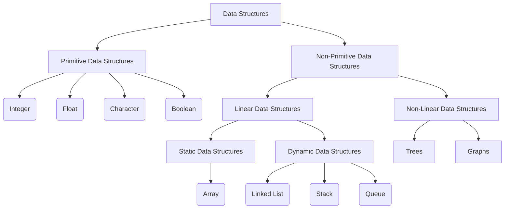

A data structure is a way of organizing and storing data so that it can be accessed and modified efficiently. It is a collection of data values, the relationships among them, and the functions or operations that can be applied to the data. Data structures are used to represent data in a meaningful way. They provide a way to store and organize data in memory.

Data structures can be classified into different types based on various criteria. Here are some common types of data structures:



### Primitive Data Structures

Primitive data structures are the basic data structures that are directly operated upon by the machine instructions. They include:

1.  **Integer**: A data type that represents whole numbers.

    for example: `1`, `2`, `3`, `4`, `5`, ...

    ```javascript title="Integer"
    let num = 10;
    ```

2.  **Float**: A data type that represents real numbers with decimal points.

        for example: `1.0`, `2.5`, `3.14`, `4.2`, `5.75`, ...

        ```javascript title="Float"
        let num = 3.14;
        ```

3.  **Character**: A data type that represents a single character.

    for example: `a`, `b`, `c`, `d`, `e`, ...

    ```javascript title="Character"
    let ch = "A";
    ```

4.  **Boolean**: A data type that represents true or false values.

    for example: `true`, `false`

    ```javascript title="Boolean"
    let isTrue = true;
    ```

### Non-Primitive Data Structures

Non-primitive data structures are the advanced data structures that are derived from primitive data structures. They include:

1. **Linear Data Structures**: Data structures in which elements are arranged in a sequential manner. They include:

   - **Static Data Structures**: Data structures in which the size is fixed at compile time. They include:

     - **Array**: A collection of elements of the same data type stored in contiguous memory locations.

       ```javascript title="Array"
       let arr = [1, 2, 3, 4, 5];
       ```

   - **Dynamic Data Structures**: Data structures in which the size can be changed at runtime. They include:

     - **Linked List**: A collection of elements called nodes, where each node contains a data field and a reference (link) to the next node in the sequence.

       ```javascript title="Linked List"
       class Node {
         constructor(data) {
           this.data = data;
           this.next = null;
         }
       }

       class LinkedList {
         constructor() {
           this.head = null;
         }

         add(data) {
           const newNode = new Node(data);

           if (!this.head) {
             this.head = newNode;
           } else {
             let current = this.head;

             while (current.next) {
               current = current.next;
             }

             current.next = newNode;
           }
         }
       }

       const list = new LinkedList();
       list.add(1);
       list.add(2);
       list.add(3);
       ```

     - **Stack**: A collection of elements with two main operations: push (insert) and pop (delete).

       ```javascript title="Stack"
       class Stack {
         constructor() {
           this.items = [];
         }

         push(element) {
           this.items.push(element);
         }

         pop() {
           if (this.items.length === 0) {
             return "Underflow";
           }
           return this.items.pop();
         }
       }

       const stack = new Stack();
       stack.push(1);
       stack.push(2);
       stack.push(3);
       stack.pop();
       ```

     - **Queue**: A collection of elements with two main operations: enqueue (insert) and dequeue (delete).

       ```javascript title="Queue"
       class Queue {
         constructor() {
           this.items = [];
         }

         enqueue(element) {
           this.items.push(element);
         }

         dequeue() {
           if (this.items.length === 0) {
             return "Underflow";
           }
           return this.items.shift();
         }
       }

       const queue = new Queue();
       queue.enqueue(1);
       queue.enqueue(2);
       queue.enqueue(3);
       queue.dequeue();
       ```

2. **Non-Linear Data Structures**: Data structures in which elements are not arranged in a sequential manner. They include:

   - **Trees**: A hierarchical data structure with a root node and subtrees of children nodes.

     ```javascript title="Tree"
     class Node {
       constructor(data) {
         this.data = data;
         this.children = [];
       }

       addChild(data) {
         const child = new Node(data);
         this.children.push(child);
       }
     }

     const tree = new Node(1);
     tree.addChild(2);
     tree.addChild(3);
     ```

   - **Graphs**: A non-linear data structure consisting of nodes (vertices) and edges (connections between nodes).

     ```javascript title="Graph"
     class Graph {
       constructor() {
         this.nodes = [];
         this.edges = [];
       }

       addNode(node) {
         this.nodes.push(node);
       }

       addEdge(node1, node2) {
         this.edges.push([node1, node2]);
       }
     }

     const graph = new Graph();
     graph.addNode(1);
     graph.addNode(2);
     graph.addEdge(1, 2);
     ```

   - **Hash Table**: A data structure that stores key-value pairs and provides fast lookup of values based on keys.

     ```javascript title="Hash Table"
     class HashTable {
       constructor() {
         this.table = {};
       }

       put(key, value) {
         this.table[key] = value;
       }

       get(key) {
         return this.table[key];
       }
     }

     const hashTable = new HashTable();
     hashTable.put("name", "John");
     hashTable.get("name");
     ```

   - **Heap**: A specialized tree-based data structure that satisfies the heap property.

     ```javascript title="Heap"
     class MinHeap {
       constructor() {
         this.heap = [];
       }

       insert(value) {
         this.heap.push(value);
         this.heapifyUp();
       }

       heapifyUp() {
         let index = this.heap.length - 1;

         while (index > 0) {
           let parentIndex = Math.floor((index - 1) / 2);

           if (this.heap[parentIndex] <= this.heap[index]) {
             break;
           }

           [this.heap[parentIndex], this.heap[index]] = [
             this.heap[index],
             this.heap[parentIndex],
           ];
           index = parentIndex;
         }
       }
     }

     const minHeap = new MinHeap();
     minHeap.insert(3);
     minHeap.insert(2);
     minHeap.insert(1);
     ```

## Different Between Primitive and Non-Primitive Data Structures

|No. |Primitive Data Structures|Non-Primitive Data Structures|
|----|--------------------------|-----------------------------|
|1.  |Basic data structures that are directly operated upon by the machine instructions.|Advanced data structures that are derived from primitive data structures.|
|2.  |Examples: Integer, Float, Character, Boolean.|Examples: Array, Linked List, Stack, Queue, Tree, Graph, Hash Table, Heap.|
|3.  |Stored in contiguous memory locations.|Stored in non-contiguous memory locations.|
|4.  |Fixed size at compile time.|Size can be changed at runtime.|
|5.  |Efficient for simple data storage and retrieval.|Efficient for complex data storage and retrieval.|
|6.  |Low-level data structures.|High-level data structures.|

## Different Between Linear and Non-Linear Data Structures

|No. |Linear Data Structures|Non-Linear Data Structures|
|----|-----------------------|-------------------------|
|1.  |Data structures in which elements are arranged in a sequential manner.|Data structures in which elements are not arranged in a sequential manner.|
|2.  |Examples: Array, Linked List, Stack, Queue.|Examples: Tree, Graph.|
|3.  |Elements are stored in a linear sequence.|Elements are stored in a non-linear sequence.|
|4.  |Efficient for simple data storage and retrieval.|Efficient for complex data storage and retrieval.|
|5.  |Low-level data structures.|High-level data structures.|

## Different Between Static and Dynamic Data Structures

|No. |Static Data Structures|Dynamic Data Structures|
|----|----------------------|----------------------|
|1.  |Data structures in which the size is fixed at compile time.|Data structures in which the size can be changed at runtime.|
|2.  |Examples: Array.|Examples: Linked List, Stack, Queue.|
|3.  |Size is determined at compile time.|Size can be changed at runtime.|
|4.  |Efficient for fixed-size data storage and retrieval.|Efficient for variable-size data storage and retrieval.|
|5.  |Low-level data structures.|High-level data structures.|

## Different Between Mutable and Immutable Data Structures

|No. |Mutable Data Structures|Immutable Data Structures|
|----|-----------------------|------------------------|
|1.  |Data structures in which the data can be modified after creation.|Data structures in which the data cannot be modified after creation.|
|2.  |Examples: Array, Linked List, Stack, Queue.|Examples: String, Tuple, Set, Map.|
|3.  |Data can be changed after creation.|Data cannot be changed after creation.|
|4.  |Efficient for data that needs to be modified frequently.|Efficient for data that needs to be shared and reused.|
|5.  |Low-level data structures.|High-level data structures.|

## Conclusion

Data structures are the building blocks of computer science. They are the tools you'll use to build software systems. Understanding the different types of data structures and their applications is essential for designing efficient algorithms and solving complex problems. By learning data structures, you'll be able to represent data in a meaningful way, store and organize data in memory, and build software systems that are scalable, efficient, and reliable.