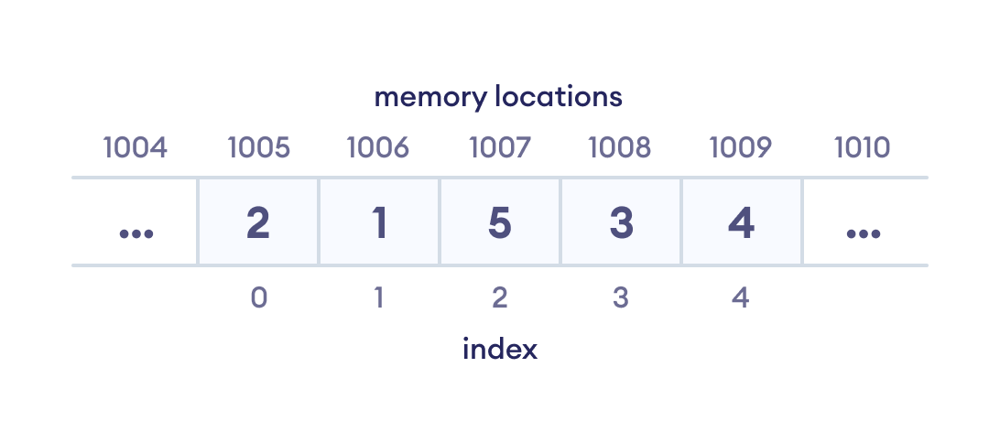
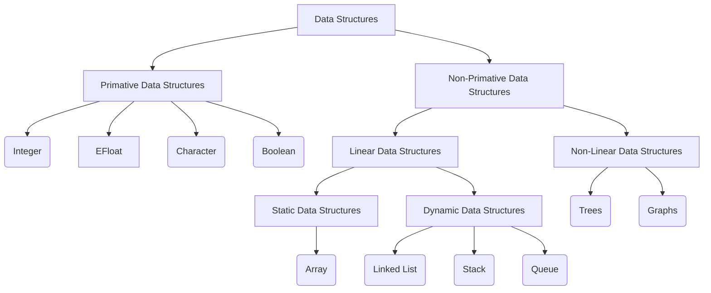

> Data Structures and Algorithms are the building blocks of computer science. They are the tools you'll use to build software systems. This section is a collection of resources to help you understand and master Data Structures and Algorithms.

## Introduction

Data Structures and Algorithms are the fundamental concepts that every programmer must know. They are the tools you'll use to build software systems. Data Structures are a way of organizing and storing data so that it can be accessed and modified efficiently. Algorithms are a set of instructions to solve a problem or perform a task.

## What is Algorithm?

An algorithm is a set of instructions to solve a problem or perform a task. It is a step-by-step procedure that defines a set of actions to be executed in a certain order to get the desired output.

### Quility of Good Algorithm 

- **Correctness**: An algorithm is correct if it produces the correct result for all instances of the problem it is designed to solve.
- **Efficiency**: An algorithm is efficient if it solves the problem within the resources (like time and space) available to it.
- **Simplicity**: An algorithm is simple if it is easy to understand and implement.
- **Optimality**: An algorithm is optimal if it produces the best result among all possible solutions for the given problem.
- **Scalability**: An algorithm is scalable if it can handle the input size efficiently.
- **Adaptability**: An algorithm is adaptable if it can be easily modified to solve a different problem.
- **Robustness**: An algorithm is robust if it can handle invalid input without crashing.
- **Maintainability**: An algorithm is maintainable if it can be easily modified and maintained.
- **Reusability**: An algorithm is reusable if it can be used in different programs.

### Algorithm Examples 

- **Sorting Algorithms**: Bubble Sort, Selection Sort, Insertion Sort, Merge Sort, Quick Sort, Heap Sort, Radix Sort, Counting Sort, Bucket Sort, etc.
- **Searching Algorithms**: Linear Search, Binary Search, Jump Search, Interpolation Search, Exponential Search, etc.
- **Graph Algorithms**: Breadth-First Search (BFS), Depth-First Search (DFS), Dijkstra's Algorithm, Bellman-Ford Algorithm, Floyd-Warshall Algorithm, Prim's Algorithm, Kruskal's Algorithm, etc.
- **Dynamic Programming Algorithms**: Fibonacci Series, Longest Common Subsequence, Longest Increasing Subsequence, Knapsack Problem, Matrix Chain Multiplication, etc.
- **Greedy Algorithms**: Fractional Knapsack Problem, Job Sequencing Problem, Huffman Coding, Prim's Algorithm, Kruskal's Algorithm, etc.
- **Divide and Conquer Algorithms**: Binary Search, Merge Sort, Quick Sort, Strassen's Algorithm, etc.
- **Backtracking Algorithms**: N-Queens Problem, Sudoku Solver, Knight's Tour, Rat in a Maze, etc.
- **Branch and Bound Algorithms**: Traveling Salesman Problem, 0/1 Knapsack Problem, Job Assignment Problem, etc.
- **Randomized Algorithms**: Randomized Quick Sort, Randomized Selection, Las Vegas Algorithm, Monte Carlo Algorithm, etc.
- **Approximation Algorithms**: Traveling Salesman Problem, Knapsack Problem, Set Cover Problem, etc.

## What is Data Structure?

A data structure is a way of organizing and storing data so that it can be accessed and modified efficiently. It is a collection of data values, the relationships among them, and the functions or operations that can be applied to the data. Data structures are used to represent data in a meaningful way. They provide a way to store and organize data in memory.

:::note 
Data structures are the building blocks of computer science. They are the tools you'll use to build software systems. Data structures are used to represent data in a meaningful way. They provide a way to store and organize data in memory.
:::

### Types of Data Structures

Data structures can be classified into two categories:

1. **Primitive Data Structures**: These are the basic data structures that are directly operated upon by the machine instructions. They include Integer, Float, Character, Boolean, etc.
2. **Non-Primitive Data Structures**: These are the advanced data structures that are derived from primitive data structures. They include Linear Data Structures (Array, Linked List, Stack, Queue), Non-Linear Data Structures (Trees, Graphs), etc.

### Data Structure Examples

- **Array**: A collection of elements of the same data type stored in contiguous memory locations.
- **Linked List**: A collection of elements called nodes, where each node contains a data field and a reference (link) to the next node in the sequence.
- **Stack**: A collection of elements with two main operations: push (insert) and pop (delete).
- **Queue**: A collection of elements with two main operations: enqueue (insert) and dequeue (delete).
- **Tree**: A hierarchical data structure with a root node and subtrees of children nodes.
- **Graph**: A non-linear data structure consisting of nodes (vertices) and edges (connections between nodes).
- **Hash Table**: A data structure that stores key-value pairs and provides fast lookup of values based on keys.
- **Heap**: A specialized tree-based data structure that satisfies the heap property.

## Why Learn Data Structures and Algorithms?

Data Structures and Algorithms are the building blocks of computer science. They are the tools you'll use to build software systems. Here are some reasons why you should learn Data Structures and Algorithms:

1. **Problem Solving**: Data Structures and Algorithms help you solve complex problems efficiently.
2. **Performance**: Data Structures and Algorithms help you write efficient code that runs faster and uses less memory.
3. **Understanding**: Data Structures and Algorithms help you understand how software systems work under the hood.
4. **Career Growth**: Data Structures and Algorithms are essential skills for software engineers, data scientists, machine learning engineers, and other tech professionals.
5. **Interview Preparation**: Data Structures and Algorithms are commonly asked in technical interviews for software engineering roles.
6. **Competitive Programming**: Data Structures and Algorithms are essential for competitive programming and coding competitions.
7. **Open Source**: Data Structures and Algorithms are used in open-source projects and libraries.
8. **Learning New Technologies**: Data Structures and Algorithms help you learn new programming languages, tools, and concepts.
9. **Building Systems**: Data Structures and Algorithms are the foundation of building software systems.
10. **Community**: Data Structures and Algorithms have a vibrant community of learners, educators, and practitioners.

## Resources

Here are some resources to help you learn and master Data Structures and Algorithms:

1. **Books**: Introduction to Algorithms, Data Structures and Algorithms in Python, Algorithms, The Algorithm Design Manual, etc.
2. **Websites**: GeeksforGeeks, LeetCode, HackerRank, CodeSignal, CodeChef, TopCoder, etc.
3. **Courses**: Coursera, edX, Udemy, Khan Academy, MIT OpenCourseWare, Stanford Online, etc.
4. **YouTube Channels**: freeCodeCamp, HackerRank, GeeksforGeeks, mycodeschool, Abdul Bari, etc.
5. **Practice**: LeetCode, HackerRank, GeeksforGeeks, CodeChef, TopCoder, etc.

## Conclusion

Data Structures and Algorithms are the building blocks of computer science. They are the tools you'll use to build software systems. This section is a collection of resources to help you understand and master Data Structures and Algorithms. Happy learning!