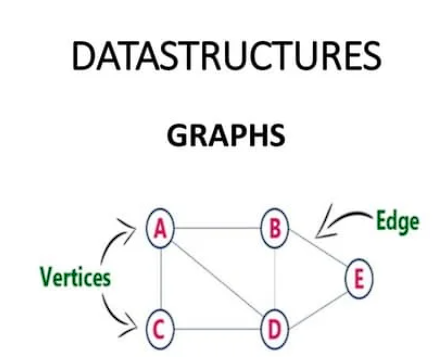

# Graphs in Data Structures and Algorithms (DSA)

Graphs in Data Structures and Algorithms (DSA) are a non-linear data structure that consists of a set of vertices (nodes) connected by edges. They are widely used to represent relationships between objects or entities.



## Implementing a Graph using an Adjacency Matrix

To implement a graph, you can use various data structures such as an adjacency matrix or an adjacency list. 

An adjacency matrix is a 2D array where each cell represents the presence or absence of an edge between two vertices. It requires O(V^2) space, where V is the number of vertices.

Here's an example of implementing a graph using an adjacency matrix in Python:

```python
class Graph:
     def __init__(self, num_vertices):
          self.num_vertices = num_vertices
          self.adj_matrix = [[0] * num_vertices for _ in range(num_vertices)]

     def add_edge(self, src, dest):
          self.adj_matrix[src][dest] = 1
          self.adj_matrix[dest][src] = 1

     def remove_edge(self, src, dest):
          self.adj_matrix[src][dest] = 0
          self.adj_matrix[dest][src] = 0

     def print_graph(self):
          for row in self.adj_matrix:
               print(row)

# Example usage:
g = Graph(4)
g.add_edge(0, 1)
g.add_edge(1, 2)
g.add_edge(2, 3)
g.print_graph()
```

Output:
```plaintext
[0, 1, 0, 0]
[1, 0, 1, 0]
[0, 1, 0, 1]
[0, 0, 1, 0]
```

## Implementing a Graph using an Adjacency List

Another way to implement a graph is using an adjacency list. It is a collection of linked lists, where each vertex has a list of its adjacent vertices. It requires O(V + E) space, where V is the number of vertices and E is the number of edges.

Here's an example of implementing a graph using an adjacency list in Python:

```python
class Graph:
     def __init__(self, num_vertices):
          self.num_vertices = num_vertices
          self.adj_list = [[] for _ in range(num_vertices)]

     def add_edge(self, src, dest):
          self.adj_list[src].append(dest)
          self.adj_list[dest].append(src)

     def remove_edge(self, src, dest):
          self.adj_list[src].remove(dest)
          self.adj_list[dest].remove(src)

     def print_graph(self):
          for vertex, adj_vertices in enumerate(self.adj_list):
               print(f"Vertex {vertex}: {adj_vertices}")

# Example usage:
g = Graph(4)
g.add_edge(0, 1)
g.add_edge(1, 2)
g.add_edge(2, 3)
g.print_graph()
```

Output:
```plaintext
Vertex 0: [1]
Vertex 1: [0, 2]
Vertex 2: [1, 3]
Vertex 3: [2]
```

## Additional Operations on Graphs

These are just basic operations on graphs. Depending on your requirements, you can perform various other operations like finding a path between two vertices, checking for cycles, or finding the shortest path using algorithms like Depth-First Search (DFS) or Breadth-First Search (BFS).


Graphs in Data Structures and Algorithms (DSA) are a non-linear data structure that consists of a set of vertices (nodes) connected by edges. They are widely used to represent relationships between objects or entities.

To implement a graph, you can use various data structures such as an adjacency matrix or an adjacency list. 

An adjacency matrix is a 2D array where each cell represents the presence or absence of an edge between two vertices. It requires O(V^2) space, where V is the number of vertices.

Here's an example of implementing a graph using an adjacency matrix in Python:

```python
class Graph:
     def __init__(self, num_vertices):
          self.num_vertices = num_vertices
          self.adj_matrix = [[0] * num_vertices for _ in range(num_vertices)]

     def add_edge(self, src, dest):
          self.adj_matrix[src][dest] = 1
          self.adj_matrix[dest][src] = 1

     def remove_edge(self, src, dest):
          self.adj_matrix[src][dest] = 0
          self.adj_matrix[dest][src] = 0

     def print_graph(self):
          for row in self.adj_matrix:
               print(row)

# Example usage:
g = Graph(4)
g.add_edge(0, 1)
g.add_edge(1, 2)
g.add_edge(2, 3)
g.print_graph()
```

Output:
```
[0, 1, 0, 0]
[1, 0, 1, 0]
[0, 1, 0, 1]
[0, 0, 1, 0]
```

Another way to implement a graph is using an adjacency list. It is a collection of linked lists, where each vertex has a list of its adjacent vertices. It requires O(V + E) space, where V is the number of vertices and E is the number of edges.

Here's an example of implementing a graph using an adjacency list in Python:

```python
class Graph:
     def __init__(self, num_vertices):
          self.num_vertices = num_vertices
          self.adj_list = [[] for _ in range(num_vertices)]

     def add_edge(self, src, dest):
          self.adj_list[src].append(dest)
          self.adj_list[dest].append(src)

     def remove_edge(self, src, dest):
          self.adj_list[src].remove(dest)
          self.adj_list[dest].remove(src)

     def print_graph(self):
          for vertex, adj_vertices in enumerate(self.adj_list):
               print(f"Vertex {vertex}: {adj_vertices}")

# Example usage:
g = Graph(4)
g.add_edge(0, 1)
g.add_edge(1, 2)
g.add_edge(2, 3)
g.print_graph()
```

Output:
```
Vertex 0: [1]
Vertex 1: [0, 2]
Vertex 2: [1, 3]
Vertex 3: [2]
```

These are just basic operations on graphs. Depending on your requirements, you can perform various other operations like finding a path between two vertices, checking for cycles, or finding the shortest path using algorithms like Depth-First Search (DFS) or Breadth-First Search (BFS).

## Implementing a Graph in Java

To implement a graph in Java, you can use similar approaches as in Python. Here's an example of implementing a graph using an adjacency matrix in Java:

```java
public class Graph {
     private int numVertices;
     private int[][] adjMatrix;

     public Graph(int numVertices) {
          this.numVertices = numVertices;
          this.adjMatrix = new int[numVertices][numVertices];
     }

     public void addEdge(int src, int dest) {
          adjMatrix[src][dest] = 1;
          adjMatrix[dest][src] = 1;
     }

     public void removeEdge(int src, int dest) {
          adjMatrix[src][dest] = 0;
          adjMatrix[dest][src] = 0;
     }

     public void printGraph() {
          for (int i = 0; i < numVertices; i++) {
               for (int j = 0; j < numVertices; j++) {
                    System.out.print(adjMatrix[i][j] + " ");
               }
               System.out.println();
          }
     }

     public static void main(String[] args) {
          Graph g = new Graph(4);
          g.addEdge(0, 1);
          g.addEdge(1, 2);
          g.addEdge(2, 3);
          g.printGraph();
     }
}
```

Output:
```
0 1 0 0 
1 0 1 0 
0 1 0 1 
0 0 1 0 
```

## Implementing a Graph in C++

Similarly, you can implement a graph in C++ using an adjacency matrix. Here's an example:

```cpp
#include <iostream>
#include <vector>

using namespace std;

class Graph {
private:
     int numVertices;
     vector<vector<int>> adjMatrix;

public:
     Graph(int numVertices) {
          this->numVertices = numVertices;
          this->adjMatrix.resize(numVertices, vector<int>(numVertices, 0));
     }

     void addEdge(int src, int dest) {
          adjMatrix[src][dest] = 1;
          adjMatrix[dest][src] = 1;
     }

     void removeEdge(int src, int dest) {
          adjMatrix[src][dest] = 0;
          adjMatrix[dest][src] = 0;
     }

     void printGraph() {
          for (int i = 0; i < numVertices; i++) {
               for (int j = 0; j < numVertices; j++) {
                    cout << adjMatrix[i][j] << " ";
               }
               cout << endl;
          }
     }
};

int main() {
     Graph g(4);
     g.addEdge(0, 1);
     g.addEdge(1, 2);
     g.addEdge(2, 3);
     g.printGraph();

     return 0;
}
```

Output:
```
0 1 0 0 
1 0 1 0 
0 1 0 1 
0 0 1 0 
```

Remember to adjust the number of vertices and edges according to your requirements.

In conclusion, graphs are a fundamental data structure in Data Structures and Algorithms (DSA) that are used to represent relationships between objects or entities. They can be implemented using various data structures such as an adjacency matrix or an adjacency list.

An adjacency matrix is a 2D array that represents the presence or absence of edges between vertices. It requires O(V^2) space, where V is the number of vertices. On the other hand, an adjacency list is a collection of linked lists where each vertex has a list of its adjacent vertices. It requires O(V + E) space, where V is the number of vertices and E is the number of edges.

Both implementations have their own advantages and disadvantages. The choice of implementation depends on the specific requirements of the problem at hand.

Additionally, there are various other operations that can be performed on graphs, such as finding a path between two vertices, checking for cycles, or finding the shortest path using algorithms like Depth-First Search (DFS) or Breadth-First Search (BFS).

Graphs can also be implemented in other programming languages like Java and C++. The implementation follows similar approaches using either an adjacency matrix or an adjacency list.

Overall, understanding graphs and their implementations is crucial for solving problems that involve relationships and connectivity between entities.
