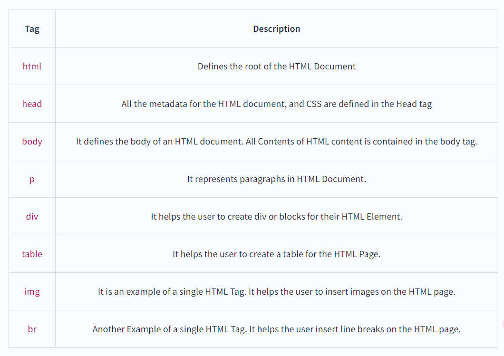

HTML (Hypertext Markup Language) is the standard markup language used for creating web pages. It consists of various tags and elements that define the structure and content of a web page.

## HTML Tags

HTML tags are the building blocks of an HTML document. They are enclosed in angle brackets (`<>`) and are used to define the structure and formatting of the content. Tags are usually paired with an opening tag and a closing tag, with the content placed between them.

For example, the `<h1>` tag is used to define a heading, and it is written as `<h1>Heading</h1>`. The opening tag `<h1>` indicates the start of the heading, and the closing tag `</h1>` indicates the end of the heading.

Commonly used HTML Tags:-

## HTML Elements

HTML elements are made up of tags, along with the content placed between them. An element consists of an opening tag, the content, and a closing tag. The content can be text, images, links, or other HTML elements.

For example, in the HTML element `
 This is a paragraph.
`, `
` and `
` are HTML tags, and the entire string together is considered an HTML element

## Difference between HTML Elements and HTML Tags

| HTML Tags | HTML Elements |
|-----------|--------------|
| HTML Tags are used to hold HTML Elements | HTML Elements hold the content |
| Enclosed in angle brackets (`<>`) | Consist of opening tag, content, and closing tag |
| Used to define structure and formatting | Can contain text, images, links, or other HTML elements |
| Paired with opening and closing tags | Content placed between opening and closing tags |

## Conclusion

In conclusion, HTML consists of various tags and elements that define the structure and content of a web page. HTML tags are the building blocks of an HTML document, used to define the structure and formatting of the content. HTML elements are made up of tags and the content placed between them, which can be text, images, links, or other HTML elements. Understanding the difference between HTML elements and HTML tags is essential for creating well-structured web pages.
