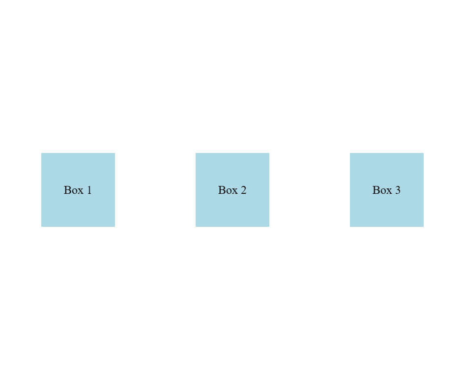
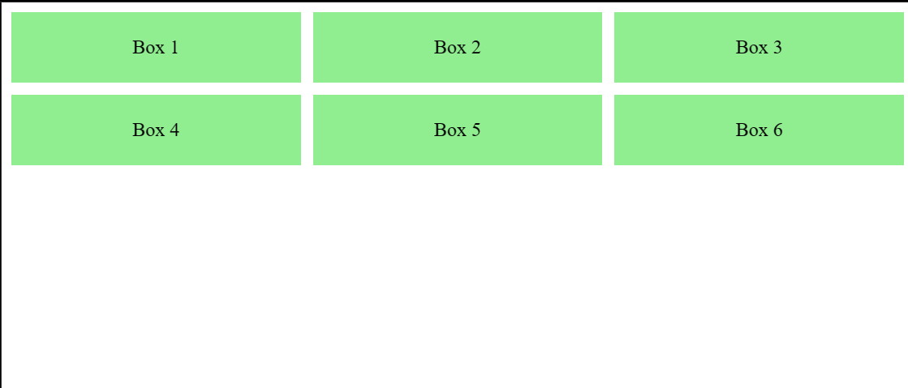
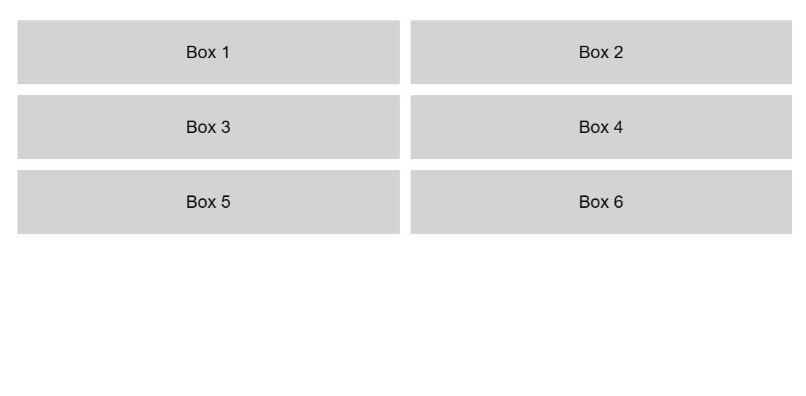

In this tutorial, you will learn how to use Flexbox and Grid Layout to create responsive web designs and build complex layouts in HTML and CSS.
<br></br>


## What is Flexbox?
Flexbox, or the Flexible Box Layout, is a layout model that allows items within a container to be automatically arranged depending on the available space.

### Basic Syntax
Here is the basic syntax of a Flexbox container:

```css
.container {
  display: flex;
  flex-direction: row; /* or column */
}
```

### Example
Let's look at a simple example where we create a flexible layout:

<Tabs>
    <TabItem value="Code">
```html
<!DOCTYPE html>
<html lang="en">
<head>
  <meta charset="UTF-8">
  <meta name="viewport" content="width=device-width, initial-scale=1.0">
  <title>Flexbox Example</title>
  <style>
    .container {
      display: flex;
      justify-content: space-around;
      align-items: center;
      height: 100vh;
    }
    .box {
      width: 100px;
      height: 100px;
      background-color: lightblue;
      text-align: center;
      line-height: 100px;
    }
  </style>
</head>
<body>
  <div class="container">
    <div class="box">Box 1</div>
    <div class="box">Box 2</div>
    <div class="box">Box 3</div>
  </div>
</body>
</html>
```
    </TabItem>
    <TabItem value="Output">
        <BrowserWindow>
            
        </BrowserWindow>
    </TabItem>
</Tabs>


## What is Grid Layout?
Grid is a blueprint for making websites.

The Grid model allows you to layout the content of your website. Not only that, it helps you create the structures you need for building responsive websites for multiple devices. This means your site will look good on desktop, mobile, and tablet.

Grid Layout is a two-dimensional layout system for the web. It allows you to create complex layouts using rows and columns.

### Basic Syntax
Here is the basic syntax of a Grid container:

```css
.container {
  display: grid;
  grid-template-columns: repeat(3, 1fr);
  grid-template-rows: auto;
}
```

### Example
Let's look at a simple example where we create a grid layout:
<Tabs>
    <TabItem value="Code">
```html
<!DOCTYPE html>
<html lang="en">

<head>
    <meta charset="UTF-8">
    <meta name="viewport" content="width=device-width, initial-scale=1.0">
    <title>Grid Layout Example</title>
    <style>
        .container {
          display: grid;
          grid-template-columns: repeat(3, 1fr);
          gap: 10px;
        }
        .box {
          background-color: lightgreen;
          text-align: center;
          padding: 20px;
        }
    </style>
</head>

<body>
    <div class="container">
        <div class="box">Box 1</div>
        <div class="box">Box 2</div>
        <div class="box">Box 3</div>
        <div class="box">Box 4</div>
        <div class="box">Box 5</div>
        <div class="box">Box 6</div>
    </div>
</body>

</html>
```
    </TabItem>
    <TabItem value="Output">
        <BrowserWindow>
            
        </BrowserWindow>
    </TabItem>
</Tabs>

## Practical Example
Let's create a practical example where we use both Flexbox and Grid Layout to adjust the layout of a simple webpage based on different screen sizes:

<Tabs>
    <TabItem value="Flexbox">
```html
<!DOCTYPE html>
<html lang="en">
<head>
  <meta charset="UTF-8">
  <meta name="viewport" content="width=device-width, initial-scale=1.0">
  <title>Responsive Flexbox Layout</title>
  <style>
    body {
      font-family: Arial, sans-serif;
      margin: 0;
      padding: 0;
    }
    .container {
      display: flex;
      flex-direction: column;
      align-items: center;
      padding: 20px;
    }
    .box {
      width: 100%;
      padding: 20px;
      margin: 10px 0;
      background-color: lightgray;
      text-align: center;
    }
    @media (min-width: 600px) {
      .container {
        flex-direction: row;
        flex-wrap: wrap;
        justify-content: space-around;
      }
      .box {
        width: 45%;
      }
    }
    @media (min-width: 900px) {
      .box {
        width: 30%;
      }
    }
  </style>
</head>
<body>
  <div class="container">
    <div class="box">Box 1</div>
    <div class="box">Box 2</div>
    <div class="box">Box 3</div>
  </div>
</body>
</html>
```
    </TabItem>
    <TabItem value="Grid">
```html
<!DOCTYPE html>
<html lang="en">
<head>
  <meta charset="UTF-8">
  <meta name="viewport" content="width=device-width, initial-scale=1.0">
  <title>Responsive Grid Layout</title>
  <style>
    body {
      font-family: Arial, sans-serif;
      margin: 0;
      padding: 0;
    }
    .container {
      display: grid;
      grid-template-columns: 1fr;
      gap: 10px;
      padding: 20px;
    }
    .box {
      background-color: lightgray;
      text-align: center;
      padding: 20px;
    }
    @media (min-width: 600px) {
      .container {
        grid-template-columns: repeat(2, 1fr);
      }
    }
    @media (min-width: 900px) {
      .container {
        grid-template-columns: repeat(3, 1fr);
      }
    }
  </style>
</head>
<body>
  <div class="container">
    <div class="box">Box 1</div>
    <div class="box">Box 2</div>
    <div class="box">Box 3</div>
    <div class="box">Box 4</div>
    <div class="box">Box 5</div>
    <div class="box">Box 6</div>
  </div>
</body>
</html>
```
    </TabItem>
    <TabItem value="Output">
    <BrowserWindow>
    
    </BrowserWindow>
    </TabItem>
</Tabs>

# Resources
 - [Fkexbox cheatsheet](https://css-tricks.com/wp-content/uploads/2022/02/css-flexbox-poster.png)
 - [Grid cheatsheet](https://css-tricks.com/wp-content/uploads/2022/02/css-grid-poster.png)

## Conclusion
Flexbox and Grid Layout are essential tools in creating responsive web designs. By understanding and utilizing these techniques, you can ensure that your web pages provide an optimal viewing experience across a wide range of devices and screen sizes. Experiment with different layout properties and combinations to see what works best for your specific design needs.
