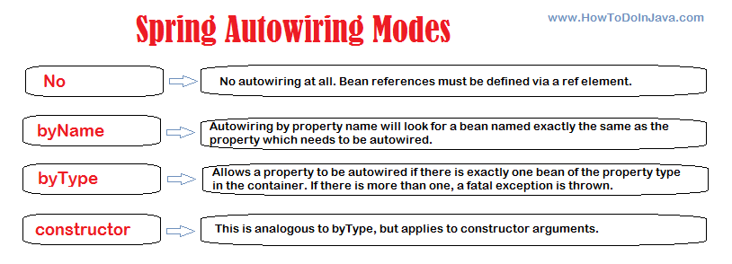

## What is Autowiring Spring?
The @Autowired annotation in Spring Boot is pivotal for enabling dependency injection, a core concept in modern software development that promotes loose coupling and scalable code management.

## Why we use Autowiring in Spring ?
Autowiring in Spring is used to automatically inject dependencies into beans, simplifying the configuration and management of dependencies within an application. Here are several reasons why autowiring is beneficial and commonly used in Spring applications:
1. Simplifies Configuration
Autowiring eliminates the need for explicit bean wiring in XML or Java configuration files. By leveraging annotations, you can reduce the amount of boilerplate code required to set up dependencies, leading to cleaner and more readable code.
2. Increases Developer Productivity
By automating the injection process, developers can focus more on writing business logic rather than managing bean dependencies. This speeds up development and reduces the potential for errors related to manual wiring.
3. Improves Maintainability
Autowiring makes the codebase more maintainable by reducing the need for explicit configuration. Changes to dependencies require fewer updates to configuration files, as the dependency injection is handled automatically.
4. Promotes Loose Coupling
Autowiring encourages loose coupling between components by relying on interfaces and annotations to define dependencies. This decoupling makes it easier to replace or modify components without affecting other parts of the application.
5. Supports Dependency Injection Best Practices
Autowiring facilitates the implementation of dependency injection, a key principle in software design that enhances testability and flexibility. By injecting dependencies, it becomes easier to write unit tests and mock dependencies.
6. Reduces Boilerplate Code
Using autowiring annotations like @Autowired, @Qualifier, and @Resource reduces the amount of boilerplate code needed for dependency management. This leads to a more concise and expressive codebase.
7. Enhances Code Clarity
Annotations used for autowiring provide clear documentation within the code about how dependencies are injected. This makes it easier for other developers to understand the relationships between different components.

## Types of Autowiring

Autowiring in Spring Boot is a feature that allows Spring to automatically inject dependencies into Spring beans. This can be done by using the @Autowired annotation.
There are four types of autowiring in Spring Boot:
 1.byName:
This is the default type of autowiring. Spring will inject a bean into a field or setter method if the name of the bean matches the name of the field or setter method.
 2.byType:
Spring will inject a bean into a field or setter method if the type of the bean matches the type of the field or setter method.
 3.constructor:
Spring will inject a bean into a constructor if the type of the bean matches the type of one of the constructor parameters.
 4.qualifier:
Spring will inject a bean into a field or setter method if the bean is annotated with a specific qualifier.

## Challenges and Considerations in Using @Autowired in Spring Boot
1. Overdependence on Spring
Challenge: Heavy reliance on Spring's dependency injection can make it difficult to migrate to other frameworks or even to non-Spring environments.
Consideration: To mitigate this, use standard Java dependency injection annotations like @Inject (from JSR-330) where possible, and design your application to follow SOLID principles and avoid tight coupling with the Spring framework.
2. Runtime Errors
Challenge: Incorrect configurations or missing beans can lead to runtime errors which are often harder to debug compared to compile-time errors.
Consideration: Ensure comprehensive testing, including integration tests, to catch configuration issues early. Use Spring’s @Configuration and @ComponentScan annotations judiciously to control bean creation and scanning.
3. Ambiguity in Bean Injection
Challenge: When multiple beans of the same type are present, Spring may not know which one to inject, leading to NoUniqueBeanDefinitionException.
Consideration: Use @Qualifier to specify which bean should be injected, or use the @Primary annotation to designate a default bean.

## Project Structure

src/
├── main/
│   ├── java/
│   │   └── com/
│   │       └── example/
│   │           └── usermanagement/
│   │               ├── UserManagementApplication.java
│   │               ├── controller/
│   │               │   └── UserController.java
│   │               ├── service/
│   │               │   └── UserService.java
│   │               ├── repository/
│   │               │   └── UserRepository.java
│   │               └── model/
│   │                   └── User.java
│   └── resources/
│       └── application.properties
└── test/
    └── java/
        └── com/
            └── example/
                └── usermanagement/
                    └── UserManagementApplicationTests.java

## Main Application Class

package com.example.usermanagement;

import org.springframework.boot.SpringApplication;
import org.springframework.boot.autoconfigure.SpringBootApplication;

@SpringBootApplication
public class UserManagementApplication {
    public static void main(String[] args) {
        SpringApplication.run(UserManagementApplication.class, args);
    }
}
## Model Class
package com.example.usermanagement.model;

import javax.persistence.Entity;
import javax.persistence.GeneratedValue;
import javax.persistence.GenerationType;
import javax.persistence.Id;

@Entity
public class User {
    @Id
    @GeneratedValue(strategy = GenerationType.IDENTITY)
    private Long id;
    private String name;
    private String email;

    // Getters and Setters
}
## Repository Interface
package com.example.usermanagement.repository;

import com.example.usermanagement.model.User;
import org.springframework.data.jpa.repository.JpaRepository;
import org.springframework.stereotype.Repository;

@Repository
public interface UserRepository extends JpaRepository<User, Long> {
}
## Service Class
package com.example.usermanagement.service;

import com.example.usermanagement.model.User;
import com.example.usermanagement.repository.UserRepository;
import org.springframework.beans.factory.annotation.Autowired;
import org.springframework.stereotype.Service;

import java.util.List;

@Service
public class UserService {
    private final UserRepository userRepository;

    @Autowired
    public UserService(UserRepository userRepository) {
        this.userRepository = userRepository;
    }

    public List<User> getAllUsers() {
        return userRepository.findAll();
    }

    public User getUserById(Long id) {
        return userRepository.findById(id).orElse(null);
    }

    public User saveUser(User user) {
        return userRepository.save(user);
    }

    public void deleteUser(Long id) {
        userRepository.deleteById(id);
    }
}
## Controller Class
package com.example.usermanagement.controller;

import com.example.usermanagement.model.User;
import com.example.usermanagement.service.UserService;
import org.springframework.beans.factory.annotation.Autowired;
import org.springframework.web.bind.annotation.*;

import java.util.List;

@RestController
@RequestMapping("/users")
public class UserController {
    private final UserService userService;

    @Autowired
    public UserController(UserService userService) {
        this.userService = userService;
    }

    @GetMapping
    public List<User> getAllUsers() {
        return userService.getAllUsers();
    }

    @GetMapping("/{id}")
    public User getUserById(@PathVariable Long id) {
        return userService.getUserById(id);
    }

    @PostMapping
    public User createUser(@RequestBody User user) {
        return userService.saveUser(user);
    }

    @DeleteMapping("/{id}")
    public void deleteUser(@PathVariable Long id) {
        userService.deleteUser(id);
    }
}
## Explanation
Main Application Class: The UserManagementApplication class is the entry point of the Spring Boot application.
Model Class: The User class represents the entity to be stored in the database.
Repository Interface: The UserRepository interface extends JpaRepository to provide CRUD operations on the User entity.
Service Class: The UserService class contains business logic and is autowired with the UserRepository.
Controller Class: The UserController class handles HTTP requests and is autowired with the UserService.

This example demonstrates the use of autowiring to inject dependencies at various layers (Controller, Service, Repository) in a Spring Boot application. It shows how @Autowired can be used to streamline dependency management, promoting clean, maintainable, and modular code.

